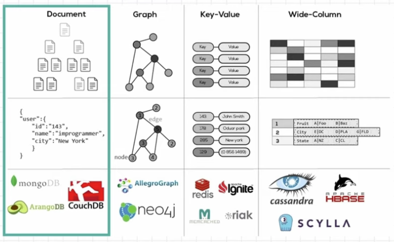

# 데이터 베이스와 SQL

* 데이터베이스(DB)

  컴퓨터 시스템에 저장되는 구조화된 정보 혹은 데이터의 조합

  

* DBMS (Database Management System)

  데이터 베이스에서 데이터를 정의, 저장, 검색 및 인출, 관리하기 위해 사용되는 소프트웨어

  

## DBMS 종류

1. SQL
   관계형 데이터베이스
   데이터 조작을 위해 SQL(언어)이 필수

2. NoSQL
   비관계형 데이터베이스
   형태가 다양하고 Not Only SQL

* R-DBMS

  데이터가 테이블 형태로 저장된다.

  테이블 사이의 관계(Relationship)로 구조가 형성된다.

  SQL(Structured Query Language) 이용한다.

  

* NoSQL

  

  * Document : Json 형태, API형태로 이용할 때, 데이터를 Json형태로 사용하는 것은 매우 효율적이다.
  * Graph : 신용카드 회사에서 평상시 사용과 완전 다른 모습을 보일 때, 이상 감지를 하는 부분에서 매우 효율적
  * Key-Value : 해쉬 테이블이라고도 부름
  * Wide-Column : 컬럼을 유연하게 사용

## SQL의 분류

1. DML (Data MAnipulaction Language)
   * 데이터 조작 언어
   * 데이터를 조작(선택, 삽입, 수정, 삭제)하는데 사용되는 언어
   * DML 구문이 사용되는 대상은 테이블의 행
   * 트랜잭션이 발생하는 SQL도 DML에 속함
     
2. DDL (Data Definition Language)
   * 데이터 정의 언어
   * 데이터베이스, 테이블, 뷰, 인덱스 등 데이터베이스 개체를 생성/삭제/변경하는 역할
   * CREATE, DROP, ALTER 구문
   * DDL은 트랜잭션 발생시키지 않음
   * Rollback이나 Commit 사용 불가
   * DDL문은 실행 즉시 적용
3. DCL (Data Control Language)
   * 데이터 제어 언어
   * 사용자에게 어떤 권한을 부여하거나 빼앗을 때 사용
   * GRANT, REVOKE 구문

## MySQL 사용법

### Use

