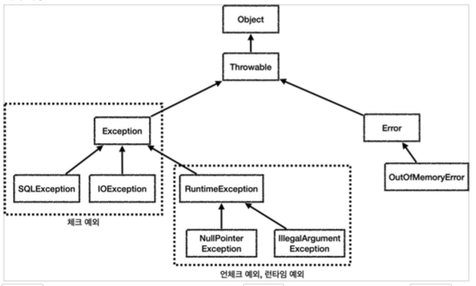
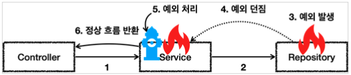

# 자바 예외 이해

## 예외 계층

스프링이 제공하는 예외 추상화를 이해하기 위해서는 먼저 자바 기본 예외에 대한 이해가 필요하다.

실무에 필요한 체크예외와 언체크 예외의 차이와 활용 방안에 대해서도 알아볼 것이다.

* `Object` : 예외도 객체이다. 결국 최상위 부모는 `Object`이다.
* `Throwable` : 최상위 예외이다. 하위에 `Exception`, `Error`가 있다.
  * `Error` : 메모리 부족이나 심각한 시스템 오류와 같이 애플리케이션에서 복구 불가능한 시스템 예외이다. 애플리케이션 개발자는 이 예외를 잡으려고 해서는 안된다.
    * 상위 예외를 `catch`로 잡으면 그 하위 예외까지 함께 잡는다. 따라서 애플리케이션 로직에서는 `Throwable`을 잡으면 안된다.
    * 참고로 `Error`도 언체크 예외이다.
  * `Exception` : 체크 예외
    * 애플리케이션 로직에서 사용할 수 있는 실질적인 최상위 예외이다.
    * `Exception`과 그 하위 예외는 모두 컴파일러가 체크하는 체크 예외이다. 단 `RuntimeException`은 예외로 한다.
  * `RuntimeException` : 언체크 예외, 런타임 예외
    * 컴파일러가 체크하지 않는 언체크 예외이다.
    * `RuntimeException`과 그 자식 예외는 모두 언체크 예외이다.
    * `RuntimeException`의 이름을 따라서 `RuntimeException`과 그 하위 언체크 예외를 런타임 예외라고 많이 부른다.

## 예외 기본 규칙

예외는 폭탄 돌리기와 같다. 잡아서 처리하거나, 처리할 수 없으면 밖으로 던져야 한다.

예외를 처리한다는 것은 `catch`로 예외를 잡아서 처리하는 것이고, 예외를 던진다는 것은 메서드나 클래스 이름 뒤에 `throws ...Exception` 형식으로 호출한 곳으로 처리하라고 던지는 것

**예외에 대한 2가지 기본 규칙**

1. 예외는 잡아서 처리하거나 던져야한다.
2. 예외를 잡거나 던질 때 지정한 예외뿐만 아니라 그 예외의 자식들도 함께 처리된다.
   * 예를 들어 `Exception`을 `catch`로 잡으면 하위 예외들도 모두 잡힌다.
   * 예를 들어 `Exception`을 `throws`로 던지면 그 하위 예외들도 모두 던진다.

**참고: 예외를 처리하지 못하고 계속 던지면 어떻게 될까?**

* 자바 `main()`쓰레드의 경우 예외 로그를 출력하면서 시스템이 종료된다.
* 웹 애플리케이션의 경우 여러 사용자의 요청을 처리하기 때문에 하나의 예외 때문에 시스템이 종료될 수 있다.
* 보통 WAS가 해당 예외를 받아서 처리하는데, 주로 사용자에게 개발자가 지정한 오류페이지를 보여준다.

## 체크 예외 기본 이해

* `Exception`과 그 하위 예외는 모두 컴파일러가 체크하는 체크 예외이다. `RuntimeException`은 예외로 한다.
* 체크 예외는 잡아서 처리하거나 밖으로 던지도록 선언해야 한다. 그렇지 않으면 컴파일 오류가 발생한다.

~~~java
@Slf4j
public class CheckedTest {

    @Test
    void checked_catch() {
        Service service = new Service();
        service.callCatch();
    }

    @Test
    void checked_throw() {
        Service service = new Service();
        Assertions.assertThatThrownBy(()-> service.callThrow())
                .isInstanceOf(MyCheckedException.class);
    }

    static class MyCheckedException extends Exception {
        public MyCheckedException(String message) {
            super(message);
        }
    }

    static class Service {
        Repository repository = new Repository();

        public void callCatch() {
            try {
                repository.call();
            } catch (MyCheckedException e) {
                log.info("예외 처리, message={}", e.getMessage(), e);
            }
        }

        public void callThrow() throws MyCheckedException {
            repository.call();
        }
    }

    static class Repository {
        public void call() throws MyCheckedException {
            throw new MyCheckedException("ex");
        }
    }
}
~~~

**Exception을 상속받은 클래스는 예외로 만들어지고, 체크 예외가 된다.**

* `MyCheckedException`은 `Exception`을 상속받아서 만들었다. 이렇게 되면 `MyCheckedException`은 체크 예외가 되었다.
* 참고로 `RuntimeException`을 상속받으면 언체크 예외가 된다.
* 예외가 제공하는 여러가지 기본 기능 중 오류 메시지를 보관하는 기능도 있다. 

~~~java
static class MyCheckedException extends Exception {
      public MyCheckedException(String message) {
          super(message);
      }
}
~~~

**체크 예외를 잡아서 처리하는 코드**

~~~java
try {
  repository.call();
} cathc (MyCheckedException e) {
  //예외 처리 로직
}
~~~

**체크 예외를 잡지 않고, 던지는 코드**

~~~java
@Test
void checked_throw() {
  Service service = new Service();
  Assertions.assertThatThrownBy(() -> service.callThrow())
    .isInstanceOf(MyCheckedException.class);
}
~~~

위 모습은 `service.callThrow()`를 호출하면 `throws MyCheckedException` 때문에 위 메서드에 예외가 던져진다. 여기서도 잡지 않고 던질 것인데, 테스트 환경이므로 `Assertions.assertThatThrownBy(() -> service.callThrow()).isInstanceOf(MyCheckedException.class)`를 통해 던져지는 예외가 `MyCheckedException`이 맞는지 확인하는 테스트를 하는 것이다.

**체크 예외를 처리하지 않으면?**

~~~java
public void callThrow() {
  repository.call();
}
~~~

* 위 처럼 밖으로 던지거나 처리하지 않으면 컴파일 오류가 발생한다.
  * `Unhandled exception : ....`
* 체크 예외의 경우 예외를 잡아서 처리하거나 밖으로 던진다는 선언을 필수로 해주어야 한다.

**체크 예외의 장단점**

체크 예외는 처리 할 수 없을 때, 예외를 밖으로 던질 수 있다. 이 때문에 장단점이 동시에 존재한다.

* 장점 : 개발자가 실수로 예외를 누락하지 않도록 컴파일러를 통해 문제를 잡아주는 훌륭한 안전장치이다.
* 단점 : 하지만 개발자가 모든 체크 예외를 반드시 잡거나 던지도록 처리되어있기 때문에 번거롭다.

## 언체크 예외 기본 이해

* `RuntimeException`과 그 하위 예외는 언체크 예외로 분류된다
* 언체크 예외는 말 그대로 컴파일러가 예외를 체크하지 않는다는 뜻
* 언체크 예외는 예외를 잡아서 처리하지 않고, `throws`를 통해 예외를 던지지 않아도 자동으로 예외를 던진다.

**체크 예외 vs 언체크 예외**

* 체크 예외 : 예외를 항상 처리하거나 `throws`에 던져야 한다.
* 언체크 예외 : 예외를 잡아서 처리하지 않아도 `throws`를 생략할 수 있다.

~~~java
@Slf4j
public class UnCheckedTest {

  	//예외 catch 확인
    @Test
    void unchecked_catch() {
        Service service = new Service();
        service.callCatch();
    }

  	//예외 throw 확인
    @Test
    void unchecked_throw() {
        Service service = new Service();
        Assertions.assertThatThrownBy(() -> service.callThrow())
                .isInstanceOf(MyUnCheckedException.class);
    }

    static class MyUnCheckedException extends RuntimeException {
        public MyUnCheckedException(String message) {
            super(message);
        }
    }

    static class Service {
        Repository repository = new Repository();

        public void callCatch() {
            try {
                repository.call();
            } catch (MyUnCheckedException e) {
                log.info("예외 처리, message={}", e.getMessage(), e);
            }
        }

        public void callThrow() {
            repository.call();
        }
    }

    static class Repository {
        public void call() { //이 곳에서 throws를 안해도 된다. 자동으로 던짐
            throw new MyUnCheckedException("ex");
        }
    }
}
~~~

* 언체크 예외는 `throw`로 예외를 던져도 되고 생략도 가능하다.
* 언체크 예외는 주로 생략하지만, 중요한 예외의 경우 선언해두면 해당 코드를 호출하는 개발자가 이런 예외가 발생한다는 점을 IDE를 통해 좀 더 편리하게 인지할 수 있다.

**언체크 예외의 장단점**

언체크 예외는 예외를 잡아서 처리할 수 없을 때, 예외를 밖으로 던지는 `throws`를 생략할 수 있다. 
이것 때문에 장단점이 동시에 존재한다.

* 장점 : 신경쓰고 싶지 않은 언체크 예외를 무시할 수 있다. 신경쓰고 싶지 않은 예외의 의존관계를 참조하지 않아도 되는 장점이 있다.
* 단점 : 언체크 예외는 개발자가 실수로 예외를 누락할 수 있다. 반면에 체크 예외는 컴파일러를 통해 예외 누락을 잡아준다.

---

**개발자가 만드는 예외 / `Exception` 상속 사용법**

**UserException.class**

~~~java
@Getter
public class UserException extends RuntimeException {
  private UserErrorCode userErrorCode;
  private String message;
  
  public UserException(UserErrorCode errorCode) {
    super(errorCode.getMessage());
    this.userErrorCode = errorCode;
    this.message = errorCode.getMessage();
  }
}
~~~

**UserErrorCode.enum**

~~~java
@Getter
public enum UserErrorCode {
  NO_DEVELOPER("해당되는 사용자가 없습니다."),
  DUPLICATED_MEMBER_ID("MemberId가 중복되는 사용자가 있습니다."),
  LEVEL_EXPERIENCE_YEARS_NOT_MATCHED("사용자의 레벨과 연차가 맞지 않습니다."),

  INTERNAL_SERVER_ERROR("서버에 오류가 발생했습니다."),
  INVALID_REQUEST("잘못된 요청입니다.");
 
  private final String message;
  
  UserErrorCode(String message) {
    this.message = message;
  }
}
~~~

---

