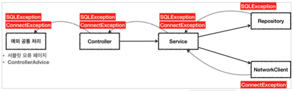
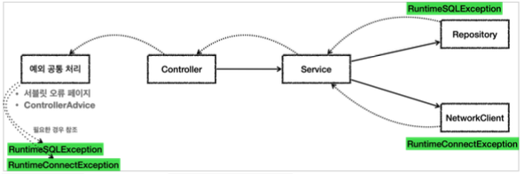

# 자바 예외 활용

## 체크 예외 활용

언제 체크 예외를 사용하고 언제 언체크 예외를 사용하면 좋을까?

**기본 원칙 2가지**

* **기본적으로 언체크 예외를 사용하자**
* 체크 예외는 비즈니스 로직상 의도적으로 던지는 예외만 사용하자
  * 예시로 반드시 처리해야하는 문제일 때만 체크 예외를 사용해야 한다.
  * 계좌 이체 실패 예외
  * 결제시 포인트 부족 예외
  * 로그인 ID, PW 불일치 예외
  * 계좌 이체처럼 매우 심각한 문제는 개발자가 실수로 예외를 놓치면 안된다고 판단할 수 있다. 이 경우를 체크 예외로 만들어두면 컴파일러를 통해 예외를 인지할 수 있다.

---

**개발자가 만드는 언체크 예외 / `Exception` 상속 사용법**

**UserException.class**

~~~java
@Getter
public class UserException extends RuntimeException {
  private UserErrorCode userErrorCode;
  private String message;
  
  public UserException(UserErrorCode errorCode) {
    super(errorCode.getMessage());
    this.userErrorCode = errorCode;
    this.message = errorCode.getMessage();
  }
}
~~~

**UserErrorCode.enum**

~~~java
@Getter
public enum UserErrorCode {
  NO_DEVELOPER("해당되는 사용자가 없습니다."),
  DUPLICATED_MEMBER_ID("MemberId가 중복되는 사용자가 있습니다."),
  LEVEL_EXPERIENCE_YEARS_NOT_MATCHED("사용자의 레벨과 연차가 맞지 않습니다."),

  INTERNAL_SERVER_ERROR("서버에 오류가 발생했습니다."),
  INVALID_REQUEST("잘못된 요청입니다.");
 
  private final String message;
  
  UserErrorCode(String message) {
    this.message = message;
  }
}
~~~

---

**체크 예외의 문제점**

체크 예외는 컴파일러가 예외 누락을 체크해주기 때문에 개발자가 실수로 예외를 놓치는 것을 막아준다.
체크 예외가 런타임 예외보다 안전해 보이지만 여러 문제가 있기 때문에 런타임 예외를 기본으로 사용하는 것이다.

* 리포지토리는 DB에 접근해서 데이터를 저장하고 관리한다. 이 곳에서 `SQLException` 체크 예외를 던진다.
* `NetworkClient`는 외부 네트워크에 접속해서 어떤 기능을 처리하는 객체이다. 여기서 `ConnectException` 체크 예외를 던진다.
* 서비스는 리포지토리와 `NetworkClient` 둘 다 호출하기 때문에 체크 예외가 올라온다.
  * 서비스에서는 두 예외를 처리할 수 없다.
  * 서비스는 애플리케이션 로직 처리만 하기 때문에 데이터베이스에서 발생하는 문제나 연결 실패처럼 심각한 문제들을 애플리케이션 로직에서 처리할 방법이 없다.
* 서비스는 `Controller`로 두 체크 예외를 던진다.
* 컨트롤러도 두 예외를 처리할 방법이 없다.
  * 각각의 예외를 `catch`해서 하면 되지만... 너무 비효율적이다.
* 보통은 서블릿 오류 페이지나 스프링 MVC가 제공하는 `ControllerAdvice`에서 이런 예외들을 공통으로 처리한다.
  * 이런 문제들은 보통 사용자에게 어떤 문제가 발생했는지 자세히 설명하기 어렵다. 그래서 사용자에게 "서비스에 문제가 있습니다 " 라는 일반적인 메시지를 보여준다.
  * API라면 보통 HTTP 상태코드 500(내부 서버 오류)을 사용해서 응답을 내려준다.
  * 이렇게 해결 불가능한 공통 예외는 별도의 오류 로그를 남기고 개발자가 오류를 빨리 인지할 수 있도록 연락을 통해서 전달 받아야 한다.

---

**개발자가 만드는 체크 예외처리 클래스 / `@ControllerAdvice`**

~~~java
@RestControllerAdvice
@Slf4j
public class UserExceptionHandler {
  
  //개발자가 설정한 언체크 예외 처리
  @ResponseStatus(value = HttpStatus.CONFLICT)
  @ExceptionHandler(UserExcepion.class)
  public UserErrorResponse handleExceptions (UserException e, HttpServletRequest request) {
    log.error("errorCode: {}, url: {}, message: {}",
              e.getUserErrorCode(), request.getRequestURI(), e.getMessage());

    return new UserErrorResponse(e.getUserErrorCode, e.getMessage());
  }
  
  //컨트롤러 들어오기 전 생기는 체크 예외 처리
  @ExceptionHandler(value = {
    HttpRequestMethodNotSupportedException.class, //post에 get요청 등
    MethodArgumentNotValidaException.class //validation 
  })
  public UserErrorResponse handleBadRequest (Exception e, HttpServletRequest request) {
    log.error("url: {}, message: {}",
              request.getRequestURI(), e.getMessage());
    
    return new UserErrorResponse(INVALID_REQUEST, INVALID_REQUEST.getMessage());
  }
  
  //나머지 모든 체크 예외
  @ExceptionHandler(Exception.class)
  public UserErrorResponse handleException (Exception e, HttpServletRequest request) {
    log.error("url: {}, message: {}",
              request.getRequestURI(), e.getMessage());
    
    return new UserErrorResponse(INTERNAL_SERVER_ERROR, INTERNAL_SERVER_ERROR.getMessager());
  }
}
~~~

---

**2가지 문제**

1. 복구 불가능한 예외
2. 의존 관계에 대한 문제

**1. 복구 불가능한 예외**

대부분 예외는 복구가 불가능하다.
`SQLException`같이 데이터베이스에 뭔가 문제가 있어서 발생하는 예외이다. SQL 문법 문제일 수도 있고, 데이터베이스 자체 문제일 수 있다. 이런 문제들은 대부분 복구가 불가능하다.
특히 대부분의 서비스나 컨트롤러는 이런 문제를 해결할 수 없다. 따라서 이런 문제들을 일관성 있게 공통으로 처리해야 한다.
서블릿 필터, 스프링 인터셉터, 스프링 `ControllerAdvice`를 사용하면 공통으로 해결할 수 있다.

**2. 의존 관계에 대한 문제**

체크 예외의 또 다른 심각한 문제는 예외에 대한 의존 관계 문제이다.
컨트롤러나 서비스 입장에서는 본인이 처리할 수 없어도 `throws`를통해 던지는 예외를 선언함으로서 그 예외에 의존하게 된다.
예를 들어, `SQLException`에 의존하고 있다가 JPA같은 다른 기술을 쓰게되면 `JPAException`으로 변경해야 한다.
결과적으로 **OCP, DI를 통해 클라이언트 코드의 변경없이 대상 구현체를 변경할 수 있다는 장점이 사라진다.**

**정리**

* 처리할 수 있는 체크 예외라면 서비스나 컨트롤러에서 처리하겠지만, DB나 네트워크같은 시스템 레벨에서 올라온 예외들은 복구가 불가능하고 처리가 불가능하다.
* 던지고 던지면서 결국 서비스나 컨트롤러에서 불필요한 의존관계가 생긴다

## 언체크 예외 활용

체크 예외들을 언체크 예외들로 변경할 것이다.

* `SQLException` -> `RuntimeSQLException`
* `ConnectException` -> `RuntimeConnectException`
* 런타임 예외이기 때문에 서비스, 컨트롤러는 해당 예외들을 처리할 수 없다면 별도의 선언 없이 그냥 두면 된다.

**예외 전환**

~~~java
public class UnCheckedAppTest {

    @Test
    void unChecked() {
        Controller controller = new Controller();
        Assertions.assertThatThrownBy(() -> controller.request())
                .isInstanceOf(Exception.class);
    }

    static class Controller {
        Service service = new Service();

        public void request() {
            service.logic();
        }
    }

    static class Service {
        Repository repository = new Repository();
        Network network = new Network();

        public void logic() {
            repository.call();
            network.call();
        }
    }

    static class Repository {

        public void call() {
            try {
                runSQL();
            } catch (SQLException e) {
                throw new RuntimeSQLException(e);
            }
        }

        public void runSQL() throws SQLException {
            throw new SQLException("ex");
        }
    }

    static class Network {
        public void call() {
            try {
                runConnect();
            } catch (ConnectException e) {
                throw new RuntimeConnectException(e.getMessage());
            }
        }

        public void runConnect() throws ConnectException {
            throw new ConnectException("연결 실패");
        }
    }

    static class RuntimeConnectException extends RuntimeException {
        public RuntimeConnectException(String message) {
            super(message);
        }
    }

    static class RuntimeSQLException extends RuntimeException {
        public RuntimeSQLException(Throwable cause) {
            super(cause);
        }
    }
}
~~~

* 리포지토리에서 체크 예외인 `SQLException`이 발생하면 런타임 예외인 `RuntimeSQLException`으로 전환해서 예외를 던진다.
  * 참고로 이 때 기존 예외를 포함해주어야 예외 출력시 기존 예외도 함께 확인할 수 있다.
* `ConnectException` 또한 `RuntimeConnectException`예외가 발생하도록 코드를 바꾸었다.

**런타임 예외 - 복구 불가능한 예외**

시스템에서 발생한 예외는 대부분 복구 불가능한 예외이다. 런타임 예외로 전환하면 서비스나 컨트롤러가 이런 복구 불가능한 예외를 신경쓰지 않아도 된다.

**런타임 예외 - 의존 관계에 대한 문제**

런타임 예외는 해당 객체가 처리할 수 없는 예외는 무시하면 된다. 체크 예외와 달리 강제로 의존하지 않아도 된다.

**런타임 예외 - 기술 변경시 파급 효과**

런타임 예외를 사용하면 중간에 기술이 변경되어도 해당 예외를 사용하지 않는 컨트롤러, 서비스에서는 코드를 변경하지 않아도 된다.

물론 구현 기술이 변경되는 경우엔 예외에 따른 다른 처리가 필요할 수 있지만 공통 처리하는 한 곳만 변경하면 되기 때문에 영향 범위는 최소화 된다.

**정리**

처음 자바를 설계할 당시에는 체크 예외가 더 나은 선택이라 생각했다. 그래서 자바가 기본으로 제공하는 기능들에는 체크 예외가 많다. 그런데 시간이 흐르면서 복구 할 수 없는 예외가 너무 많아졌다. 특히 라이브러리를 점점 더 많이 사용하면서 처리해야 하는 예외도 더 늘어났다. 체크 예외는 해당 라이브러리들이 제공하는 모든 예외를 처리할 수 없을 때마다 `throws`에 예외를 덕지덕지 붙여야 했다.

체크예외의 이런 문제점 때문에 최근 라이브러리들은 대부분 런타임 예외를 기본으로 제공한다. 사실 위에서 말한 JPA기술도 런타임 예외를 사용한다. 스프링도 대부분 런타임 예외를 제공한다. 런타임 예외도 필요하면 잡을 수 있기 때문에 필요한 경우 잡아서 처리하고, 그렇지 않으면 자연스럽게 던지도록 둔다.

**런타임 예외 문서화**

* 런타임 예외는 놓칠 수 있기 때문에 문서화를 잘해야 한다.

**JPA EntityManager**

~~~java
	/*   
	 * Make an instance managed and persistent.
   * @param entity  entity instance
   * @throws EntityExistsException if the entity already exists.
   * @throws IllegalArgumentException if the instance is not an
   *         entity
   * @throws TransactionRequiredException if there is no transaction when
   *         invoked on a container-managed entity manager of that is of type
   *         <code>PersistenceContextType.TRANSACTION</code>
   */
public void persist(Object entity);
~~~

위 처럼 JPA 사용할 떄 필요한 클래스를 보면 런타임 예외들을 앞에 적혀있다.

**스프링 JdbcTemplate**

~~~java
	/**
   * Issue a single SQL execute, typically a DDL statement.
   * @param sql static SQL to execute
   * @throws DataAccessException if there is any problem
   */
  void execute(String sql) throws DataAccessException;
~~~

위 처럼 스프링의 `JdbcTemplate`에는 문서화도 되어있고 코드에도 명시되어 있다.

## 예외 포함과 스택 트레이스

예외를 전환할 때는 꼭! 기존 예외를 포함해야 한다. 그렇지 않으면 스택 트레이스를 확인할 떄 심각한 문제를 야기한다.

~~~java
@Test
void printEx() {
  Controller controller = new Controller();
  try {
    controller.request();
  } catch (Exception e) {
    //e.printStackTrace(e);
    log.info("ex", e);
  }
}
~~~

* 로그를 출력할 때 마지막 파라미터에 예외를 넣어주면 로그에 스택 트레이스를 출력할 수 있다.
  * 예) `log.info("message={}", "message", e)` 여기서 마지막에 `e`를 전달한다. 이렇게 하면 `Exception`을 스택 트레이스에 로그를 출력할 수 있다.
  * 예) `log.info("ex", e)` 지금 예시에서는 메세지 파라미터( {} <- 이거 )가 없기 때문에, 예외만 파라미터에 전달하면 스택 트레이스를 로그에 출력할 수 있다.
* `System.out`에 스택 트레이스를 출력하려면 `e.printStackTrace()`를 사용하면 된다.
  * 그러나 이건 로그에 남기는 것이 아니기 때문에 로그를 사용하도록 하자

**기존 예외를 포함하는 경우**

~~~java
public RuntimeSQLException(Throwable cause) {
  super(cause);
}
~~~

`catch(Exception e)`를 통해 로그를 남기기 위해 `Throwable`을 통해서 `Caused by :...`을 로그에 남길

~~~
17:42:09.913 [Test worker] INFO hello.jdbc.Exception.UnCheckedAppTest - ex
hello.jdbc.Exception.UnCheckedAppTest$RuntimeSQLException: java.sql.SQLException: ex
	at hello.jdbc.Exception.UnCheckedAppTest$Repository.call(UnCheckedAppTest.java:54)
	at hello.jdbc.Exception.UnCheckedAppTest$Service.logic(UnCheckedAppTest.java:43)
	at hello.jdbc.Exception.UnCheckedAppTest$Controller.request(UnCheckedAppTest.java:34)
	at hello.jdbc.Exception.UnCheckedAppTest.printEx(UnCheckedAppTest.java:24)
	...
Caused by: java.sql.SQLException: ex
	at hello.jdbc.Exception.UnCheckedAppTest$Repository.runSQL(UnCheckedAppTest.java:59)
	at hello.jdbc.Exception.UnCheckedAppTest$Repository.call(UnCheckedAppTest.java:52)

~~~

예외를 포함해서 기존에 발생한 `SQLException`와 스택 트레이스를 확인할 수 있다.

**기존 예외를 포함하지 않는 경우**

~~~
17:42:09.913 [Test worker] INFO hello.jdbc.Exception.UnCheckedAppTest - ex
hello.jdbc.Exception.UnCheckedAppTest$RuntimeSQLException: null
	at hello.jdbc.Exception.UnCheckedAppTest$Repository.call(UnCheckedAppTest.java:54)
	at hello.jdbc.Exception.UnCheckedAppTest$Service.logic(UnCheckedAppTest.java:43)
	at hello.jdbc.Exception.UnCheckedAppTest$Controller.request(UnCheckedAppTest.java:34)
	at hello.jdbc.Exception.UnCheckedAppTest.printEx(UnCheckedAppTest.java:24)
	...
~~~

예외를 포함하지 않아서 기존에 발생한 `SQLException`과 스택 트레이스를 확인할 수 없다.
변환한 `RuntimeException`만 확인이 가능하다. 실제 DB에 연동했다면 DB에서 발생한 예외를 확인할 수 없는 심각한 문제가 발생한다.