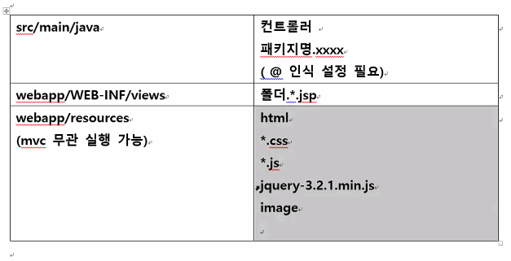

# 스프링 프레임워크

* Spring tool suite4

  https://spring.io/tools

  

  * 스프링 환경설정

  1. sts툴 새로 설치해서 spring3 추가

  2. web, server 기능 사용하기 위해 추가


## pom.xml에서 스프링 버전 바꾸기

* 처음에 스프링 버전이 3.1.1로 설정 되어있음 우린 다른걸 쓰므로...

```xml
<org.springframework-version>4.3.18.RELEASE</org.springframework-version>
```

* dependency가 라이브러리 관리하는 부분
* 우리가 쓸 라이브러리 추가(https://mvnrepository.com/ 이곳에서 라이브러리 따로 받을 수 있고, pom.xml에 밑 처럼 써도 라이브러리는 다운받아짐)

```xml
<!-- 파일 업로드 -->
<!-- https://mvnrepository.com/artifact/commons-fileupload/commons-fileupload -->
<dependency>
    <groupId>commons-fileupload</groupId>
    <artifactId>commons-fileupload</artifactId>
    <version>1.3.1</version>
</dependency>

<!-- https://mvnrepository.com/artifact/commons-io/commons-io -->
<dependency>
    <groupId>commons-io</groupId>
    <artifactId>commons-io</artifactId>
    <version>2.6</version>
</dependency>
```

* servlet-context.xml

  파일업로드-Multipart - 인식태그

  <bean class Multipart 객체... 


* 프레임워크

  경량의 컨테이너(여러 jar 파일(mb수준) - ioc, di 기능)

  일정 규격에 맞추어 프로그래밍을 하라는 것 => 강제적으로 규칙에 맞게 프로그래밍 해라

  프로그래밍의 뼈대 설계 => 살은 사용자가 구현한다.

  반은 이미 구현되어 제공되어있고, 나머지 반은 사용자가 구현해라 => 간결해짐

  

* 예를들어 지금까지 프로그래밍 할 때 일정한 규격은 있었지만 강제적으로는 없었다.

  로그인 - 요청/db연결/결과/응답

  회원가입 - 

  게시판 글쓰기 - 


* struts 프레임워크
* spring 프레임워크 - 자바로 구현된 대표적인 프레임워크 툴
  * spring 기능들 - ioC, DI, AOP, MVC, 다른 프레임워크 연동


## spring xml 파일들

pom.xml - 스프링 라이브러리 다운로드 및 버전 설정

web.xml - 웹 관련 설정

1. 스프링 시작 이전(url을 톰캣을 통해 DispatcherServlet으로 보내기 전에) 전달할 정보들
2. url을 스프링 DispatcherServlet에 보내줌
   3. encoding utf-8 설정을 따로 안하고 web.xml에 쓸거다
   4. 스프링 전달 추가 설정xml 정보

servlet-context.xml - 스프링 설정 내용

1. jsp(view) 경로와 확장자가 써있음
   1. 웹 정적인 요소들 - html, css, jss, image 등 resources라는 경로에 저장해라
   2. ㅇ
2. context:component-scan

추가 설정 xml

1. member.xml같이 따로 추가 설정할 것들


| interface TV                                                 |                                                              |
| ------------------------------------------------------------ | ------------------------------------------------------------ |
| powerOn(), Off, SoundUp(), Down                              |                                                              |
|                                                              |                                                              |
| SamsungTV implements TV                                      | LgTV implements TV                                           |
| TVFactory<br />TV getTV(String name)<br />=> spring에서 factory 역할을 하는 api를 사용할 것이다. | TVMain<br />1. TV 객체 변경시에도 기능 메소드 수정 필요없다.<br />2. TVFactory 전달하는 TV 객체 사용이 가능하고 의존한다.<br />3. 소스코드 변경시 최소화 할 수 있음<br />=> spring 프레임워크에서 di 전달 객체를 사용 |
| spring bean configuration xml<br />                          |                                                              |

1. 여러개 클래스에 규칙 강제화

2. TV 객체 변경시에도 기능이 들어있는 메소드의 수정이 필요없다.

   TV tv = xxxxTV();


* 스프링은 ioc 기능을 지원하며 di 구현방법을 사용한다.

## IOC => Inversion Of Control

* 제어의 역전

  * 원하는 객체 수정하고자 한다면 클래스 내부 new xxxx()

  * 원하는 객체 수정하고자 한다면 클래스 내부 new xxxx()

    => main 객체 생성 제어권 기본 있다

    =>TVFactory 객체 생성 제어권 줌 그래서 main을 역전함

    => 객체 타입은 한정하자 아무 객체나 받지말고 TV라는 객체로 => 그래서 TV인터페이스가 필요한 것

## DI  => Dependency Injection

* IOC라는 개념을 구현하는 방법

  main으로부터 전달받아야 함

  tvfactory 의존하여 생성한 객체만 주입받는다

  => 의존성 주입


* 우리가 필요해서 생성하는 객체는 없고 spring에 있는 api를 쓸 것임

```xml
<bean id="tv" class="spring.tv.SamsungTV" /> <!-- ???tv = new SamsungTV 이런 객체 만드는 것 -->
```


```java
public static void main(String[] args) {
		//spring factory 역할하는 api
		ApplicationContext factory = 
		new ClassPathXmlApplicationContext("spring/tv/tv.xml");
		
		TV tv = (TV)factory.getBean("tv");
		// LgTV tv = new LgTV();
		tv.powerOn();
		tv.soundUp();
		tv.soundDown();
		tv.powerOff();
		}
```

* xml

  <bean

  <property

  <constructor-arg


* member.xml

```xml
<bean id="dao" class="member.MemberDAO">
	<property name="membervo" ref="vo2"/>
</bean>

<bean id="vo" class="member.MemberVO">
	<property name="memberid" value="spring"/>
	<property name="password" value="1111"/>
</bean>

<bean id="vo2" class="member.MemberVO">
	<constructor-arg value="servlet"/>
	<constructor-arg value="2222"/>
</bean>
```

* MemberVO

  ```java
  public MemberVO() {}
  	public MemberVO(String memberid, int password) {
  
  		this.memberid = memberid;
  		this.password = password;
  	}
  setter, getter
  ```

  

* MemberDAO

  ```java
  MemberVO membervo;
  	
  public void setMembervo(MemberVO vo) {
      this.membervo = vo;
  }
  public boolean selectMember() {
      if(membervo.getMemberid().equals("spring") && membervo.getPassword() == 1111) {
          return true;
      }
      return false;
  }
  public void insertMember() {
      System.out.println(membervo.getMemberid() + " 회원님 정상적으로 회원 가입되셨습니다.");
  }
  ```

  

* DAO와 VO 이용하기 (자바 application,servlet , jsp, spling)

  1. 프레임워크! = 반은 완성 되어있으니 xml + 나머지 구현
  2. 경량의 컨테이너다!

  ====>

  servlet과 jsp은 tomcat, jdk 필요

  tomcat에는 꽤 많은 라이브러리가 있음 그에 반해 spring의 라이브러리는 적음

  3. 독립적 실행
  4. pojo 클래스 - plain old java object - 평소에 쓰던 자바 클래스 파일
  5. ioc, di 기능

* SERVICE 추가하기

  dao의 메소드 1개는 sql 1개 실행 // insertmember는 insert 하는 sql 메소드

  

  기능 = 서비스 1개 = 여러개의 sql = 여러개의 dao 메소드

  login(){ selectMember() }

  register(){ selectMember() 후 insertMember() }

  => MemberService 는 인터페이스로 만듦

  => 상속받은걸로 MemberFileService나 MemberDBService를 만듦


* member.xml

```xml
<bean id="service" class="service.member.MemberServiceImpl">
	<property name="memberDAO" ref="dao"></property>
</bean>

<bean id="dao" class="service.member.MemberDAO">
	<property name="membervo" ref="vo"/>
</bean>

<bean id="vo" class="service.member.MemberVO">
	<property name="memberid" value="spring"/>
	<property name="password" value="1111"/>
</bean>

<bean id="vo2" class="service.member.MemberVO">
	<constructor-arg value="servlet"/>
	<constructor-arg value="2222"/>
</bean>
```

* MemberVO

  ```java
  public MemberVO() {}
  	public MemberVO(String memberid, int password) {
  
  		this.memberid = memberid;
  		this.password = password;
  	}
  setter, getter
  ```

  

* MemberDAO

  ```java
  	MemberVO membervo;
  	
  	public void setMembervo(MemberVO vo) {
  		this.membervo = vo;
  	}
  	public boolean selectMember() {
  		if(membervo.getMemberid().equals("spring") && membervo.getPassword() == 1111) {
  			return true;
  		}
  		return false;
  	}
  	public void insertMember() {
  		System.out.println(membervo.getMemberid() + " 회원님 정상적으로 회원 가입되셨습니다.");
  	}
  ```

  * MemberMain

  ```java
  ApplicationContext factory = new ClassPathXmlApplicationContext("service/member/member.xml");
  MemberService service = (MemberService)factory.getBean("service"); //vo 객체도 얘가 가져옴
  
  service.login();
  		
  service.register();
  ```

  * MemberService.Interface

  ```java
  	public void login();
  	public void register();
  ```

  * MemberServiceImpl

  ```java
  	MemberDAO dao;
  	public void setMemberDAO(MemberDAO dao){
  		this.dao = dao;
  	}
  	@Override
  	public void login() {
  	 boolean result = dao.selectMember();
  	 if(result) {
  		 System.out.println("정상 로그인 사용자");
  	 }
  		
  	}
  	@Override
  	public void register() {
  		boolean result = dao.selectMember();
  		if(!result) {
  			dao.insertMember();
  		
  	}
  	}
  ```

  

1.  spring pojo 클래그(dao, vo, service) 구현한다

2. 서로 다른 클래스 공통 메소드 필요로 하면 인터페이스를 만든다

3. 1. spring 연결하는 xml을 작성한다 <bean, <property, <constructor-arg
   2. 자바 

   ​		@WebServlet() => WebServlet annotation

   ​		annotation - 자바 실행시 실행 환경으로 알려주는 설명


## Spring annotation

| ioc di xml 태그 방식                   | annotation                                                   |
| -------------------------------------- | ------------------------------------------------------------ |
| <bean id ="a" class="ss.A"             | @Component("a")<br />class A{}                               |
| <bean id="a" class="ss.xxxServiceImpl" | @Service<br />class xxxServiceImpl implements xxxService{}   |
| <bean id="a" class="ss.ADAO"           | @Repository<br />class ADAO{<br /> @Autowired => 찾아와라<br />AVO vo;}<br /><br />@Component("vo")<br />class AVO{}<br /><br />@Repository<br />class BDAO{} |
| <property                              | @Autowired                                                   |
| <constructor-arg                       | @Qualifier 우선순위                                          |


* 스프링 AOP 기능

  AOP - (aspect oriented programming)


## Spring MVC

### 모델 1 non-mvc

* web server - servlet, jsp(html포함), dao, vo 
* 웹서버 개발 형식 - 흐름 복잡하다. 서버 내부 jsp 파일 관계 분석이 어렵다


초창기 모델임


### 모델 2 = servlet + jsp 구조

* 기능을 더 원하면 DAO를 늘리거나 추가하면 된다.

* 각 장점을 살리자

  servlet - 결국 자바이니까 자바 로직 처리하기가 쉽다. (dao 호출)

  dao, vo - 실제 처리 결과물들을 생성하고 저장

  jsp - 응답

* 모델 1보다는 규칙적이다


​		


​	MVC


### MVC 우선 구현해보자


=> spring MVC


// http://localhost:9090/ 이후  webmvc/member/a.spring = URI


DispatcherServlet - 클라리언트 모든 요청 집중 ("/") frontcontroller 중앙통제 역할

```java
@WebServlet("/")
public class DispatcherServlet extends HttpServlet {

	protected void doGet(HttpServletRequest request, HttpServletResponse response) throws ServletException, IOException {
		String uri = request.getRequestURI(); // http://localhost:9090/  이후  webmvc/member/a.spring = URI
		String[] sp = uri.split("/");
		
		String result = sp[sp.length - 1]; 
		System.out.println(result);
		
		//hello.spring => c
		HandlerMapping mapping = new HandlerMapping();
		Controller con = mapping.getController(result);
		
		// m, v
		String viewname = con.handleRequest(request, response);
		
		//이동
		RequestDispatcher rd = request.getRequestDispatcher(viewname);
		rd.forward(request, response);
		
	}
}
```


HandlerMapping - 특정  url - 컨트롤러 매핑 정보

```java
	HashMap<String, Controller> mappings;
	public HandlerMapping() {
		mappings = new HashMap<String, Controller>();
		mappings.put("hello.spring", new HelloController());
	}
	public Controller getController(String key) {
		return mappings.get(key);
	}
```


Controller - 메소드

```java
	public String handleRequest(HttpServletRequest request, HttpServletResponse response);
```


HelloController - 특정 url - model, view 설정

```java
@Override
public String handleRequest(HttpServletRequest request, HttpServletResponse response) {
	request.setAttribute("insa", "hello jsp"); //model 
	return "hello.jsp"; //view
	
	/*jsp 내에서 
	 * 받아내는 방법 <%=request.getAttribute("insa")
	 * ${insa}
	 * */
	}
```


hello.jsp - 응답

```jsp
<h1>컨트롤러부터 전달하는 모델 데이터</h1>
<h3><%=request.getAttribute("insa") %></h3>
<h3>${insa}</h3>
```

servlet-context 

```xml
	<context:component-scan base-package="edu.spring.multi" />
	
	<!-- hello.spring url - new HelloController() - HandlerMapping 하는거 설정할 예정 -->
	
	<beans:bean id="hello" class="edu.spring.multi.HelloController"/> 
	
	<beans:bean id="urlMapping" class="org.springframework.web.servlet.handler.SimpleUrlHandlerMapping"> 
		<beans:property name="mappings">
			<beans:props>
				<beans:prop key="/hello.spring">hello</beans:prop>
			</beans:props>
		</beans:property> <!-- HandlerMapping의 mapping 메소드 만드는중-->
```


### spring api를 이용한 MVC 구현


* HelloController에서 implements 하는 Contoller는 우리가 만든 인터페이스가 아닌

  스프링 프레임워크에서 제공하는 Controller 사용함

HelloController로 모델"hello" 뷰"hello.jsp" 만드는건 동일하였음


## annotation


| ioc id | @Component                                          |
| ------ | --------------------------------------------------- |
|        | @Service                                            |
|        | @Repository                                         |
|        | @Autowired                                          |
|        | @Qualifier                                          |
|        |                                                     |
| mvd    | @RequestParam                                       |
|        | @RequestMapping                                     |
|        | @ModelAttribute                                     |
|        | @Controller- 상속 안받는 대신에 컨트롤러클래스 위에 |


HelloAnnotationController

```java
@Controller
public class HelloAnnotationController {

	/*
	 * @Override public String handleRequest(HttpServletRequest request,
	 * HttpServletResponse response) { request.setAttribute("insa", "hello jsp");
	 * //model return "hello.jsp"; //view
	 * }
	 */
	@RequestMapping("/hello.spring")
	public ModelAndView handleRequest(HttpServletRequest request, HttpServletResponse response) throws Exception {
	ModelAndView mv = new ModelAndView();
	mv.addObject("insa", "Hello spring mvc~~~");
	mv.setViewName("hello"); //확장자 필요없음 /WEB-INF/views/hello.jsp => hello
	return mv;
```

servlet-context.xml

```xml
	<!-- Handles HTTP GET requests for /resources/** by efficiently serving up static resources in the ${webappRoot}/resources directory -->
	<resources mapping="/resources/**" location="/resources/" />
```

=========================================================================


* 모든 요청은 처음부터 jsp로 가는것이 아니다.


LoginController

```java
@Controller
public class LoginController {
	1. 
	@RequestMapping("/loginform")
	public ModelAndView loginstart() {
		ModelAndView mv = new ModelAndView();
		//mvc (m이 없는 경우)
		mv.setViewName("loginform");
		return mv;
	}
	2. view만 필요할 때
    @RequestMapping("/loginform")
	public String loginstart() {
		return "loginform"; //view만 필요할 때 
	}
    3. return도 싫다
     @RequestMapping("/loginform")
	public void loginstart() {
	}
    4. view를 알려주지 않으면 view 이름은 요청한 uri이름과 동일해진다.
    @RequestMapping("/loginform")
	public ModelAndView loginstart() {
		ModelAndView mv = new ModelAndView();
		mv.addObject("model", "모델값입니다.");
		return mv;
    5. String 뒤에는 생략되는게 좀.. 많다
    @RequestMapping("login")
	public String login() {
		return "redirect:/loginform";//redirect://uri
		//String이고 redirect로 시작된다면 /loginform을 찾아서 메소드를 실행하라는 뜻
	}
    
	@RequestMapping("/loginresult")
	public ModelAndView loginresult(HttpServletRequest request) {
        //post 방식으로 갈거면 한글 깨지니까 request.setCharacterEncoding("utf-8");
        //request 필요없이 파라미터 이름이 같으면 받아올 수 있음 String인데 int로도 받아올 수 있음
        public ModelAndView loginresult(String id, int pw) throws Exception{
        public ModelAndView loginresult(@RequsetParam("id") String memberid,@RequsetParam("pw") int pw) throws Exception{ 
            
            //객체로도 가져올 수 있음
            public ModelAndView loginresult(@ModelAttribute("vo") LoginVO vo) throws Exception{
            
		String memberid = request.getParameter("memberid");
		String password = request.getParameter("password");
		String result = "";
		if(memberid.equals("spring") && password.equals("1111")) {
			result = "정상 로그인 사용자입니다.";
		}
		else {
			result = "로그인 정보 오류입니다.";
		}
		ModelAndView mv = new ModelAndView();
		mv.addObject("login", result);
		mv.addObject("user", memberid);
		mv.setViewName("loginresult");
		return mv;//spring이 setview를 보고 forward해주는거임 이 때 request객체도 같이 전송됨
        		//즉 addObject로 안보내도 loginresult에서 result.getparameter로 읽을 수 있음
	}
}
```

loginform.jsp

```jsp
<form action="loginresult">
아이디<input type="text" name="memberid"><br>
암호<input type="password" name="password"><br>
<input type=submit value="스프링로그인">
</form>
```

loginresult.jsp

```jsp
<h1>로그인 처리 결과입니다</h1>
<h3>${user }</h3>
<h3>${login }</h3>
```


| 400      | 매핑 메소드 매개변수가 form 전달 데이터 타입과 일치하지 않을 때<br />"111a1" => int <br />파일 업로드 - 파일 타입이 인식안됐을 때 |
| -------- | ------------------------------------------------------------ |
| 404      | spring<br />@RequestMapping, @Controller 확인 , jsp 확인     |
| 405      |                                                              |
| 500      |                                                              |
| 200, 300 | 정상실행                                                     |


컨트롤러 메소드의 매개변수(선언이 좀 자유로움)

| 서블릿 api              | HttpSession에 데이터 저장한다면 서블릿에 하던 그대로 사용하면 된다. |
| ----------------------- | ------------------------------------------------------------ |
| 자바 데이터 타입의 변수 | 요청 파라미터 이름과 동일한 이름으로 변수를 둔다면 자동으로 저장됨.<br />타입을 자동으로 변환시킬 수 있어서 편하기도 함<br />@RequestParam("요청 파라미터 이름") |
| 자바 객체               | @ModelAttribute("jsp이름") LoginVO                           |


모든 spring mvc

| web.xml             | "/" -이게 있으면 DispatcherServlet으로 실행해줄게<br />(...servlet-context.xml 설정을 참고해라 라고 dispatcher에게 알려줌)<br /> |
| ------------------- | ------------------------------------------------------------ |
| servlet-context.xml | view 저장경로 / 확장자<br />@xxx 설정 인식 패키지 설정       |
|                     |                                                              |
|                     |                                                              |


### web.xml에서 한글 인코딩하기

서블릿 api를 안쓰려고 하는데 request를 쓰면 안되잖아? request.setCharaterEncoding("utf-8") 그럼 이걸 설정을 어디서 할까?

```xml
	<filter>
	<filter-name>encoding</filter-name>
	<filter-class>
	org.springframework.web.filter.CharacterEncodingFilter
	</filter-class>
	<init-param>
		<param-name>encoding</param-name>
		<param-value>utf-8</param-value>
	</init-param>
	</filter>
	<filter-mapping>
	<filter-name>encoding</filter-name>
	<url-pattern>/*</url-pattern>
	</filter-mapping>
```


실습


* servlet-context.xml

```xml
	<context:component-scan base-package="edu.spring.multi" />
	
	
	<!-- mvcannotation.HelloAnnotiationController... -->
	<context:component-scan base-package="mvcannotation"/> <!-- mvc로 이 패키지 두 개만 쓰겠다 -->
```

* MemberVO

  xml에 MemberVO를 저 둘 중 패키지에 넣어주기

* MemberController

  list라는 모델을 넘겨야됨

  		<beans:property name="prefix" value="/WEB-INF/views/" />
  		<beans:property name="suffix" value=".jsp" />
  		=> mv.serViewName("memberlist")를 쓰면 /WEB-INF/views/memberlist.jsp로 자동으로 된다.

  ```java
  @Controller
  public class MemberController {
  	@RequestMapping("/memberlist")
  	ModelAndView getMemberList() {
  		ArrayList<MemberVO> list = new ArrayList<MemberVO>();
  		list.add(new MemberVO("member1", 1111, "김회원", "kim@mul.com"));
  		list.add(new MemberVO("member2", 1111, "박대한", "kim@mul.com"));
  		list.add(new MemberVO("member3", 1111, "김민국", "kim@mul.com"));
  		list.add(new MemberVO("member4", 1111, "홍길동", "kim@mul.com"));
  		list.add(new MemberVO("member5", 1111, "최회원", "kim@mul.com"));
  		ModelAndView mv = new ModelAndView();
  		mv.addObject("memberlist", list);
  		mv.setViewName("member/memberlist"); //경로와 확장자가 xml에 저장
  		return mv;
  	}
  ```

* memberlist.jsp

```jsp
자바 코드로 짜기
<%
 ArrayList list = (ArrayList)request.getAttribute("memberlist");
for(MemberVO vo : list){
	out.println(vo);
%>

jstl로 짜기
<%@ taglib prefix="c" uri="http://java.sun.com/jsp/jstl/core" %>
<c:forEach items="${memberlist }" var="vo">
<h3>${vo.memberid }</h3>
</c:forEach>
```

multi/memberlist 로만 view를 호출할 수 있음

WEB-INF/view/... 에 있는 파일은 보안 폴더라서 절대 호출 불가능 controller에서 설정한 request.mapping 어노테이션에서 설정한 uri로만 간다!!


## get / post

http 요청 클라이언트 방식

| get                                                          | post |
| ------------------------------------------------------------ | ---- |
| <form action=" " <br /><a href="/multi/insert> =>모든 html 하이퍼링크는 get방식임 |      |

```java
@RequestMapping("/loginform")
public ModelAndView loginstart() {
    ModelAndView mv = new ModelAndView();
    mv.addObject("model", "모델값입니다."); 
    //mv.setViewName("loginform")을 안써주는 이유는 view를 알려주지 않으면 view 이름은 요청한 uri이름과 동일해진다.
    return mv;
}
```


```java
	//memeber가 추가되려면 아이디 암호 이름 이메일 입력하는 form view가 필요
	//입력되면 db 저장(mybatis)후 출력view
	@RequestMapping(value="/insert" , method=RequestMethod.GET )
	String memberForm() {
		return "member/insertform"; //member폴더안에 insertform.jsp 보여달라!!
	}
	
===============================================
	@RequestMapping(value="/insertprocess", method=RequestMethod.POST)
	ModelAndView memberProcess(MemberVO vo) { 
		//@RequestParam("memberid") String id => 원래 이런 형식으로 insertform에서 파라미터 받아와야됨.
		//vo.setMemberid(request.getParameter("memberid"); + 3개 필드 setter해야하는데 이걸 안해도 되는 효과~
		
		ModelAndView mv = new ModelAndView();
		
		if(!vo.getMemberid().equals("spring")) {
			mv.addObject("result", "정상 회원 아이디로 사용 가능합니다.");
		}
		else {
			mv.addObject("result", "아이디 중복입니다. 다른 아이디 입력하세요!");
		} //모델을 다르게
		mv.setViewName("member/insertprocess");
		return mv;
	}
```


```jsp
<h1>${param.memberid } : ${result }</h1>
<a href="/multi/insert">회원가입</a>하러갑시다.
```


```jsp
<h1> 회원 가입 폼</h1>
<form action="/multi/insertprocess" method=post>
아이디<input type="text" name="memberid"><br>
암호<input type="password" name="password"><br>
이름<input type="text" name="membername"><br>
이메일<input type="text" name="email"><br>
<input type="submit" value="회원가입">
</form>
```

==================

method 방식이 서로 다르면 RequestMapping value 값을 같게주고 쓸 수 도 있음 왜? 메소드에 따라 결과가 달라지니까


## resources 폴더



mvc와 무관한 것들 넣고 사용한다.

servlet-context.xml 파일에 정의돼있음

### 이미지

이미지는  webapp/resources/images 이 루트에 있어야함

### jquery

jquery 또한 resources 폴더에 넣고 사용

```jsp
<script src="/multi/resources/jquery-3.2.1.min.js"> </script>
<script>
	$(document).ready(
		function() {
			alert(1);
	});
</script>
```


## 비즈니스로직과 main    ////     mvc

* 요청 - 처리(자바 수행 결과) - 응답
* main을 빼고 Controller로 할 것이다.
* main은 html과 연결하는 애가 아니니까
* main 


### web.xml

```xml
tomcat 서버가 /multi 컨텍스트로 정보를 전달 => root-context.xml도 읽어라
<context-param>
    <param-name>contextConfigLocation</param-name>
    <param-value>/WEB-INF/spring/root-context.xml</param-value>
</context-param>


member.xml도 읽게하고 싶다. 그러면 밑 처럼 DispatcherServlet한테 이것도 읽으라고 설정
<context-param>
    <param-name>contextConfigLocation</param-name>
    <param-value>
        /WEB-INF/spring/root-context.xml
        classpath:annotation/service/member/member.xml
    </param-value>
</context-param>

<servlet>
	<servlet-name>appServlet</servlet-name>
	<servlet-class>org.springframework.web.servlet.DispatcherServlet</servlet-class>
	<init-param>
		<param-name>contextConfigLocation</param-name>
		<param-value>/WEB-INF/spring/appServlet/servlet-context.xml</param-value>
	</init-param>
	<load-on-startup>1</load-on-startup>
</servlet>
```

## 하.. 왜 못찾지?

* 주 원인 
  * servlet-context를 보면   <context:component-scan base-package="mvcannotation"/> 이것도 있고
  * 서비스단으로 만든거때문에 그럼 ????

### annotation

* di
  * @Component
  * @Repository
  * @Service
  * @Autowired
* mvc
  * @Controller
  * @RequestMapping
  * @RequestParam
  * @ModelAttribute


# 28장 파일 업로드

* pom.xml에서 파일 업로드에 관한 라이브러리 2개 다운

  ```xml
  <!-- 파일 업로드 -->
  <!-- https://mvnrepository.com/artifact/commons-fileupload/commons-fileupload -->
  <dependency>
      <groupId>commons-fileupload</groupId>
      <artifactId>commons-fileupload</artifactId>
      <version>1.3.1</version>
  </dependency>
  
  <!-- https://mvnrepository.com/artifact/commons-io/commons-io -->
  <dependency>
      <groupId>commons-io</groupId>
      <artifactId>commons-io</artifactId>
      <version>2.6</version>
  </dependency>
  ```

* servlet-context.xml에 파일업로드 기능 추가

  ```xml
  	<!-- 파일 업로드 기능 추가 -->
  	<beans:bean id="multipartResolver" 
  	class="org.springframework.web.multipart.commons.CommonsMultipartResolver" />
  ```

* method는 post


* UploadVO

  ```java
  	String name;
  	String desciption;
  	MultipartFile file1;
  	MultipartFile file2;
  ```

  

* UploadController

  ```java
  @Controller
  public class UploadController {
  	
  	@RequestMapping(value="/fileupload", method=RequestMethod.GET)
  	public String uploadForm() {
  		return "/upload/uploadform";
  	}
  	
  	@RequestMapping(value="/fileupload", method=RequestMethod.POST)
  	public String uploadResult(@ModelAttribute("vo") UploadVO vo) throws IOException {
  		
  		//Multipart multi1 = vo.getFile1();
  		//서버 c:/kdigital/upload 에 업로드 되게 설정하자
  		MultipartFile multi1 = vo.getFile1();
  		MultipartFile multi2 = vo.getFile2();
  		//파일명 추출
  		String filename1 = multi1.getOriginalFilename();
  		String filename2 = multi2.getOriginalFilename();
  		//파일 업로드
  		String savePath = "c:/kdigital2/upload/";
  		
  		//파일이 계속 중복됨 어케할까?
  		File file1 = new File(savePath + filename1);
  		File file2 = new File(savePath + filename2);
  		//저장
  		multi1.transferTo(file1);
  		multi2.transferTo(file2);
  		
  		return "/upload/uploadresult";
  	}//uploadResult end
  	//파일 안덮어쓰게 만드는 방법 = 파일 이름 안겹치게 만드는 방법
  	public static String getUuid() {
  		return UUID.randomUUID().toString().replaceAll("-", "").substring(0, 10);
  	}
  }
  
  ```

  

* uploadform.jsp

  ```jsp
  <form action="/multi/fileupload" method="post" enctype="multipart/form-data">
  전송자 : <input type=text name="name"><br>
  설명 : <input type=text name="description"><br>
  파일명1 : <input type="file" name="file1"><br>
  파일명2 : <input type="file" name="file2"><br>
  <input type="submit" value="전송">
  </form>
  ```

  

* uploadersult.jsp

  ```jsp
  ${vo.file1.originalFilename } <!-- String filename1 = multi1.getOriginalFilename(); 여기서 getter니까 get빼고 소문자 -->
  ${vo.file2.originalFilename } 파일 저장완료
  
  ```


# REST API

* restful 기능 mvc

  * rest

    a.jsp에서 /b 실행 응답화면 b.jsp를 포함하고 싶다

  * ajax를 쓰려면....

    1. 요청 => 응답

    2. 요청 처리 시간 동안 클라이언트는 대기한다. 화면에는 아무 변화가 없어야한다.

       => 동기화 통신 방식(synchronous)

       기본적인 http로는 비동기화 통신 방식을 구현할 수 없다.

    3. 변경 => 요청 => 화면은 계속 이용할 수 있고, 응답하면 변경됨

       => 비동기화 통신 방식(asynchronous)

       => java script가 이 일을 해줄 수 있음 

       => (초기방식 : 비동기 통신시 전달 데이터 형태)xml 자바스크립트의 객체  형식을 쓰자{"a" : "test" , "b":100, "c":true, "d":{....} }

       => ajax (asynchronous javascript and xml)

    

    현재 방식은 json => java script object notation

    자바 객체 방식 a = { "변수명" : "값"}

    나중에 읽을 땐? => a.변수명

    

    http 이전 상태 정보를 유지할 수 없어서 추가 HttpSession 구현


@ResponseBody 이 어노테이션을 쓸 예정

```java
@Controller
class A{
    @RequestMapping("/a")
    String m(){
        return "a";  => view 이름
    }
    
    @RequestMapping("/b")
    @ResponseBody => 너 문서의 바디부분만 이용할거야
    String m2(){
        return "b"; => "b" 결과 리턴 jsp파일이 아님 b="{"":"", "":""}"
    }
}
```


* ajax 쓰려면 pom.xml 다운받을 라이브러리 필요

  ```xml
  <!-- https://mvnrepository.com/artifact/com.fasterxml.jackson.core/jackson-databind -->
  <dependency>
      <groupId>com.fasterxml.jackson.core</groupId>
      <artifactId>jackson-databind</artifactId>
      <version>2.12.4</version>
  </dependency>
  
  ```

  

* ajaxlogin.jsp

  ```jsp
  <script src="/multi/resources/jquery-3.2.1.min.js"></script>
  <script>
  $(document).ready(function(){
  	$("#ajaxbtn").on('click', function(){
  		$.ajax({
  			url : "/multi/ajax/login",
  			data : {'id':$("#idd").val(), 'pw':$("#pass").val() },
  			type : 'post',
  			dataType : 'json',
  			success : function(serverdata){
  				alert(serverdata);
  			}
  		});
  	});	
  });
  </script>
  </head>
  <body>
  <!--  <form action="/multi/ajax/login" method=post>
  	아이디<input type="text" name="id"><br>
  	암호<input type="password" name="pw"><br>
  	<input type="submit" value="로그인">
  </form> --> 이 방식이 아닌 ajax방식으로
  
  
  아이디<input type="text" name="id" id="idd"><br>
  암호<input type="password" name="pw" id="pass"><br>
  <button id="ajaxbtn">ajax로그인</button>
  
  <div id=result></div>
  ```

  


LoginAjaxController

```java
@Controller
public class LoginAjaxController {
	
	@RequestMapping(value = "/ajax/login", method=RequestMethod.GET)
	public String loginForm() {
		return "/ajax/ajaxlogin";
	}
	
	@RequestMapping(value = "/ajax/login", method=RequestMethod.POST, produces = {"application/json;charset=utf-8"})
	@ResponseBody
	public String loginResult(String id, String pw) {//{'id':$("#idd").val(), 'pw':$("#pass").val() }
		//처리
		String result = "";
		if(id.equals("spring") && pw.equals("1111")) {
			result = "{\"process\" : \"정상로그인\", \"role\" : \"admin\"}";
					
		}
		else {
			result = "{\"process\" : \"비정상로그인\", \"role\" : \"user\"}";
		}
		return result; //spring 에서 String으로 리턴되면 javascript에선 이걸 json으로 받아들임
	}
	
	@RequestMapping(value = "/ajax/memberinform", method=RequestMethod.GET, produces = {"application/json;charset=utf-8"})
	@ResponseBody
	public MemberVO getMemberInform() {
		MemberVO vo = new MemberVO("MEMBER1", 1111, "김기술", "tech@a.com");
		return vo; //리턴 자바 객체를 JSON형태로 변환시켜줌
				   //{"memberid" : "MEMBER1" , "password" : "1111",....
	}
	
	@RequestMapping(value = "/ajax/memberlist", method=RequestMethod.GET, produces = {"application/json;charset=utf-8"})
	@ResponseBody
	public ArrayList<MemberVO> getMemberList(int count) {
		ArrayList<MemberVO> list = new ArrayList<MemberVO>();
		list.add(new MemberVO("member1", 1111, "김회원", "kim@mul.com"));
		list.add(new MemberVO("member2", 1111, "박대한", "kim@mul.com"));
		list.add(new MemberVO("member3", 1111, "김민국", "kim@mul.com"));
		list.add(new MemberVO("member4", 1111, "홍길동", "kim@mul.com"));
		list.add(new MemberVO("member5", 1111, "최회원", "kim@mul.com"));

		return list; //배열형태로 리턴해준다
	}
```

ajaxlogin.jsp

```jsp
<%@ page language="java" contentType="text/html; charset=UTF-8"
    pageEncoding="UTF-8"%>
<!DOCTYPE html>
<html>
<head>
<meta charset="UTF-8">
<title>Insert title here</title>
<script src="/multi/resources/jquery-3.2.1.min.js"></script>
<script>
$(document).ready(function(){
	$("#ajaxbtn").on('click', function(){
		$.ajax({
			url : "/multi/ajax/login",
			data : {'id':$("#idd").val(), 'pw':$("#pass").val() },
			type : 'post',
			dataType : 'json',
			success : function(serverdata){
				$("#result").html("<h1>" + serverdata.process + "역할로" + serverdata.role + "</h1>");
				$("#result").css("color", "blue");
			}
		});
	});	
	$("#ajaxbtn2").on('click', function(){
		$.ajax({
			url : "/multi/ajax/meberinform",
			type : 'get',
			success : function(serverdata){
				$("#result").html("<h1>" + serverdata.memberid + " " + serverdata.password + "</h1>");
				$("#result").html("<h1>" + serverdata.membername + " " + serverdata.email + "</h1>");
				$("#result").css("color", "blue");
				//json을 String으로 변경
				alert(JSON.stringify(serverdata));
				//string을 json으로 형변환
				 var o = JSON.parse(serverdata);
				 alert(o);
			}
		});
	});	
	
	$("#ajaxbtn3").on('click', function(){
		$.ajax({
			url : "/multi/ajax/meberlist",
			data : {'count' : 5}, //5명의 회원정보만
			type : 'get',
			success : function(serverdata){
				
				$("#result").css("color", "blue");
				for(var i = 0 ; i < servercata.length ; i++){
				$("#result").append("<h1>" + serverdata[i].memberid + " " + serverdata[i].password + "</h1>");
				$("#result").append("<h1>" + serverdata[i].membername + " " + serverdat[i].email + "</h1>");
				}
				//json을 String으로 변경
				alert(JSON.stringify(serverdata[0]));
				//string을 json으로 형변환
				 var o = JSON.parse(serverdata[0]);
				 alert(o);
			}
		});
	});	
	
});
</script>
</head>
<body>
<!--  <form action="/multi/ajax/login" method=post>
	아이디<input type="text" name="id"><br>
	암호<input type="password" name="pw"><br>
	<input type="submit" value="로그인">
</form> -->


아이디<input type="text" name="id" id="idd"><br>
암호<input type="password" name="pw" id="pass"><br>
<button id="ajaxbtn">ajax로그인</button>

<button id="ajaxbtn2">회원정보 주세요~</button>

<button id="ajaxbtn3">회원리스트 주세요~</button>

<div id=result></div>

</body>
</html>
```


# mybatis

jdk jdbc

spring jdbc

mybatis

| jdk jdbc                                                     | spring jdbc    | mybatis                                                      |
| ------------------------------------------------------------ | -------------- | ------------------------------------------------------------ |
| java.sql.*                                                   | 스프링제공jdbc | jdbc 프레임워크                                              |
| 코드 반복이 심하다<br />Class.forName("")<br />DriverManager.... |                | 1. xml설정<br />sql 문장 자바 코드 제거<br />2. connectionpool, sql 실행 객체 자동 생성<br />3. sql 조회 결과를 여러 타입으로 받기 |
|                                                              |                |                                                              |

## 라이브러리 다운을 위한 pom.xml 수정

* spring maven 기능을 사용하는 중

```xml
<!-- https://mvnrepository.com/artifact/org.mybatis/mybatis -->
<dependency>
    <groupId>org.mybatis</groupId>
    <artifactId>mybatis</artifactId>
    <version>3.4.6</version>
</dependency>

우리가 쓰던 오라클 드라이버
<!-- https://mvnrepository.com/artifact/com.oracle.database.jdbc/ojdbc8 -->
<dependency>
    <groupId>com.oracle.database.jdbc</groupId>
    <artifactId>ojdbc8</artifactId>
    <version>19.7.0.0</version>
</dependency>

연동하는 라이브러리
<!-- https://mvnrepository.com/artifact/org.mybatis/mybatis-spring -->
<dependency>
    <groupId>org.mybatis</groupId>
    <artifactId>mybatis-spring</artifactId>
    <version>1.3.2</version>
</dependency>

spring- 로 시작하는 라이브러리 버전은 spring 프레임워크랑 같아야함 4.3.18.release
<!-- https://mvnrepository.com/artifact/org.springframework/spring-jdbc -->
<dependency>
    <groupId>org.springframework</groupId>
    <artifactId>spring-jdbc</artifactId>
    <version>4.3.18.RELEASE</version>
</dependency>

```


## xml 생성

* mybatis-config.xml

  ```xml
  <?xml version="1.0" encoding="UTF-8" ?>
  <!DOCTYPE configuration
    PUBLIC "-//mybatis.org//DTD Config 3.0//EN"
    "http://mybatis.org/dtd/mybatis-3-config.dtd">
    <!-- mybatis db 연결정보 세팅 파일 -->
  <configuration>
  
  <!-- 1. sql 실행 결과 Resultset으로 받았었는데 EmpVO타입으로 결과를 매핑할 것이다. -->
  <typeAliases>
  <typeAlias type="mybatis.EmpVO" alias="empVO"/>
  </typeAliases>
  
  <!-- 2. DataSource 설정 -->
  <environments default="development">
  	<environment id="devleopment">
  		<transactionManager type="JDBC"/>
  		<dataSource type="POOLED">
  			<property name="driver" value="oracle.jdbc.driver.OracleDriver"/>
  			<property name="url" value="jdbc:oracle:thin:@localhost:1521"/>
  			<property name="username" value="hr"/>
  			<property name="password" value="hr"/>
  		</dataSource>
  	</environment>
  </environments>
  <!-- 3. sql 정의 매퍼 설정 -->
  <mappers>
  <mapper resource="mybatis/sql-mapping.xml"/>
  </mappers>
  
  </configuration>
  
  ```

* sql-mapping.xml

  ```xml
   <mapper>
   <select id="emplist" resultType="empVO"> //EmpVO타입으로 결과를 매핑할 것이다.
   	select * from employees
   </select>
   </mapper>
  ```


* mybatis-config.xml


* sql-mapping.xml

  ```xml
  <?xml version="1.0" encoding="UTF-8" ?>
  <!DOCTYPE mapper PUBLIC "-//mybatis.org//DTD Mapper 3.0//EN"
    "http://mybatis.org/dtd/mybatis-3-mapper.dtd">
  
   <mapper namespace="emp">
   <select id="emplist" resultType="empVO">
   	select * from employees
   </select>
   
   <select id="empone" resultType="empVO" parameterType="int">
   	select * from employees where employee_id=#{id}
   </select>
   
   <insert id="insertemp" parameterType="empVO">
   	insert into employees(employee_id, first_name, last_name, email, phone_number, job_id, hire_date)
   	values(#{employee_id}, #{first_name}, #{last_name}, #{email}, #{phone_number}, #{job_id}, sysdate)
   </insert>
   
   <update id="updateemp" parameterType="empVO">
   update employees
   set last_name = #{last_name} , department_id= #{department_id}
   where employee_id = #{employee_id}
   </update>
   
   <delete id="deleteemp" parameterType="String">
   delete employees where first_name like #{name}
   </delete>
       
   <select id="cnt" resultType="int">
   select count(*) from employees
   </select>
   
   <select  id="empdeptlist" resultType="empVO" parameterType="int[]">
  	select * from employees where department_id in 
  	<foreach collection="array" item="d_list" open="(" close=")" separator=",">
  		#{d_list}
  	</foreach>
   </select>
   </mapper>
  ```

  

* EmpVO

  ```java
  	int employee_id;
  	String first_name, last_name, email, phone_number, hire_date, job_id;
  	double salary, commission_pct;
  	int manager_id, department_id;
  ```

  

* EmpDAO

  ```java
  	SqlSession session;
  	public void setSqlSession(SqlSession session) {
  		this.session = session;
  	}
  	
  	//sql 정의 태그 중에서 id=emplist 실행해서 결과를 가져와라
  	public List<EmpVO> getEmpList(){
  		List<EmpVO> list = session.selectList("emp.emplist");
  		return list;
  	}
  	public EmpVO getEmpOne(int id) {	
  	EmpVO vo = session.selectOne("emp.empone", id);
  	return vo;
  	//System.out.println(vo.getEmployee_id() + ":" + vo.getFirst_name() + ":" + vo.getHire_date() + ":" + vo.getSalary());
  	}
  	public void insertEmp(EmpVO vo) {
  		session.insert("emp.insertemp", vo); //emp.insertemp는 sql-mapping 에서 namespace와 id임
  	}
  	
  	public void updateEmp(EmpVO vo) {
  		session.update("emp.updateemp", vo);
  	}
  	public void deleteEmp(String name) {
  		session.delete("emp.deleteemp", name);
  	}
  	public int countEmp() {
  		int cnt = session.selectOne("emp.cnt");
  		return cnt;
  	}
  	
  	public List<EmpVO> empDeptList(int[] dept_list) {
  		List<EmpVO> list = session.selectList("emp.empdeptlist", dept_list);
  		return list;
  	}
  ```

  

* EmpService

  ```java
  	public List<EmpVO> getEmpList();
  	public EmpVO getEmpOne(int id);
  	public void insertEmp(EmpVO vo);
  	public void updateEmp(EmpVO vo);
  	public void deleteEmp(String name);
  	public int countEmp();
  	public List<EmpVO> empDeptList(int[] a);
  ```

  

* EmpServiceImpl

  ```java
  	EmpDAO dao;
  	public void setDao(EmpDAO dao) {
  		this.dao = dao;
  	}
  	@Override
  	public List<EmpVO> getEmpList() {
  		return dao.getEmpList();
  	}
  
  	@Override
  	public EmpVO getEmpOne(int id) {
  		return dao.getEmpOne(id);
  	}
  	@Override
  	public void insertEmp(EmpVO vo) {
  		EmpVO RESULT = dao.getEmpOne(vo.getEmployee_id());
  		if(RESULT == null)  {dao.insertEmp(vo);}
  	}
  	@Override
  	public void updateEmp(EmpVO vo) {
  		dao.updateEmp(vo);
  	}
  	@Override
  	public void deleteEmp(String name) {
  		name = "%" + name + "%";
  		dao.deleteEmp(name);
  	}
  
  	@Override
  	public int countEmp() {
  		return dao.countEmp();
  	}
  	@Override
  	public List<EmpVO> empDeptList(int[] a) {
  		return dao.empDeptList(a);
  	}
  ```

  

* EmpMain

  ```java
  	public static void main(String[] args) throws Exception {
  		//마이바티스 설정된 것이 있으면 모든 파일 읽기
  		SqlSessionFactoryBuilder builder = new SqlSessionFactoryBuilder();
  		
  		//mybatis-config.xml 불러오기, 연결, /결과타입과 sql정의를 써놓음
  		SqlSessionFactory factory = builder.build(Resources.getResourceAsReader("mybatis/mybatis-config.xml"));
  		
  		//데이터베이스 연결 객체 생성
  		SqlSession session = factory.openSession(true); //session이 커넥션임
  		//true를 안쓰면 커밋이 자동으로 안돼서 데이터가 저장 안됨.
  		
  		
  		EmpDAO dao = new EmpDAO();
  		dao.setSqlSession(session);
  		
  		EmpServiceImpl service = new EmpServiceImpl();
  		service.setDao(dao);
  		
  		/*List<EmpVO> list = service.getEmpList();
  		for(EmpVO vo : list) {
  			System.out.println(vo.getEmployee_id() + ":" + vo.getFirst_name() + ":" + vo.getHire_date() + ":" + vo.getSalary());
  		}
  		
  		EmpVO vo = service.getEmpOne(150);
  		System.out.println(vo.getEmployee_id() + ":" + vo.getFirst_name() + ":" + vo.getHire_date() + ":" + vo.getSalary());*/
  		
  		insert 사번이 300번이고 길동 홍 hong@a.com 010.123.4567 오늘입사 IT_PROG
  		EmpVO vo = new EmpVO();
  		vo.setEmployee_id(300);
  		vo.setFirst_name("길동");
  		vo.setLast_name("홍");
  		vo.setEmail("hong@a.com");
  		vo.setPhone_number("010.123.4567");
  		vo.setJob_id("IT_PROG");
  		
  		service.insertEmp(vo);
  		
          update
  		EmpVO vo = new EmpVO();
  		vo.setEmployee_id(300);
  		vo.setLast_name("김");
  		vo.setDepartment_id(50);
  		service.updateEmp(vo);
  		
  		delete
  		String name = "길동";
  		service.deleteEmp(name);
          
          int cnt = service.countEmp();
  		System.out.println("총 사원수 = " + cnt);
  		
  		System.out.println("==========================");
  		int[] dept_list = {10, 50, 80};
  		List<EmpVO> list = service.empDeptList(dept_list);
  		for(EmpVO vo: list) {
  			System.out.println(vo.getFirst_name() + ":" + vo.getDepartment_id());
  		}
  	}
  ```


* 실습


