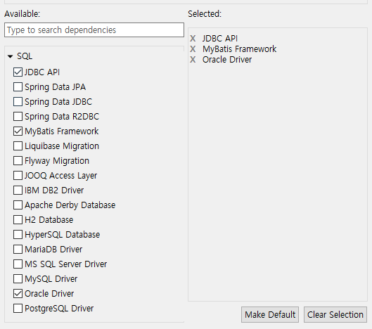

# 스프링 부트

* xml 설정이 최소화
* 

pom.xml수정

```xml
<!-- for jsp -->
	<dependency>
        <groupId>org.apache.tomcat.embed</groupId>
        <artifactId>tomcat-embed-jasper</artifactId>
        <scope>provided</scope>
    </dependency>
<!-- for jsp jstl -->
    <dependency>
        <groupId>javax.servlet</groupId>
        <artifactId>jstl</artifactId>
    </dependency>
<!--for tomcat restart -->
	<dependency>
        <groupId>org.springframework.boot</groupId>
        <artifactId>spring-boot-devtools</artifactId>
        <optional>true</optional>
	</dependency>

```

* application.properties


## spring boot ajax

* 스프링 부트는 몇 가지 라이브러리를 포함하고 있는데 그 중 하나가 spring-databind이다 pom.xml에서 추가할 필요가 없다.
  * jquery를 사용하기 위해 jquery js는 static 폴더에 넣는다
    * script src="http:localhost:9001/jquery-3.2.1.min.js"

## spring boot file upload

* 위와 동일하게 라리브러리 추가 필요 없다.
* 업로드 파일 용량을 늘릴려면

```xml
spring.servlet.multipart.maxFileSize=100MB
```

* xml componentscan 쓸 것을 @ComponentScan을 쓸것임
* Myboot0Application.java에 업로드 컨트롤러 인식하도록 씀
* 없으면 현재 패키지 컨트롤러만 인식함

```java
@ComponentScan(basePackageClasses = UploadController.class) => upload 패키지 컨트롤러만 인식
=> upload 패키지는 경로 안써도 됨
   패키지 구별은 패키지명만 배열 형식으로 나열하는 옵션을 씁니다 아님 패키지명.클래스명.class  형식으로 씁니다

```

* 현재 패키지도 인식하게 하려면

```java
@ComponentScan(basePackageClasses = TestController.class)
or
@ComponentScan => 현재 패키지 스캔
```

== hello.jsp ajaxbtn 작동 안되니 수정하셈

@SpringBootApplication

* 스프링 부트 시작 클래스임
* main 메소드라 생각하면 된다.

@ComponentScan(basePackageClasses = xxxController)

* xxxController 패키지를 스캔해라

### 업로드 된 이미지 올리기

@Configuration

* 특정 파일 외부 폴더 저장하고, 외부 폴더를 웹 서버에 등록

* 웹서버는 폴더 접근을 제한함
  * "src/main/resources/static" => 그래서 경로는 여기부터 시작해서 /images/americano.jpg 이 방식이 됨
  * 현재 프로젝트가 아닌 경로는 접근이 불가하다.
* 그러면 어떻게 웹서버가 무엇을 바뀌어야 할까?
  * servlet.jsp에선 server.xml에 <Context path=" c:/kdigital2 ... uri="/upload" 이런 형식을 추가
  * spring mvc에서도 쓸 수 있는거잖아!
    * ㅇㅇ 맞음 톰캣에 web.xml( 내장된 tomcat 설정)이 있음
  * 스프링 부트에서는  server.xml, web.xml이 없음
    * WebMvcConfigurer 인터페이스에서 상속받아 xxx메소드를 오버라이딩 해서 위 같은 내용을 쓰면됨
    * @Configuration = application.properties
* MyWebMVCConfig.java

```java
@Configuration
public class MyWebMVCConfig implements WebMvcConfigurer{

	@Override
	public void addResourceHandlers(ResourceHandlerRegistry registry) {
		registry.addResourceHandler("/upload/**").addResourceLocations("file:///c:/kdigital2/upload/");
	}
    file:/// 뒤 부분 경로를
    /upload/... 으로 쓸게~ 라는 의미임.
```

## 스프링 부트에서  mybatis 실행하기

| spring mvc 에서는 어떻게 설정했나                            | spring boot 어떻게 설정할까?                                 |
| ------------------------------------------------------------ | ------------------------------------------------------------ |
| pom.xml에서 4개 라이브러리 추가<br />mybatis.jar,mybatis-spring, framework, oracle | 스프링 부트 스타터 항목 설정<br />jdbc api, oracle driver, mybatis |
| spring-mybatis.xml<br />스프링과 마이바이트 연동<br />db연결, mapping 파일 정보 | application.properties에 설정                                |
| mybatis-config.xml<br />클래스 alias정보까지                 | 그대로 사용                                                  |
| sql-mapping.xml<br />sql 매핑                                | sql 매핑 방식은 같지만 <br />수정(표현 방법이 다름) 필요     |
| web.xml<br />spring-mybatis.xml이 연동 설정 등록<br />       | web.xml은 스프링 부트에 없다 <br />application.properties에서 설정한다. |
| servlet-context.xml<br /><context:component-scan...<br />jsp 확장자/경로<br />html 경로<br />파일업로드 api MultipartResolver | @ComponentScan으로 대신할 것<br /><br />jsp 같은 경로 확장자는 application.properties에서 설정<br />html 경로는 resources/static 폴더에 반영<br />부트에 내장됨 |

1. stater 설정

   

2. application.properties

   ```
   #mybatis oracle
   spring.datasource.driver-class-name=oracle.jdbc.OracleDriver
   spring.datasource.url=jdbc:oracle:thin:@localhost:1521:xe
   spring.datasource.username=hr
   spring.datasource.password=hr
   
   #config파일
   mybatis.config-location=src.main/resources/mybatis-config.xml
   mybatis.config-location=classpath:mybatis-config.xml 위를 이렇게 줄이기
   #mapper파일
   mybatis.mapper-locations=classpath:mappers/sql-mapping.xml
   ```

   

| EmpDAO                                                       | sql-mapping.xml                                              |
| ------------------------------------------------------------ | ------------------------------------------------------------ |
| @Autowired<br />SqlSession session;                          |                                                              |
| session.selectList()<br />session.selectOne<br />session.insert<br />session.delete<br />session.update | <select id=" " resultType=" " parameterType=" "              |
|                                                              |                                                              |
| 스프링 부트에선                                              |                                                              |
| @Mapper<br />EmpDAO<br />클래스였는데 인터페이스로 바꿈      | sql-mapping.xml                                              |
| @Autowired<br />SqlSession session;                          | namespace는 매퍼 이름과 같게<br />select id를 DAO 메소드와 이름을 동일하게 만듦 |
| public void emplist();                                       | =>  namespace="xxx.EmpDAO"<br />=>  <select id="emplist"     |

3. EmpDAO interface !!

   ```java
   class EmpDAO => interface EmpDAO
       
   @Autowired
   SqlSession session; => @Mapper
       
   public List<EmpVO> getEmpList(){ ... } => public List<EmpVO> empList();
   ```

4. 부트 시작파일 MyBoot0Application 수정

   ```java
   @MapperScan(basePackageClasses = EmpDAO.class)
   ```


### 실습 DB에 파일 업로드하기

* 실습

데이터베이스 저장

```sql
create table files
(name varchar2(30),
description varchar2(2000),
filename1 varchar2(100),
filename2 varchar2(100)
);
```

UploadVO

```java
	String name;
	String description;
	MultipartFile file1;
	MultipartFile file2;
	String filename1;
	String filename2;
```

UploadController

```java

@Controller
public class UploadController {
	
	@Autowired
	@Qualifier("uploadservice")
	UploadService service;
	
	@RequestMapping(value="/fileupload", method=RequestMethod.GET)
	public String uploadForm() {
		return "/upload/uploadform";
	}
	
	@RequestMapping(value="/fileupload", method=RequestMethod.POST)
	public String uploadResult(@ModelAttribute("vo") UploadVO vo) throws IOException{
		//전송 파일 2개 객체 생성
		MultipartFile multi1 = vo.getFile1();
		MultipartFile multi2 = vo.getFile2();
		//파일명 추출
		String filename1 = multi1.getOriginalFilename();
		String filename2 = multi2.getOriginalFilename();
		
		//서버 c:/kdigital2/upload 폴더 저장
		String savePath = "c:/kdigital2/upload/";
		
		
		//확장자
		String ext1 = filename1.substring(filename1.lastIndexOf("."));
		String ext2 = filename2.substring(filename2.lastIndexOf("."));
		
		filename1 = getUuid()+ext1;
		filename2 = getUuid()+ext2;
		
		
		File file1 = new File(savePath + filename1);
		File file2 = new File(savePath + filename2);	
		
		//저장
		multi1.transferTo(file1);
		multi2.transferTo(file2);
		
		//db에 저장
		vo.setFilename1(filename1);
		vo.setFilename2(filename2);
		
		service.insertFiles(vo);
		
		//System.out.println(getUuid());
		return "/upload/uploadresult";//${vo.file1}
	}//uploadResult end

	public static String getUuid() {
		return UUID.randomUUID().toString().replaceAll("-", "").substring(0, 10);
	}
	
}
```

UploadDAO

```java
@Mapper
@Repository
public interface UploadDAO {
	public void insertFiles(UploadVO vo);
}
```

UploadService

```java
public interface UploadService {
	public void insertFiles(UploadVO vo);
}
```

UploadServiceImpl

```java
@Service("uploadservice")
public class UploadServiceImpl implements UploadService {
	@Autowired
	UploadDAO dao;
	
	@Override
	public void insertFiles(UploadVO vo) {
		dao.insertFiles(vo);
	}
```

? @Qualifire??

답이 늦었습니다.  @Service("service")
public class EmpServiceImpl implements EmpService --> 여기선 우리가 이름을 "service"라고 주었는데요 다른 이름보다 "service"라는 이름의 클래스 객체를 우선하기 때문에 그렇습니다.
@Service("service")
public class UploadServiceImpl implements UploadService--> 이 부분도 "service"로 이름을 변경하면 @Qualifier 안쓰셔도 됩니다. 단 현재는 그렇게 하려면 스프링 시작 클래스에서 @ComponentScan(basePackageClasses = EmpMybatisController.class) @MapperScan(basePackageClasses = EmpDAO.class) 두 부분을 주석처리한 후 해보세요. "service" 라는 이름 중복 때문에 그렇습니다.


### 실습 파일 보여주기

a태그로 파일 내용을 출력하는 뷰 보여주기

실제 파일은 c:kdigital2\upload 폴더에 있음 그러나 MyWebMVCConfig.java에 설정한 것이 있음.

* UploadController

  ```java
  	@RequestMapping(value="/myfilelist", method=RequestMethod.GET)
  	public ModelAndView fileListForm() {
  		ModelAndView mv = new ModelAndView();
  		mv.setViewName("/upload/filelistform");
  		return mv;
          이런건 걍 스트림으로 써
  	}
  	@RequestMapping(value="/myfilelist", method=RequestMethod.POST)
  	public ModelAndView fileListGet(String name) {
  		List<UploadVO> listVO = service.fileList(name);
  		ModelAndView mv = new ModelAndView();
  		mv.addObject("list", listVO);
  		mv.setViewName("/upload/filelist");
  		return mv;
  	}
  ```

  * UploadDAO

```java
@Mapper
@Repository
public interface UploadDAO {
	public void insertFiles(UploadVO vo);
	public List<UploadVO> selectFiles(String name);
}
```

* UploadMapping

  ```xml
  <mapper namespace="upload.UploadDAO">
  <select id="selectFiles" resultType="uploadVO" parameterType="String">
   	select * from files where name=#{name}
  </select>
  ```

  

* filelistform.jsp

  ```jsp
  <form action="myfilelist" method="post">
  	전송자 : <input type="text" name="name">
  	<input type="submit" value="전송버튼">
  </form>
  ```

  

* filelist.jsp

  ```jsp
  <c:forEach items="${list }" var="uploadVO">
  <h3><a href="/upload/${uploadVO.filename1 }">${uploadVO.filename1}</a></h3>
  <h3><a href="/upload/${uploadVO.filename2 }">${uploadeVO.filename2}</a></h3>
  </c:forEach>
  ```

  

