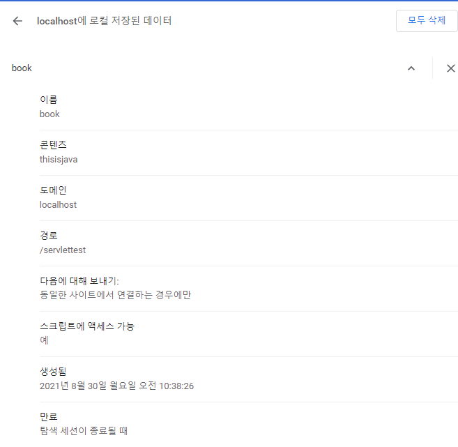
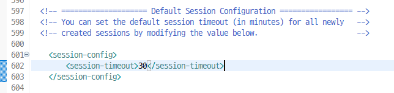
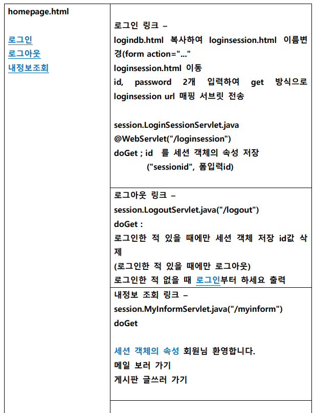
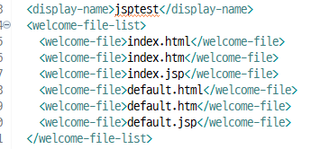
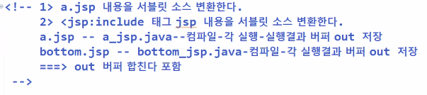
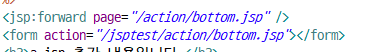
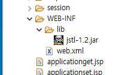
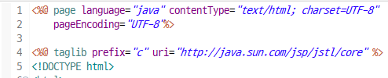

# 웹 서버.2

## api 이름(서블릿, jsp)

| 상속                                                    | javax.servlet.http.HttpServlet                               |
| ------------------------------------------------------- | ------------------------------------------------------------ |
| 매개변수 선언                                           | javax.servlet.http.HttpServletRequest<br />javax.servlet.http.HttpServletResponse |
| 다른 서블릿 포함 or 이동<br />다른 서블릿과 데이터 공유 | RequestDispatcher<br />request.setAttribute("","");<br />request.getAttribute("");<br />request.removeAttribute(""); |
| 다른 서블릿과 데이터 공유                               | javax.servlet.http.Cookie                                    |
| 다른 서블릿과 데이터 공유                               | javax.servlet.http.HttpSession<br />session.setAttribute("","");<br />session.getAttribute("");<br />session.removeAttribute(""); |


## Attribute

```java
AServelt
@WebServlet("/")
request.getParameter("id");
request.setAttribute("name", "campus"); // 데이터를 주고받아야할 때 
RequestDispatcher rd = request.getRequestDispatcher("/");
rd.forward(request, response)
```

```java
BServelt
@WebServlet("/")
request.getParameter("id");
String name = (String)request.getAttribute("name"); // "campus" 데이터를 공유받을 수 있음

공유받는 방법 2가지
```


## Session, Cookie

* include나 forward 관계가 아님에도 데이터를 공유할 수 있는 것이 Cookie와 Session임

| http 프로토콜이 url을 요청                                   |
| ------------------------------------------------------------ |
| 파라미터 전송 방식 두 가지 get/post                          |
| 첫번째 요청(id = test)-연결생성(init)-처리-응답-연결해제(destroy) => 연결이 해제되면 모든 요청/응답객체삭제 |
| 두번째 요청(id = ???? 서버에 정보가 남아있지 않음) -연결생성(init)-처리-응답-연결해제(destroy) |

* http 프로토콜 서버는 모든 클라이언트의 이전 정보를 서버에 남기지 않음 => 메모리한계 때문에


### 서블릿 데이터 공유

| 쿠키                                               | 세션                   |
| -------------------------------------------------- | ---------------------- |
| 브라우저 종료시 혹은 종료 이후 지정 시각까지       | 부라우저 종료시        |
| 클라이언트 컴퓨터측 저장기술                       | 서버 컴퓨터측 저장기술 |
| 문자열만 저장 가능<br />(인코딩 설정해서 보내야함) | 자바객체 저장 가능     |
| 보안에 취약함                                      | 보안에 유리함          |


| 1. 클라이언트 요청한다.<br /><br />4. 쿠키 내용이 브라우저로 전송된다. | 2. 서버 에서 쿠키 객체로 생성한다.<br />Cookie c = new Cookie("쿠키명", "값");<br />c.setMaxAge(60x60x24); => 쿠키 살아있는 시간<br />3. 클라이언트에게 응답한다<br />response.addCookie(c); |
| ------------------------------------------------------------ | ------------------------------------------------------------ |
| 5. 클라이언트 요청한다<br />(동일 서버로부터 받은 쿠키도 같이 전송) | 6. 클라이언트로부터 쿠키를 읽어온다<br />Cookies[] coo = request.getCookies();<br />coo[].getName();<br />coo[].getValue(); |


### 쿠키 만들기

* 부라우저 종료시 쿠키는 삭제된다
* 전달하는 데이터가 한글이라면 java.net.URLDecoder.

```java
Cookie c = new Cookie("book", "thisisjava");
response.addCookie(c);
		
response.setContentType("text/html;charset=utf-8");
PrintWriter out = response.getWriter();
out.println("클라이언트로 주문한 책 정보를 전송했습니다.");
```



* 부라우저 종료되어도 쿠키 유지

```java
c.setMaxAge(60x60x24);
```


### 쿠키 가져오기

```java
response.setContentType("text/html;charset=utf-8");
PrintWriter out = response.getWriter();
Cookie[] coo = request.getCookies();
for(int i = 0 ; i < coo.length ; i++) {
    String name = coo[i].getName();
    String value = coo[i].getValue();
    out.println("책 제목을 지정한 쿠키 이름은 " + name + 
                " 이고 책 제목은" + value + "인 책을 주문해 놓으신 적이 있습니다.");
```

* 쿠키는 문자열만 저장 가능하기에 한글인경우 인코딩을 해야함

  Cookie c = new Cookie("book", URLEncoder.encode("이것이 자바다", "utf-8"));

* 인코딩을 했다면 디코딩을 해서 쿠키를 받아와야함

  value = URLDecoder.decode("value", "utf-8");


### 세션

| 1. 클라이언트 요청한다.<br />                                | 2. 처리 -  세션 데이터 저장 - 공유<br />HttpSession session = request.getSession();<br />false - 최초 연결시 setAttribute<br />3. session.setAttribute("세션 속성명", 값(object)); |
| ------------------------------------------------------------ | ------------------------------------------------------------ |
| 4. 클라이언트 2번째 요청<br /><br /><br /><br />7. 응답      | 5. HttpSession session = request.getSession();<br />true - 이전 연결 중<br />6. Object o = session.getAttribute("세션 속성명");<br />=> 형변환 필요시 하면됨 |
| 8. 클라이언트 요청한다(로그아웃 경우처럼 서버에 남겨높은 정보 삭제) | 9.  HttpSession session = request.getSession();<br />true - 이전 연결 중<br />10. session.removeAttribute("세션 속성명") |

* 로그인을 할 필요 없는 상황에서
* 브라우저가 종료되고
* Object 타입으로 받기 때문에 모든 타입의 데이터를 받을 수 있음


### 세션만들기

```java
HttpSession session = request.getSession();
session.setAttribute("session1", "multicampus"); //브라우저 종료시
		
//브라우저에 응답
response.setContentType("text/html;charset=utf-8");
PrintWriter out = response.getWriter();
out.println("서버에 세션 정보를 저장했습니다.");
```


### 세션 꺼내오기

```java
HttpSession session = request.getSession();
//Object o = session.getAttribute("session1");
String o = (String)session.getAttribute("session1");

//브라우저에 응답
response.setContentType("text/html;charset=utf-8");
PrintWriter out = response.getWriter();
out.println("서버에 세션 정보" + o + "를 조회하였습니다.");
//인코딩 안해도됨 서버에서 저장하고 브라우저에 올리는 것이 아니기 때문에
```

### 세션 삭제 방법

1. 브라우저가 종료돼도 삭제된다.
2. removeAttribute("속성") - 하나씩 삭제
3. invalidate() - 모든 속성 삭제(브라우저 종료하지 않았어도)
4. 30분간 액션이 없으면 자동으로 삭제
   * 30분이란 것은 web.xml에 session-timeout에 설정되어 있음
   * session.setMaxInactiveInterval(30*60); 코드로도 변경 가능




* datasource 설정, port 번호 수정 설정 - Servers\tom...\server.xml, web.xml => 모든 프로젝트 공통 설정
* 서블릿 url 매핑 - dynamic web project\webcontent\WEB-INF\web.xml => 각 프로젝트마다

```java
session.invalidate();
```


### 세션이 있는지 없는지

```java
if(session.isNew() == false && session.getAttribute("session1") != null && session.getAttribute("session2") != null) {
    
}
```


### 실습




## JSP

jsp - java server page / html + java

* 처음 자바 웹서버는 서블릿 구조만 제공되었다.

  그 후 서블릿 기능 중 별도 화면 기능을 쉽고 간결하게 작업하기 위해 JSP가 등장했다.

  톰캣 서버가 jsp 내용을 자바 언어로 만들어줌

| 서블릿                                                       | jsp                                                          |
| ------------------------------------------------------------ | ------------------------------------------------------------ |
| 자바 언어 구현 + html태그 응답                               | 자바 언어 구현 + html태그 응답                               |
| class A extends HttpServlet<br />doGet(){<br />응답 - 자바 언어 내부에 html 언어를 포함한 형식<br />out.prinln("<h1 ... ")} | <% 서블릿 api + db + DVO, VO객체생성 자바문장; %><br /><html<br /><body<br />html 양식 언어 내부 자바 문장 포함<br />jsp 태그와 html 태그 혼용 가능<br />서블릿처럼 메소드 오버라이딩 필요없다 |


### 작성

1. servlet api + jsp api + 내장 객체들
2. <% %>

| html 태그  | html<br />css<br />js<br />jquery                            |
| ---------- | ------------------------------------------------------------ |
| jsp 기본   | <%  지역변수 선언, 자바 문장   %><br />표현문 태그 <%=변수명     %><br />선언문 태그 <%! 메소드 정의, 필드변수 정의    %><br />jsp 주석 태그<%--     --%><br />지시문 태그<%@    %> |
| jsp action | <jsp:xxxx   />                                               |
| jsp custom | <c:xxx    />                                                 |
| el         | ${}<br />$("#i")                                             |
| 내장객체   | jsp는 서블릿보다 간결하게 응답, servlet api 그대로 사용할 수 있음 그러나 자바 문장 구현을 없애자 해서 나온 것이 내장 객체임<br />내장객체 : request, response, exception, session, application 서블릿과 달리 만들 필요가 없음 |

response.setContentType("text/html;charset=utf-8"); => contentType="text/html;charset=utf-8"


```jsp
<%! String user = "다른값"; %> <!-- =>필드변수 -->

<%! void notService(){
	System.out.println(user); /* =>필드변수 불러옴 */
} %>

<% String user = "test"; %> <!-- =>_jspService 메소드의 지역 변수라서 -->

<h1 id="jsp"><%=user %>, <%=this.user %></h1>
```


* jsp 사용 스크립트 언어 = 자바 언어문장 = 스크립트릿 태그

### jsp에서 구구단 만드는 방법 2가지

1. html 안에 jsp 넣기

```jsp
<table>
<% 	for(int j=1 ; j<10 ; j++){ %>
	<tr><%for(int i=2 ; i<10 ; i++){%>
			<td><%=i + "*" + j + "=" + i * j%></td>
		<%}%>
	</tr>
	<%}%>

</table>
```

2. jsp안에 서블릿에서 사용하던 것들 넣기

```jsp
<table>
<%	for(int j=1 ; j<10 ; j++){ 
	out.println("<tr>");
	for(int i=2 ; i<10 ; i++){
	out.println("<td>" + i + "*" + j + "=" + i * j + "</td>");
		}
	out.println("</tr>");
	}
%>
</table>
```


### 내장 객체(자주 사용하는 객체 미리 변수 선언되어 제공)

1. _jspService() 

   <%! %> 태그 제외하면 jsp 모든 내용은 _jspService()실행코드가 된다.

2. _jspService() 지역변수처럼 취급됨

| 내장 객체 이름 | 타입                                                         | 역할                                                         | 메소드                 |
| -------------- | ------------------------------------------------------------ | ------------------------------------------------------------ | ---------------------- |
| request        | javax.servlet.http.HttpServletRequest                        | 요청                                                         | request.getParameter() |
| response       | javax.servlet.http.HttpServletResponse                       | 응답                                                         |                        |
| out            | javax.servlet.jsp.JspWriter(PrintWriter 하위)                | 응답 출력 객체                                               | out.println()          |
| session        | javax.servlet.http.HttpSession                               | 브라우저 내부 공유                                           |                        |
| page           | java.lang.Object(자바에서 this같은 존재)                     | 현재 jsp 소스를 서블릿 소스로 변환 - 컴파일 -  객체로 생성(tomcat 서버가 사용) |                        |
| pageContext    | javax.servlet.jsp.PageContext                                | 현재 jsp 내장객체 조회 객체                                  |                        |
| config         | javax.servlet.ServletConfig                                  | web.xml 파일에 변수 저장하고 jsp 파일에서 사용               |                        |
| application    | javax.servlet.ServletContext<br />application.getAttribute("변수");<br />application.setAttribute("변수", ""); | 현재 컨텍스트의 모든 jsp파일 공유(브라우저 종료 이후에도 가능) |                        |
| exception      | java.lang.Throwable                                          | 예외                                                         |                        |

### session, application

포함/이동 서블릿까지만 공유 request.setAttribute("","")

하나의 브라우저 내부에서 종료까지 공유 session.setAttribute("","")

ie + 크롬 모든 브라우저에서 서버 종료까지 공유 application.setAttribute("","")


### jsp 작성

```jsp
<% 
if(request.getMethod().equals("POST")) { //request.getMethod => get인지 post인지 확인
request.setCharacterEncoding("utf-8");  //post 방식에선 인코딩 설정 필요하다.
String id = request.getParameter("id");
String pw = request.getParameter("pw");
String[] con = request.getParameterValues("con"); 
%>

<h1> 아이디 = <%=id %></h1>
<h1> 암호 = <%=pw %></h1>
<% for(int i = 0 ; i < con.length ; i++) { %>
	<h1> 관심사항 = <%=con[i] %></h1>
<% }
} %>
```


```jsp
<h1>총 버퍼 크기 = <%= out.getBufferSize() %> </h1>
<% out.println("출력합니다"); %>
<%= "출력합니다." %>
<h1>남은 버퍼 크기 = <%= out.getRemaining() %> </h1> //out.getRemaining() => 남은 버퍼크기 확인
<!-- 1. out.println 메소드는 클라이언트 즉각 출력되는 것이 아님
	 2. 서버 jsp 출력내용 모아서 버퍼 메모리에 임시 저장함
	 3. 다른 파일로 이동이 없고, 출력을 하지말라는 명령도 없으면 파일 끝까지 수행
	 4. 브라우저 출력
	 다른 파일로 이동시에는 현재 파일 출력 내용 무시하고 이동 -->
```

### jsp주석과 html주석

* html 주석은 브라우저까지 보내지만

* jsp 주석은 서버까지만 보냄 

  즉, 버퍼 크기에서도 jsp 주석은 크기 차지 안함

```jsp
<% out.clearBuffer(); %> <!-- 모든 출력이 취소됨 -->
```


### 예외처리 

* http 프로토콜 응답코드

| 200, 300                  | 정상 실행 정상 결과 응답                                     |
| ------------------------- | ------------------------------------------------------------ |
| 404                       | 요청파일 서버내부 존재x                                      |
| 405                       | get방식 => doPost메소드구현<br />post방식 => doGet메소드구현 |
| 400<br />http:....?su=aaa | 스프링에서 보임<br />처리메소드(int su)<br />클라가 요청한 타입과 서버에서 정한 타입이 맞지 않을 때 |
| 500                       | 서블릿이나 jsp 논리적인 오류                                 |
|                           | exception 내장객체로 예외처리                                |


| a.jsp <%@ page errorPage="c.jsp"%><br />NullPointerException 발생 - 500<br />try{<br />}catch(){} | c.jsp (예외처리전담jsp)<br /><%@ page isErrorPage ="true" %> => 이제 exception 내장객체 사용 가능 |
| ------------------------------------------------------------ | ------------------------------------------------------------ |
| b.jsp<%@ page errorPage="c.jsp"%><br />NullPointerException 발생 - 500<br />try{<br />}catch(){} |                                                              |
|                                                              |                                                              |
|                                                              |                                                              |

* 오류 전달 및 setAttribute로 오류 발생 파일명 전달

```jsp
<% 
request.setAttribute("filename", request.getRequestURI());
String name = request.getParameter("name");
if(name.length() <= 10) {
	out.println("<h1>올바른값</h1>");
	System.out.print("b");
}
%>
```

* c.jsp를 통해 예외 처리 및 오류 발생 파일명 확인

```jsp
<%
if(exception.getClass().getName().equals("java.lang.NumberFormatException")){
	out.println(request.getAttribute("filename"));
	out.println("<h3>숫자를 입력해야 진행됩니다.</h3>");
} else if(exception.getClass().getName().equals("java.lang.nullPointerException")){
	out.println(request.getAttribute("filename"));
	out.println("<h3>이름은 필수 입력 사항입니다.<h3>");
}
%>
```


### welcome 파일 지정하기



* jsptest까지 쳤을 때 순서대로 welcome-file을 찾음


## 자바 코드를 없애는 액션 태그


### jsp에서 forward, include

서블릿

RequestDispatcher rd = requset.getRequestDispatcher("/b or b.jsp");

rd.include

rd.forward


jsp

<jsp:include page="/b or b.jsp"/>


서블릿

MemberVO vo = new MemberVO("","","","");

request.setAttribute("이름",vo);


jsp

<jsp:useBean id="vo" class="vo.MemberVO" scope="request" >

​									class="패키지명.클래스명"

<jsp:setProperty property="name" name="vo" value="java" param="id"

​							짓는 이름													불러오는 파라미터 이름

<jsp:getProperty property="name" name="vo"

<%= 안써도 브라우저 출력됨						

| a.jsp                      | b.jsp                |
| -------------------------- | -------------------- |
| 처리 응답 이미지출력       | 처리 응답 이미지출력 |
| bottom.jsp로 이미지를 출력 |                      |

```jsp
<h1>a.jsp 처리 내용입니다.</h1>
<h1>회원 리스트를 출력합니다.</h1>
<jsp:include page="bottom.jsp" /> => 
<h3>a.jsp 추가 내용입니다.</h3>
```



action 태그와 page 태그 차이




### 생성자 호출, setter, getter  

<%@page import="vo.MemberVO">

<% MemberVO vo = new MemberVO();  => 기본생성자만 호출가능

vo.setMemeberid("member1")%>  => setter 호출

<%=vo.gerMemberid()%> =>


<jsp:useBean id="vo" class="vo.MemberVO" />

<jsp:setProperty name="vo" property="memberid" value="member1" />

<jsp:getProperty name="vo" property="memberid" />

=> jsp파일 (html태그 웹디자이너 + 자바 문장 웹개발자)


* 자바 코드로 짜는 방법

```jsp
<%
//request.setCharacterEncoding("utf-8");
String memberid = request.getParameter("memberid");
String password = request.getParameter("password");
String membername = request.getParameter("membername");
String email = request.getParameter("email");

MemberVO vo = new MemberVO();
vo.setMemberid(memberid);
vo.setPassword(Integer.parseInt(password));
vo.setMembername(membername);
vo.setEmail(email);

%>
아이디:<%=vo.getMemberid() %><br>
암호:<%=vo.getPassword() %><br>
이름:<%=vo.getMembername()%><br>
이메일:<%=vo.getEmail() %><br>

```

* 액션 태그로 짜는 방법

```jsp
<jsp:useBean id="vo" class="vo.MemberVO"/> <!-- MemberVO 기본생성자 호출 --> 
<jsp:setProperty property="memberid" name="vo" value="<%=request.getParameter(\"id\") %>"/>
<jsp:setProperty property="password" name="vo" value="<%=Integer.parseInt(request.getParameter(\"pw\")) %>"/>
<jsp:setProperty property="membername" name="vo" value="<%=request.getParameter(\"name\") %>"/>
<jsp:setProperty property="email" name="vo" param="mail" %>"/>

value 속성이 너무 길어서 param 사용하자
param="id"
<h1> 액션 태그로 읽어옵니다.</h1>
<jsp:getProperty property="memberid" name="vo" />
<jsp:getProperty property="password" name="vo" />
<jsp:getProperty property="membername" name="vo"/>
<jsp:getProperty property="email" name="vo" />
```

* jsp:setProperty에서 property값과 파라미터 변수명이 같으면 param, value를 생략할 수 있다.

* jsp:usebean scope=" "

  page - 공유 안할것이다.

  request - forward, include 되어도 공유하겠다.

  session - 같은 브라우저 내에서는 계속 쓰겠다.

  application - 서버가 시작돼서 종료까지 계속 쓰겠다.

### request

```jsp
<jsp:useBean id="vo" class="vo.MemberVO" scope="request"/>
 
<h1> 액션 태그로 읽어옵니다.</h1>
<jsp:getProperty property="memberid" name="vo" />
<jsp:getProperty property="password" name="vo" />
<jsp:getProperty property="membername" name="vo"/>
<jsp:getProperty property="email" name="vo" />
```

```jsp
<jsp:useBean id="vo" class="vo.MemberVO" scope="request"/> //전달하는 쪽 전달 받는쪽 둘 다 써야됨

= 같은 의미

if(requset.getAttribute("vo") ==null){
 MemberVO vo = new MemberVO();
 request.setAttribute("vo",vo);
 } 
 else{
 	MemberVO vo = request.getAttribute("vo");
 }
 
<jsp:setProperty property="*" name="vo"/>

<jsp:forward page="other.jsp"/>
```


### session

```jsp
<jsp:useBean id="vo" class="vo.MemberVO" scope="session"/>
 
<h1> 액션 태그로 읽어옵니다.</h1>
<jsp:getProperty property="memberid" name="vo" />
<jsp:getProperty property="password" name="vo" />
<jsp:getProperty property="membername" name="vo"/>
<jsp:getProperty property="email" name="vo" />
```

```jsp
<jsp:useBean id="vo" class="vo.MemberVO" scope="session"/>

= 같은 의미

if(requset.getAttribute("vo") ==null){
 MemberVO vo = new MemberVO();
 session.setAttribute("vo",vo);
 } 
 else{
 	MemberVO vo = request.getAttribute("vo");
 }

<jsp:setProperty property="*" name="vo"/>

```


* 실습

action = "/jsptest/memberinform" or "memberinform"

슬래쉬가 있으면 컨텍스트루트부터

슬래쉬가 없으면 = 현재 파일과 같은 루트에 있다.


<jsp:useBean id="vo" class="vo.MemberVO" scope="request" >

​									class="패키지명.클래스명"

* servlet에 넣음

```java
		String id = request.getParameter("id");
		String pw = request.getParameter("pw");
		
		if(id.equals("action") && pw.equals("1111")) {
			MemberVO vo = new MemberVO(id, Integer.parseInt(pw), "이기술", "lee@campus.net");
			
			
			request.setAttribute("vo", vo);
			RequestDispatcher rd = request.getRequestDispatcher("/memberinform.jsp");
			rd.forward(request, response);
		}
		else {
			response.setContentType("text/html;charset=utf-8");
			PrintWriter out = response.getWriter();
			out.print("<h3>id나 암호 입력이 올바르지 않습니다.</h3>");
		}
```

* vo에서 정한 필드변수이름

  memberid, password, membername, email

```jsp
<jsp:useBean id="vo" class="vo.MemberVO" scope="request"/>

<jsp:getProperty property="memberid" name="vo"/>
<jsp:getProperty property="password" name="vo"/>
<jsp:getProperty property="membername" name="vo"/>
<jsp:getProperty property="email" name="vo"/>

<%-- <h1><% out.println(vo); %></h1> --%>
```


### el 언어

EL : EXPRESSION LANGUAGE - 브라우저 응답 내용, 쉽고 간결한 표현이 가능한 언어, jsp 파일 내부에서 사용

<% request.getParameter("id"); %>

==>${param.id}

${ el 언어 문법 }

- 변수 연산자 제어문 객체 함수


* 데이터 타입

  논리값 true, false

  정수, 실수 

  문자열 - " ", ' '

  null

```jsp
<h3>${ i2 = 100 }</h3>
<h3>${ i3 = 3.14 }</h3>

덧셈 : ${"100" + i3} => 1003.14 가 아닌 103.14
덧셈 : ${null + i3} => 계산 못하는 것이 아닌 null을 0으로 계산
덧셈 : ${"백" + i3} => 이건 계산 못하지만 ${"백" += i3} 이건 계산 가능

나눗셈 : ${10 / 3} => 정수 실수 나누지 않아서 3.3333... 나옴
나눗셈 : ${10 div 3}

나머지 : ${10 % 3} 나머지 : ${10 mod 3}

비교 : ${10 != 3} 비교 : ${10 ne 3}
비교 : ${10 == 3}
비교 : ${10 > 3} 비교 : ${10 gt 3} 
비교 : ${10 >= 3} 비교 : ${10 ge 3}
```

* 형변환이 자동으로 돼서 계산이 된다.


==============


=============

```jsp
jsp 변수를 el에 전달
<%
String s = "test";
pageContext.setAttribute("j", s); - 현재 jsp에 el 공유
request
session
%>

el 전달받기
${j}
${pageScope.j}

${ me = "test2" }
<%= pageContext.getAttribute("me") %>
```


| jsp 내장객체 | el 내장객체                                       |                         |
| ------------ | ------------------------------------------------- | ----------------------- |
| x            | param.파라미터명<br />paramValues.파라미터명[i]   |                         |
| pageContext  | pageScope // 변수를 사용하는 우선순위가 가장 높음 | 현재 페이지 el에게만    |
| request      | requestScope                                      | forward, include 까지만 |
| session      | sessionScope                                      |                         |
| application  | applicationScope                                  |                         |


<jsp:useBean id="vo" class="vo.MemberVO" scope="request />"

위는 아래랑 같음

MemberVO vo = new MemberVO(); => 기본생성자로 만드는거

request.setAttribute("vo", vo);

### 빈 사용

빈 = jsp bean = jsp 사용 자바 객체

<jsp:useBean id="vo" class="vo.MemberVO" scope="request />"

<jsp:setProperty name="vo" property="memberid" value=" " param=" " />

<jsp:getProperty name="vo" property="memberid"/>


```jsp
<jsp:setProperty property="*" name="vo"/>
<h1> 액션 태그로 읽어옵니다.</h1>
<jsp:getProperty property="memberid" name="vo" />
<jsp:getProperty property="password" name="vo" />
<jsp:getProperty property="membername" name="vo"/>
<jsp:getProperty property="email" name="vo" />

<h1> el로 읽어옵니다.</h1>
${ vo.memberId } <!-- vo.getMemberId() 메소드 호출과 똑같음 -->
${ vo.password }
${ vo.memberame }
${ vo.email }

<h1> 자바 문장으로 읽어옵니다.</h1>
<%=vo.getMemberid() %>
<%=vo.getPassword() %>
<%=vo.getMembername() %>
<%=vo.getEmail() %>
```


```jsp
<% 
String[] colors ={"빨강", "노", "초", "파", "보", "검", "흰"}; 
 pageContext.setAttribute("colors", colors);
%>

<h1> el로 배열 내용을 출력합니다.</h1>
<h3> ${colors[0] }</h3>

<%
ArrayList<MemberVO> list = new ArrayList<MemberVO>();
 list.add(new MemberVO("Member20", 2020, "김대한", "DAE@a.com"));
 list.add(new MemberVO("Member30", 3030, "박대한", "park@a.com"));
 
 pageContext.setAttribute("el_list", list);
%>
<h1> el로 회원 내용을 출력합니다.</h1>
<h3> ${el_list[0].memberid }</h3>
<h3> ${el_list[1].memberid }</h3>

<%
HashMap<String, MemberVO> map = new HashMap<String, MemberVO>();
 map.put("1번 회원" ,new MemberVO("Member20", 2020, "김대한", "DAE@a.com"));
 map.put("2번 회원" ,new MemberVO("Member30", 3030, "박대한", "park@a.com"));
 
 pageContext.setAttribute("el_map", map);
%>
<h1> el로 map을 출력합니다.</h1>
<h3> ${el_map.1번회원 }</h3>
<h3> ${el_map.2번회원 }</h3> => map은 안되네?? jstl을 알아야함!
```


### JSTL

* 쓰기위한 준비물





* jstl을 쓰는 이유는 el에 접근하기 위해서다

  ```jsp
  <c:set var="name" value="jstltest"/> == pageContext.setAttribute("name", "jstltest");
  
  ${name }<br>
  <%=pageContext.getAttribute("name") %><br>
  ```

  * 둘이 똑같은 것을 추출하지만 되도록이면 ${ }를 사용하자
  * 

* set

```jsp
<c:set var="name" value="jstltest"/>
```

* out

```jsp
<c:out value="${name}"/> => 이걸 굳이??
${name } => 이러면 되는데?
```

* remove

```jsp
<c:remove var="name"/>
```


* if

  ```jsp
  <c:if test="${empty param.id }">
   <h1>아이디 입력은 필수사항입니다.</h1>
  </c:if>
  <c:if test ="${!empty param.id }">
   <h1>${param.id } 회원님 환영입니다. 어딜 보시는거죠?</h1>
  </c:if>
  ```

* choose

  ```jsp
  <c:choose>
  	<c:when test="${param.age <=13 }">
  	 <h1> 초등학생입니다. </h1>
  	</c:when>
  	<c:when test="${param.age <=16 }">
  	 <h1> 중학생입니다.</h1>
  	</c:when>
  	<c:when test="${param.age <=19 }">
  	 <h1> 고등학생입니다.</h1>
  	</c:when>
  	<c:otherwise>
  	 <h1> 성인입니다.</h1>
  	</c:otherwise> 
  </c:choose>
  ```

  * forEach

    * 배열

    ```jsp
    % 
    String[] colors ={"빨강", "노", "초", "파", "보", "검", "흰"}; 
     pageContext.setAttribute("el_colors", colors);
    %>
    
    <h1> el로 배열 내용을 출력합니다.</h1>
    <c:forEach items="${el_colors }" var="one_color">
    <h3>${one_color }</h3>
    </c:forEach>
    
    <h1> el로 배열 내용을 출력합니다.</h1>
    <c:forEach begin="1" end="10" step="2" var="one_color">
    <h3>${one_color }</h3>
    </c:forEach>
    ```

    * ArrayList

    ```jsp
    <%
    ArrayList<MemberVO> list = new ArrayList<MemberVO>();
     list.add(new MemberVO("Member20", 2020, "김대한", "DAE@a.com"));
     list.add(new MemberVO("Member30", 3030, "박대한", "park@a.com"));
    pageContext.setAttribute("el_list", list);
    %>
    <h1> el jstl로 회원 내용을 출력합니다.</h1>
    <c:forEach items="${el_list }" var="vo">
    <h3> ${vo }</h3>
    <h3> ${vo.memberid }</h3>
    </c:forEach>
    ```

    * Map

    ```jsp
    <%
    HashMap<String, MemberVO> map = new HashMap<String, MemberVO>();
     map.put("1번 회원" ,new MemberVO("Member20", 2020, "김대한", "DAE@a.com"));
     map.put("2번 회원" ,new MemberVO("Member30", 3030, "박대한", "park@a.com"));
     
     pageContext.setAttribute("el_map", map);
    %>
    <h1> el jstl로 map을 출력합니다.</h1>
    <c:forEach items="${ el_map}" var="vo">
     ${vo.key} : ${vo.value}
    </c:forEach>
    ```

    * Map 응용

    ```jsp
    <% 
    HashMap<String, String> map2 = new HashMap<String, String>();
    map2.put("red", "빨강");
    map2.put("orange", "주황");
    map2.put("yellow", "노랑");
    map2.put("green", "초록");
    map2.put("blue", "파랑");
    map2.put("navy", "남색");
    map2.put("purple", "보라");
    pageContext.setAttribute("col_map", map2);
    %>
    
    <h1> el jstl로 map2를 출력합니다.</h1>
    <c:forEach items="${col_map }" var="color">
    <h3 style= "color:${color.key}" >${color.value }</h3>
    </c:forEach>
    ```

    * Map에서 varStatus
      * index
      * count
      * first
      * last
      * current

    ```jsp
    <h1> el jstl로 map2를 출력합니다.</h1>
    <c:forEach items="${col_map }" varStatus="st">
     <c:if test="${st.index == 3}"> or  <c:if test="${st.first}">
    <h3 style= "color:${st.current.key}" >${st.current.value }</h3>
     </c:if>
    </c:forEach>
    ```

    


