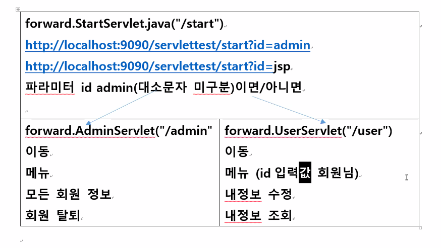

# 웹 서버

## servlet 만들기 - extends HttpServlet


* // http://localhost:9090/servlettest/src/first.FirstServlet.class => http://localhost:9090/servlettest/src/FirstServlet

* //패키지명.서블릿클래스명.class(실제 파일명) --> 별칭으로 호출 예정 

* @WebServlet("\FirstServlet") // 이것이 별칭임 이게 바뀌면 바뀐대로 창이 열림

  @ -> annotation(주석)
  
  / <= 컨텍스트루트 ex)/memberlist
  
  html에서 / 는 서버루트임 ex)/servlettest/memberlist //서로 같은 주소

## 매핑하는 방법 2가지

- 서블릿 4.0버전 자바 파일 정의한 후 tomcat 서버 설정 알려주는 2가지 방법

  | @WebServlet<br />3.0 이상에서 가능한 방법 | @WebServlet("url매핑")<br />class 서블릿 extends HttpServlet<br />doGet 오버라이딩 |
  | ----------------------------------------- | ------------------------------------------------------------ |
  | web.xml                                   | class 서블릿 extends HttpServlet<br />doGet 오버라이딩<br /> <servlet><br/>  <servlet-name>t</servlet-name><br/>  <servlet-class>test.TestServlet</servlet-class><br/>  </servlet><br/>  <br/>  <servlet-mapping><br/>  <servlet-name>t</servlet-name><br/>  <url-pattern>/test</url-pattern><br/>  </servlet-mapping> |

  확실히 @WebServlet 이 편하긴 함


## 메소드

| doGet   | 요청때마다 여러번 실행<br />매번 요청시 처리 반복<br />http://ip:port/context명/login.jsp?id=jsp&pw1234 |
| ------- | ------------------------------------------------------------ |
| doPost  |                                                              |
| service |                                                              |
| init    | 서버 시작 1번만<br />서블릿 최초 초기화 수행작업             |
| destroy | 서버 종료시, 서블릿 코드 수정 - 재컴파일시, 이전 서블릿객체 삭제시 |


## 서블릿 실행과정 - 요청 처리 응답

1. url입력 http://ip:port/test/sample?id=test

2. 요청 분석

3. sample

4. 서블릿 컴파일

5. 실행(처리)
   1. 서블릿 객체를 메모리 heap영역에 생성
   
   2. 서블릿 생성자 실행
   
   3. init 실행
   
      * 5- 1,2,3은 톰캣이 하는거임
   
   4. 요청정보 request
   
      응답정보 response
   
   5. doGet 메소드 실행
   
6. (응답)실행 결과를 클라이언트에게 전송

7. 브라우저 표현 출력

8. http://ip:port/test/sample?id=jsp

9. 브라우저 표현 출력

10. destroy()가 서블릿 객체 메모리 삭제

| 클라 | 서버 |
| ---- | ---- |
| 1    | 2    |
| 7    | 3    |
| 8    | 4    |
| 9    | 5 6  |


javax.servlet.http.패키지

|      |      |
| ---- | ---- |
|      |      |


url

? = 앞에까지만 url이고 뒤에는 데이터변수명, 데이터값 

String id = request.getParameter("id"); = id에 해당하는 데이터를 불러와라

http://localhost:9090/servlettest/login?id=test => String id = test


* http 프로토콜 규칙
  1. url?파라미터명=값& ...
  2. form action="서블릿url" method="get" or "post"

```java
@WebServlet("/loginform")
public class LoginFormServlet extends HttpServlet {
	protected void doPost(HttpServletRequest request, HttpServletResponse response) throws ServletException, IOException {
		//요청
		request.setCharacterEncoding("utf-8");
		String id = request.getParameter("id");
		String pw = request.getParameter("pw");
		String[] con = request.getParameterValues("con");
		//처리
		String result ="";
		System.out.println(pw); 

		if(pw.length() <= 10) {
			result = "암호 입력 조건에 마즘";
		}
		else {
			result = "암호 입력 조건에 맞지아늠";
		}
		
		response.setContentType("text/html;charset=utf-8");
		PrintWriter out = response.getWriter();
		out.println("<h3>" + id + " 아이디 받았습니다.</h3>");
		out.println("<h3>" + result + "</h3>");
		for(String a : con) {
			out.println("<h3> 관심 분야" + a + " </h3>");
		}
```

* get => response.setContentType("text/html;charset=utf-8");

  보안에 취약하고 파일 전송 불가

* post = request.setCharacterEncoding("utf-8");  디코딩 필요

​       		   response.setContentType("text/html;charset=utf-8");

​		보안에 유리하고 길이 무제한

* http 프로토콜 오류코드

  | 404  | url 지정 파일 없다<br />서블릿 url 매핑 오류<br />파일명 오류 |
  | ---- | ------------------------------------------------------------ |
  | 405  | get => doPost() 요청과 처리 방식이 서로 다름                 |
  | 500  | 서블릿 실행 오류들<br />오류 이름이나 메세지 라인번호        |


* drop table 하려는데 다른 곳에서 fk로 쓰고있다면

  drop table member cascade constraint;

## DAO  VO 

| logindb.html | LoginDBServlet                                               | MemberDAO                                       | MemberVO |
| ------------ | ------------------------------------------------------------ | ----------------------------------------------- | -------- |
| id, password | 2개 파라미터 입력 요청<br />응답 3가지<br />id o pw  x<br />id x<br />id o pw o | int getMember(String id, String password)<br /> |          |

===================================

select 구문 구하기

DAO에서 ArrayList 타입의 getMemberList메소드를 만들어서 여러개 나오는 selelct 구문을 배열로 받아오기

메인인 MemberListServlet에서 Arraylist를 배열로 받아오면서 print(객체) 하기위해

MemberDAO에서 toString 설정하기

```java
public class MemberDAO {
	public ArrayList<MemberVO> getMemberList() {
		Connection con = null;
		ArrayList<MemberVO> result = new ArrayList<MemberVO>();
		try {
		Class.forName("oracle.jdbc.driver.OracleDriver");
		con = DriverManager.getConnection
		("jdbc:oracle:thin:@127.0.0.1:1521:xe", "hr", "hr");
		System.out.println("연결성공");
		
		String sql = "select * from member";
		PreparedStatement st = con.prepareStatement(sql);
		ResultSet rs = st.executeQuery();
		
		while(rs.next()) {
			String db_memberid = rs.getString("memberid");
			int db_password = rs.getInt("password");
			String name = rs.getString("membername");
			String email = rs.getString("email");
			MemberVO vo = new MemberVO(db_memberid, db_password, name, email);
			result.add(vo);
			
		}
		
		con.close();
		System.out.println("연결해제성공");
		}catch(SQLException e) {/**/}
		catch(ClassNotFoundException e) {/**/}	
		
		return result;
	}
}

```

MemberListServlet

```java
@WebServlet("/memberlist")
public class MemberListServlet extends HttpServlet {

	protected void doGet(HttpServletRequest request, HttpServletResponse response) throws ServletException, IOException {
		MemberDAO dao = new MemberDAO();
		ArrayList<MemberVO> list = dao.getMemberList();
		
		response.setContentType("text/html;charset=utf-8");
		PrintWriter out = response.getWriter();
		for(MemberVO vo : list) {
			out.print("<h3>" + vo + "</h3>");
		}
	}
}
```

MemberVO

```java
package vo;

public class MemberVO {
	String memberid;
	int password;
	String membername;
	String email;
	
	
	public MemberVO(String memberid, int password, String membername, String email) {
		super();
		this.memberid = memberid;
		this.password = password;
		this.membername = membername;
		this.email = email;
	}

	public String toString() {
		return "회원아이디=" + memberid + "암호= " + password + "이름= " + membername + "이메일= " + email;
	}
}
```


========================================

회원가입

MemberDAO

```java
	public int insertMember(MemberVO vo) {
		Connection con = null;
		int result = 0;
		try {
		Class.forName("oracle.jdbc.driver.OracleDriver");
		con = DriverManager.getConnection
		("jdbc:oracle:thin:@127.0.0.1:1521:xe", "hr", "hr");
		System.out.println("연결성공");
		
		String sql = "insert into member values(?,?,?,?)";
		PreparedStatement st = con.prepareStatement(sql);
		st.setString(1, vo.getMemberid());
		st.setInt(2, vo.getPassword());
		st.setString(3, vo.getMembername());
		st.setString(4, vo.getEmail());
		
		result = st.executeUpdate();
		
		con.close();
		System.out.println("연결해제성공");
		}
		catch(SQLException e) {/**/}
		catch(ClassNotFoundException e) {/**/}	
		
		return result;
	}
```

MemberInsertServlet

```java
@WebServlet("/memberinsert")
public class MemberInsertServlet extends HttpServlet {
	protected void doGet(HttpServletRequest request, HttpServletResponse response) throws ServletException, IOException {
		String id = request.getParameter("id");
		String pw = request.getParameter("pw");
		String name = request.getParameter("name");
		String email = request.getParameter("mail");
		MemberVO vo = new MemberVO(id, Integer.parseInt(pw), name, email);
		
		MemberDAO dao = new MemberDAO();
		int row = dao.insertMember(vo);
		
		//응답
		response.setContentType("text/html;charset=utf-8");
		PrintWriter out = response.getWriter();
		if(row == 1) {out.print("<h3>회원가입이 완료되었습니다.</h3>");
		}
	}
```

MemberVO

```java
package vo;

public class MemberVO {
	String memberid;
	int password;
	String membername;
	String email;
	
	
	public MemberVO(String memberid, int password, String membername, String email) {
		super();
		this.memberid = memberid;
		this.password = password;
		this.membername = membername;
		this.email = email;
	}

	public String getMemberid() {
		return memberid;
	}

	public void setMemberid(String memberid) {
		this.memberid = memberid;
	}

	public int getPassword() {
		return password;
	}

	public void setPassword(int password) {
		this.password = password;
	}

	public String getMembername() {
		return membername;
	}

	public void setMembername(String membername) {
		this.membername = membername;
	}

	public String getEmail() {
		return email;
	}

	public void setEmail(String email) {
		this.email = email;
	}

	public String toString() {
		return "회원아이디=" + memberid + "암호= " + password + "이름= " + membername + "이메일= " + email;
	}
}

```


## DataSource 이용해 데이터베이스 연동

* 데이터베이스 이클립스에서 connection 68번정도 하면 메모리 공간이 부족해서 뻑감

* 그래서 사용하는 방법이 **커넥션풀**

* 웹 애플리케이션이 실행됨과 동시에 연동할 데이터베이스와의 연결을 미리 설정해둔다. 필요할 때마다 미리 연결해놓는 상태를 이용해 빠르게 데이터베이스와 연동하는 작업 - 미리 데이터베이스와 연결시킨 상태를 유지하는 기술

  1.  con을 미리 생성하기 때문에(tomcat server가 시작할 때)
  2. 일정 갯수 생성

  3. tomcat 라이브러리에 dbcp 포함 라이브러리

  4. dbcp 사용하기위한 설정

     Servers\Tomcat\server.xml / 리소스 추가

     ```html
           <Context docBase="servlettest" path="/servlettest" reloadable="true" 				    	  source="org.eclipse.jst.jee.server:servlettest">
           
           <Resource type="javax.sql.DataSource" 
           name="jdbc/myoracle" 
           username="hr" 
           url="jdbc:oracle:thin:@127.0.0.1:1521:xe" 
           password="hr" 
           maxIdle="5" 
           driverClassName="oracle.jdbc.driver.OracleDriver" 
           MaxActive="5"/> //자동으로 5개 만들어달라
           
           </Context>
     ```

     

  5. 서블릿 javax.sql.DataSource 객체

     ```java
     //1. context명+정보 저장 객체 생성
     Context initContext = new InitialContext();
     //2. server.xml 읽어와서 1번 컨텍스트 설정만 찾아줘
     Context envContext = (Context)initContext.lookup("java:/comp/env");
     //name="jdbc/myoracle" 설정만 찾아와
     DataSource ds = (DataSource)envContext.lookup("jdbc/myoracle");
     
     for(int i = 1 ; i <= 100 ; i++){
         Connection con = ds.getConnection();
     }
     ```


## 서블릿 확장 forward/include

* context = html - servlet - db

* 이번에는 servlet - servlet 호출(서버 내부 2개이상 파일 연동)


Aservlet에서 - Bservlet 호출

```java
class AServlet extends HttpServlet

doGet(){}

...


servlet은 이 것이 불가능 하다... tomcat이 init을 호출해서 doGet메소드를 만드는건데 밑에는 init이 없음
BServlet b = new BServlet();

b.doGet(request, response){}
```


```java
BServlet b = new BServlet();
b.doGet(request, response){}

RequestDispatcher rd = request.getRequestDispatcher("/bservlet");
rd.include(request, response); or rd.forward(request, response);//답은 forward된 servlet이 함


AServlet 남은 내용 처리

```

* include

logindb.html 요청 - LogintDBServlet('logindb') 응답

​							 - include MemberListServlet('memberlist') 너도 응답

* forward

logindb.html 요청 - LogintDBServlet('logindb') 응답 x

​							 - forward MemberListServlet('memberlist') 너만 응답

실습


