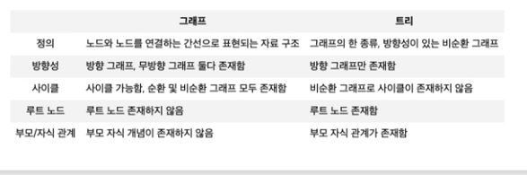
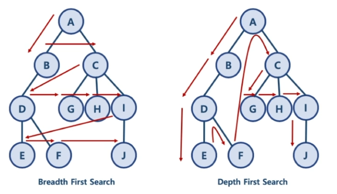
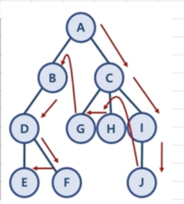

# 그래프 이해

* 그래프란?
  * 그래프는 실제 세계의 현상이나 사물을 정점 또는 노드와 간선을 표현하기 위해 사용
* 그래프 용어
  * 노드 (Node) : 위치를 말함, 정점(Vertex)라고도 함
  * 간선 (Edge) : 위치 간의 관계를 표시한 선으로 노드를 연결한 선(link 또는 branch라고도 함)
  * 인접 정점 (Adjacent Vertex) : 간선으로 직접 연결된 정점
  * 참고 용어
    * 정점의 차수 (Degree) : 인접한 정점의 수
    * 진입 차수 (In-Degree) : 방향 그래프에서 외부에서 오는 간선의 수
    * 진출 차수 (Out-Degree): 방향 그래프에서 외부로 향하는 간선의 수
    * 경로 길이 (Path Length): 경로를 구성하기 위해 사용된 간선의 수
    * 단순 경로 (Simple Path): 처음 정점과 끝 정점을 제외하고 중복된 정점이 없는 경로
    * 사이클 (Cycle): 단순 경로의 시작 정점과 종료 정점이 동일한 경우
* 그래프의 종류
  * 무방향 그래프
    * 방향이 없는 그래프 (Edge에 방향성이 없어서 노드는 양방향으로 이동 가능)
    * (A,B), (B, A)
  * 방향 그래프
    * 간선에 방향이 있는 그래프
    * <A,B>
  * 가중치 그래프 또는 네트워크
    * 간선에 비용 또는 가중치가 할당된 그래프
  * 연결 그래프와 비 연결 그래프
    * 연결 그래프
      * 무방향 그래프에 있는 모든 노드에 대해 항상 경로가 존재하는 경우
    * 비연결 그래프
      * 무방향 그래프에서 특정 노드에 대해 경로가 존재하지 않는 경우
  * 사이클과 비순환 그래프
    * 사이클
      * 단순 경로의 시작  노드와 종료 노드가 동일한 경우
    * 비순환 그래프 (Acyclic Graph)
      * 사이클이 없는 그래프
  * 완전 그래프
    * 모든 노드 사이 서로 연결된 그래프

* 그래프와 트리의 차이

  * 트리는 그래프 중에 속한 특별한 종류라고 볼 수 있음

  


## 그래프 탐색 전략

* BFS와 DFS
  * 너비 우선 탐색 (Breadth First Search): 정점들과 같은 레벨에 있는 노드들 (형제 노드들)을 먼저 탐색하는 방식
  * 깊이 우선 탐색 (Depth First Search): 한 노드의 자식을 탐색 하고 남은 형제 노드들의 자식을 타고 내려가며 탐색하는 방식




## BFS 너비 우선 탐색

### 그래프 표현

* 자바로 Collection Framework에서 제공하는 HashMap과 ArrayList를 활용해서 그래프를 표현할 수 있음
* 키에 기준 노드가 들어가있고, 밸류에 연결된 노드들이 ArrayList 형태로 들어가있음


```java
HashMap<String, ArrayList<String>> graph = new HashMap<String, ArrayList<String>>();

graph.put("A", new ArrayList<String>(Arrays.asList("B", "C")));
graph.put("B", new ArrayList<String>(Arrays.asList("A", "D")));
...
```


### BFS 구현

* visited, needVisite로 나눠서 확인

  * visited : 방문했던 노드
  * needVisit : 현재 방문한 노드에서 방문해야하는 노드

* 구현 방법

  1. A부터 시작
2. A와 연결된 노드 needVisit에 저장
  3. needVisit의 첫번 째 노드 꺼내기
4. visited에 없는 노드라면 visited에 넣고 B와 연결된 노드 needVisit에 저장
  5. 3번과 4번 needVisit에 노드가 없을 때까지 반복


* 방문해야 하는 노드 리스트에 넣는 방법

~~~java
ArrayList<String> aList = new ArrayList<String>();
aList.addAll(graph.put("A"));
~~~


* 큐를 ArrayList로 구현

~~~java
import java.util.ArrayList;

ArrayList<String> aList = new ArrayList<String>();
aList.add("A");
aList.add("B");
String node = aList.remove(0);
~~~


* BFS 구현

~~~java
import java.util.HashMap;
import java.util.ArrayList;
import java.util.Arrays;

public class BFS {
  public ArrayList<String> bfsFunc (HashMap<String, ArrayList<String>> graph, String startNode) {
    ArrayList<String> visitedNode = new ArrayList<String>();
    ArrayList<String> needVisit = new ArrayList<String>();

    needVisit.add(startNode);

    while(needVisit.size() > 0) {
      String node = needVisit.remove(0);

      if(!visitedNode.contains(node)) {
        visitedNode.add(node);
        needVisit.addAll(graph.get(node));
      }
    }
    return visitedNode;
  }

  public static void main(String[] args) {
    HashMap<String, ArrayList<String>> graph = new HashMap<String, ArrayList<String>>();
    graph.put("A", new ArrayList<String>(Arrays.asList("B", "C")));
    graph.put("B", new ArrayList<String>(Arrays.asList("A", "D")));
    graph.put("C", new ArrayList<String>(Arrays.asList("A", "G", "H", "I")));
    graph.put("D", new ArrayList<String>(Arrays.asList("B", "E", "F")));
    graph.put("E", new ArrayList<String>(Arrays.asList("D")));
    graph.put("F", new ArrayList<String>(Arrays.asList("D")));
    graph.put("G", new ArrayList<String>(Arrays.asList("C")));
    graph.put("H", new ArrayList<String>(Arrays.asList("C")));
    graph.put("I", new ArrayList<String>(Arrays.asList("C", "J")));
    graph.put("J", new ArrayList<String>(Arrays.asList("I")));
    BFS bfs = new BFS();
    System.out.println(bfs.bfsFunc(graph, "A"));
  }
}

~~~


### BFS 시간복잡도

* 노드 수 : V
* 간선 수 : E
  * while에서 V+E번 만큼 수행함
* 시간복잡도 O(V + E)


## DFS 깊이 우선 탐색

### 그래프 표현

* 스택과 큐를 활용함.
  * needVisit 스택과 visited 큐
* BFS 자료구조는 두 개의 큐를 활용하는데 반해, DFS는 스택과 큐를 활용



* visited는 큐, needVisit는 스택
* needVisit가 스택이어야 A => C => I => J 순으로 갈 수 있음


* DFS 구현

~~~java
import java.util.ArrayList;
import java.util.HashMap;
import java.util.Arrays;

public class DFS {
  public ArrayList<String> dfsFunc(HashMap<String, ArrayList<String>> graph, String startNode) {
    ArrayList<String> visited = new ArrayList<String>();
    ArrayList<String> needVisit = new ArrayList<String>();

    needVisit.add(startNode);

    while(needVisit.size() > 0) {
      String node = needVisit.remove(needVisit.size() - 1);

      if(!visited.contains(node)) {
        visited.add(node);
        needVisit.addAll(graph.get(node));
      }
    }
    return visited;
  }

  public static void main(String[] args) {
    HashMap<String, ArrayList<String>> graph = new HashMap<String, ArrayList<String>>();
    graph.put("A", new ArrayList<String>(Arrays.asList("B", "C")));
    graph.put("B", new ArrayList<String>(Arrays.asList("A", "D")));
    graph.put("C", new ArrayList<String>(Arrays.asList("A", "G", "H", "I")));
    graph.put("D", new ArrayList<String>(Arrays.asList("B", "E", "F")));
    graph.put("E", new ArrayList<String>(Arrays.asList("D")));
    graph.put("F", new ArrayList<String>(Arrays.asList("D")));
    graph.put("G", new ArrayList<String>(Arrays.asList("C")));
    graph.put("H", new ArrayList<String>(Arrays.asList("C")));
    graph.put("I", new ArrayList<String>(Arrays.asList("C", "J")));
    graph.put("J", new ArrayList<String>(Arrays.asList("I")));
    DFS dfs = new DFS();
    System.out.println(dfs.dfsFunc(graph, "A"));
  }
}

~~~


### DFS 시간 복잡도

* 일반적인 DFS 시간 복잡도
  * 노드 수 : V
  * 간선 수 : E
    * 위 코드에서 while(needVisit ... ) 은 V + E 번 만큼 수행함
  * 시간 복잡도 : O(V + E)
