# 최소 신장 트리

* 신장 트리
  * Spanning Tree, 또는 신장 트리 라고 불리움
  * 원래의 그래프의 모든 노드가 연결되어 있으면서 트리의 속성을 만족하는 그래프
  * Spanning Tree의 조건
    * 본래의 그래프의 모든 노드를 포함해야함
    * 모든 노드가 서로 연결
    * 트리의 속성을 만족시킴 (사이클이 존재하지 않음)

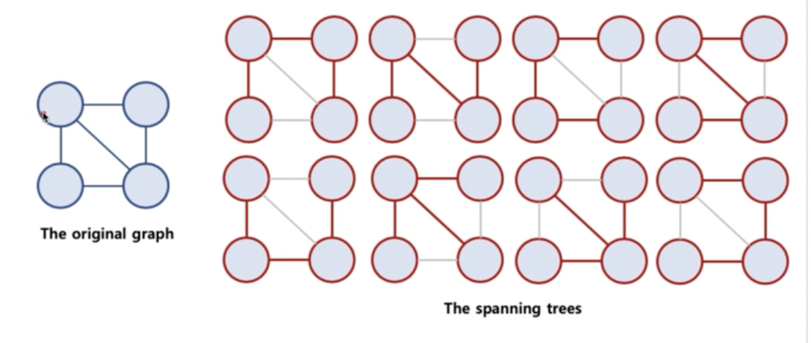

* 최소 신장 트리

  * 가중치가 있는 그래프에서 간선의 가중치 합이 최소인 Spanning Tree를 지칭함

    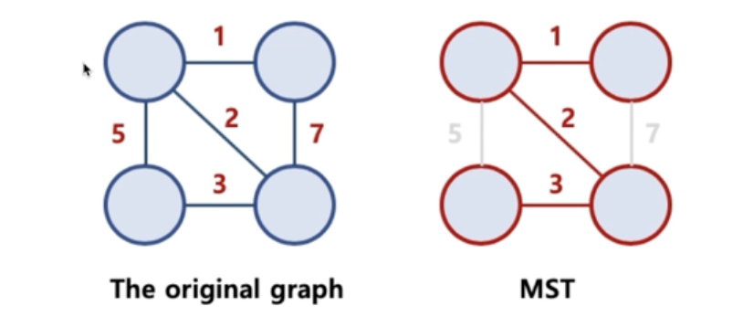

## 최소 신장 트리 알고리즘

* 그래프에서 최소 신장 트리를 찾을 수 있는 알고리즘이 존재함
* 대표적인 최소 신장 트리 알고리즘
  * 크루스칼 알고리즘, 프림 알고리즘 (난이도가 매우 높음)

### 크루스칼 알고리즘 (Kruskal's algorithm)

* 탐욕 알고리즘을 기초로 하고 있음 (당장 눈 앞의 최소 비용을 찾고, 결과적으로 최적의 솔루션을 찾음)
  1. 모든 정점을 독립적인 집합으로 만든다.
  2. 모든 간선을 비용을 기준으로 정렬하고, 비용이 작은 간선부터 양 끝의 두 정점을 비교한다.
  3. 두 정점의 최상위 정점을 확인하고, 서로 다를 경우 두 정점을 연결한다.

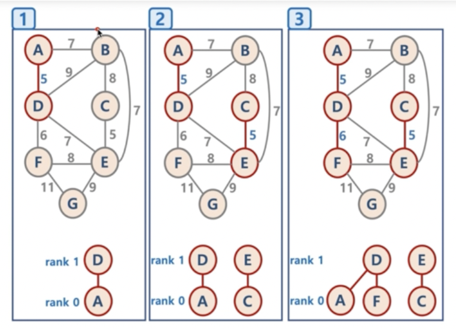

* 구현 방법

  1. 가중치 낮은 순으로 정렬
  2. 가중치가 가장 낮은 간선을 찾음

  3. 사이클이 생기는지 확인함

  4. 안 생겼으면 간선을 선택

  5. 2~4번 반복

* 구현 중 가장 문제되는 부분은 사이클이 생기는지 확인하는 부분임

  * Union-Find 알고리즘

    * Disjoint Set을 표현할 때 사용하는 알고리즘으로 트리 구조를 활용하는 알고리즘
    * 간단하게, 노드들 중에 연결된 노드를 찾거나, 노드들을 서로 연결할 때 사용

  * Disjoint Set이란?

    * 서로 중복되지 않는 부분 집합들로 나눠진 원소들에 대한 정보를 저장하고 조작하는 자료구조
    * 공통 원소가 없는 (서로소) 상호 베타적인 부분 집합들로 나눠진 원소들에 대한 자료구조를 의미함
    * Disjoint Set = 서로소 집합 자료구조

  * 구현 방법

    1. 초기화

       * n개의 원소가 개별 집합으로 이뤄지도록 초기화

         

    2. Union

       * 두 개별 집합을 하나의 집합으로 합침, 두 트리를 하나의 트리로 만듦

         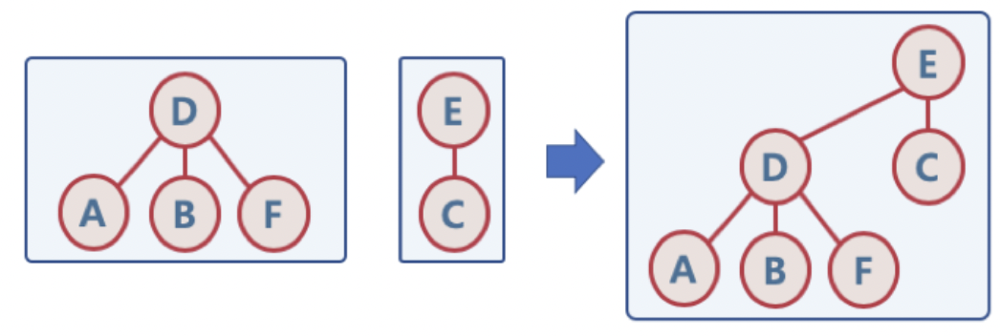

    3. Find

       * 여러 노드가 존재할 때, 두 개의 노드를 선택해서, 현재 두 노드가 서로 같은 그래프에 속하는지 판별하기 위해, 각 그룹의 최상단 원소 (루트 노드)를 확인

         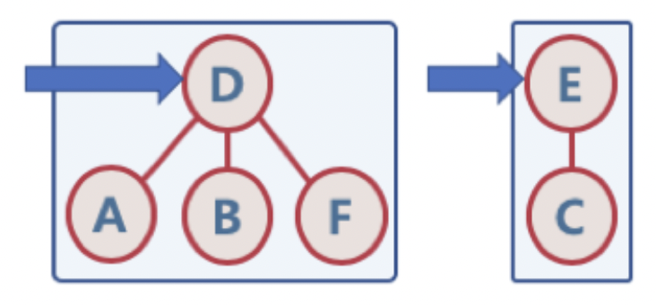

         

  * Union-Find 알고리즘의 고려할 점

    * Union 순서에 따라서, 최악의 경우 링크드 리스트와 같은 형태가 될 수 있음

    * 이 때는 Find/Union 시 계산량이 O(N)이 될 수 있으므로, 

    * 이 모습을 방지하기 위해, 해당 문제를 해결하기 위해, union-by-rank, path compression 기법을 사용함

      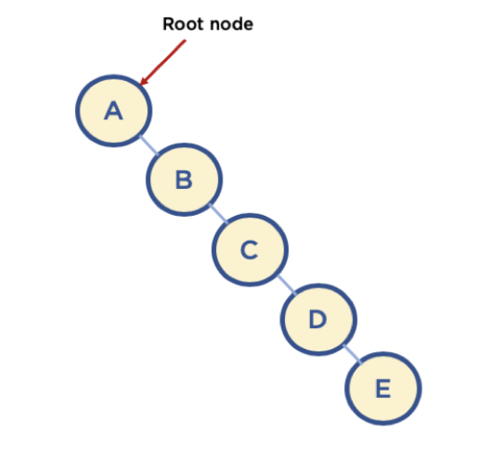

  * union-by-rank 기법

    * 각 트리에 대해 높이(rank)를 기억해두고,

    * Union시 두 트리의 높이가 다르면, 높이가 작은 트리를 높이가 큰 트리에 붙임

      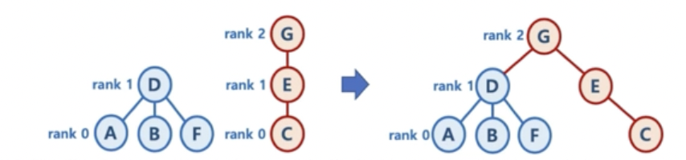

    * Union시 두 트리의 높이가 같으면, 한 쪽의 트리 높이를 1 증가시켜주고, 다른 쪽의 트리를 해당 트리에 붙여줌

      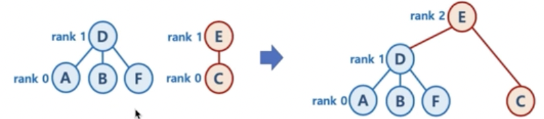

    * union-by-rank 기법을 이용한다면,

      * 높이가 h인 트리가 만들어지려면, 높이가 h-1인 두 개의 트리가 합쳐져야함
      * 높이가 h-1인 트리를 만들기 위해 최소 n개의 원소가 필요하다면, 높이가 h인 트리가 만들어지기 위해 최소 2n개의 원소가 필요함
      * 따라서 union-by-rank 기법을 사용하면, union/find 연산의 시간 복잡도는 O(N)이 아닌 O(log N)으로 줄일 수 있다.

  * path compression

    * Find를 실행한 노드에서 거쳐간 노드를 루트에 다이렉트로 연결하는 기법

    * Find를 실행한 노드는 이후부터는 루트 노드를 한 번에 알 수 있음

      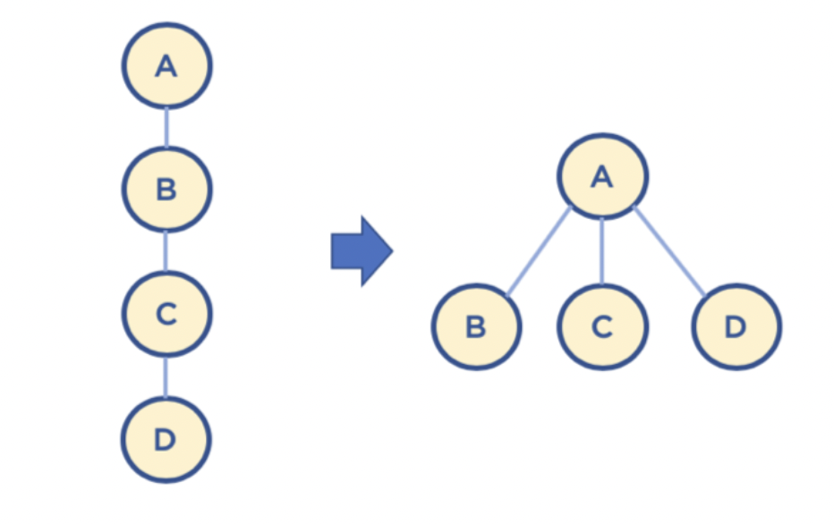

  * union-by-rank와 path compression 기법 사용시 시간 복잡도는 다음 계산식을 만족함이 증명되었음

    * O(M log* N)
    * N이 2^65536 값을 가지더라도, log* N의 값이 5이므로 거의 O(1), 즉 상수값에 가깝다고 볼 수 있음

* 구현

  * Edge 클래스 구현

  ~~~java
  package SpanningTree;
  
  import java.util.HashMap;
  
  public class Edge implements Comparable<Edge> {
    public int weight;
    public String nodeV;
    public String nodeU;
    HashMap<String, String> parent = new HashMap<String, String>();
    HashMap<String, Integer> rank = new HashMap<String, Integer>();
    
    public Edge (int weight, String nodeV, String nodeU) {
      this.weight = weight;
      this.nodeV = nodeV;
      this.nodeU = nodeU;
    }
    
    public String toString() {
      return "(" + this.weight + ", " + this.nodeV + ", " + this.nodeU + ")";
    }
    
    @Override
    public int compareTo(Edge edge) {
      return this.weight - edge.weight;
    }
  }
  ~~~
  
  * Union-Find 알고리즘 메서드
  
  ~~~java
  // 1. 초기화
    public void makeSet(String node) {
      //n개의 개별적인 원소로 초기화
      parent.put(node, node);
      rank.put(node, 0);
    }
  
  // 2. Union
  	public String find(String node) {
      //path compression 기법
      //루트 노드에 모든 노드들이 붙어있는 모습을 보여줄 수 있음.
      if (parent.get(node) != node) {
        parent.put(node, find(parent.get(node))); //부모노드가 아니면 부모 노드를 찾아서 저장
      }
      return parent.get(node);
    }
  
    public void union(String nodeV, String nodeU) {
      String root1 = find(nodeV);
      String root2 = find(nodeU);
  
      //union-by-rank 기법
      //랭크가 더 높으면 높은 곳을 부모 노드로 설정
      if (rank.get(root1) > rank.get(root2)) {
        parent.put(root2, root1);
      } else {
        parent.put(root1, root2);
        //랭크가 같으면 랭크에 1을 더해라
        if(rank.get(root1) == rank.get(root2)) {
          rank.put(root2, rank.get(root2) + 1);
        }
      }
    }
  ~~~
  
  * Kruskal 클래스
  
  ~~~java
  package SpanningTree;
  
  import java.util.ArrayList;
  import java.util.Arrays;
  import java.util.HashMap;
  import java.util.Collections;
  
  public class KruskalPath {
    HashMap<String, String> parent = new HashMap<String, String>();
    HashMap<String, Integer> rank = new HashMap<String, Integer>();
  
    public String find(String node) {
      // path compression 기법
      if (this.parent.get(node) != node) {
        this.parent.put(node, this.find(this.parent.get(node)));
      }
      return this.parent.get(node);
    }
  
    public void union(String nodeV, String nodeU) {
      String root1 = this.find(nodeV);
      String root2 = this.find(nodeU);
  
      // union-by-rank 기법
      if(this.rank.get(root1) > this.rank.get(root2)) {
        this.parent.put(root2, root1);
      } else {
        this.parent.put(root1, root2);
        if(this.rank.get(root1) == this.rank.get(root2)) {
          this.rank.put(root2, this.rank.get(root2) + 1);
        }
      }
    }
  
    public void makeSet(String node) {
      this.parent.put(node, node);
      this.rank.put(node, 0);
    }
  
    public ArrayList<Edge> kruskalFunc(ArrayList<String> vertices, ArrayList<Edge> edges) {
      ArrayList<Edge> mst = new ArrayList<Edge>();
      Edge currentEdge;
  
      // 1. 초기화
      for(int i = 0 ; i < vertices.size() ; i++) {
        this.makeSet(vertices.get(i));
      }
  
      // 2. 간선 weight 기반 sorting
      Collections.sort(edges);
  
      for(int i = 0 ; i < edges.size() ; i++) {
        currentEdge = edges.get(i);
        if(this.find(currentEdge.nodeV) != this.find(currentEdge.nodeU)) {
          this.union(currentEdge.nodeV, currentEdge.nodeU);
          mst.add(currentEdge);
        }
      }
      return mst;
    }
  
    public static void main(String[] args) {
      ArrayList<String> vertices = new ArrayList<String>(Arrays.asList("A", "B", "C", "D", "E", "F", "G"));
      ArrayList<Edge> edges = new ArrayList<Edge>();
      edges.add(new Edge(7, "A", "B"));
      edges.add(new Edge(5, "A", "D"));
      edges.add(new Edge(7, "B", "A"));
      edges.add(new Edge(8, "B", "C"));
      edges.add(new Edge(9, "B", "D"));
      edges.add(new Edge(7, "B", "E"));
      edges.add(new Edge(8, "C", "B"));
      edges.add(new Edge(5, "C", "E"));
      edges.add(new Edge(5, "D", "A"));
      edges.add(new Edge(9, "D", "B"));
      edges.add(new Edge(7, "D", "E"));
      edges.add(new Edge(6, "D", "F"));
      edges.add(new Edge(7, "E", "B"));
      edges.add(new Edge(5, "E", "C"));
      edges.add(new Edge(7, "E", "D"));
      edges.add(new Edge(8, "E", "F"));
      edges.add(new Edge(9, "E", "G"));
      edges.add(new Edge(6, "F", "D"));
      edges.add(new Edge(8, "F", "E"));
      edges.add(new Edge(11, "F", "G"));
      edges.add(new Edge(9, "G", "E"));
      edges.add(new Edge(11, "G", "F"));
  
      System.out.println(edges);
      //[(7, A, B), (5, A, D), (7, B, A), (8, B, C), (9, B, D), (7, B, E), (8, C, B), (5, C, E), (5, D, A), (9, D, B), (7, D, E), (6, D, F), (7, E, B), (5, E, C), (7, E, D), (8, E, F), (9, E, G), (6, F, D), (8, F, E), (11, F, G), (9, G, E), (11, G, F)]
  
  
      KruskalPath kObject = new KruskalPath();
      System.out.println(kObject.kruskalFunc(vertices, edges));
      //[(5, A, D), (5, C, E), (6, D, F), (7, A, B), (7, B, E), (9, E, G)]
    }
  }
  ~~~

* 시간 복잡도
  * 초기화, 정렬, 유니온
  * 초기화 : O(V) //vertices 수
  * 정렬 : O(E log E) // 퀵 소트를 사용한다면 시간 복잡도는 O(n log n) 이며, 간선이 n이므로
  * O(E) // union find 알고리즘으로 이루어져서 edge 수만큼 반복문이 돌음
  * 즉, 크루스컬 알고리즘의 시간 복잡도는 O(E log E)이다.

### 프림 알고리즘 (Prim's algorithm)

* 시작 정점을 선택한 후, 정점에 인접한 간선중 최소 간선으로 연결된 정점을 선택하고, 해당 정점에서 다시 최소 간선으로 연결된 정점을 선택하는 방식으로 최소 신장 트리를 확장해가는 방식
* Kruskal's algorithm 과 Prim's algorithm 비교
  * 둘 다 탐욕 알고리즘을 기초로 하고 있음
  * Kruskal's algorithm은 가장 가중치가 작은 간선부터 선택하면서 MST를 구함
  * Prim's algorithm은 특정 정점에서 시작, 해당 정점에 연결된 가장 가중치가 작은 간선을 선택, 간선으로 연결된 정점들에 연결된 간선중에서 가장 가중치가 작은 간선을 택하는 방식으로 MST를 구함

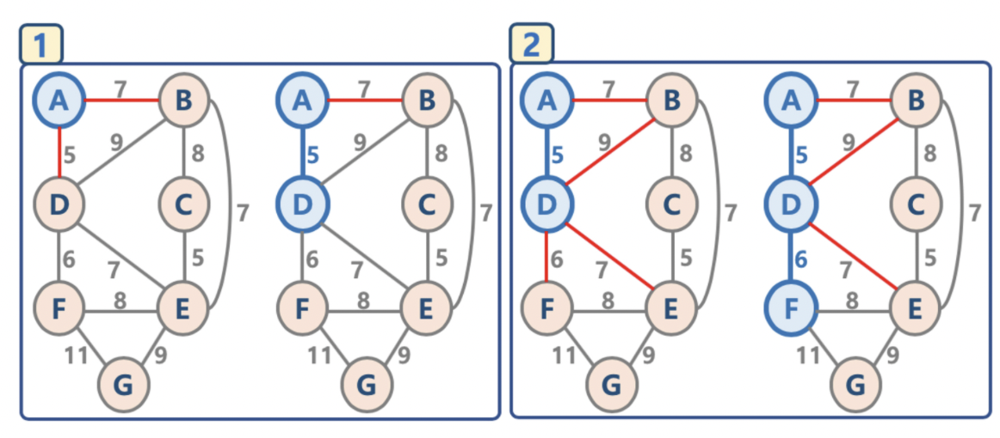

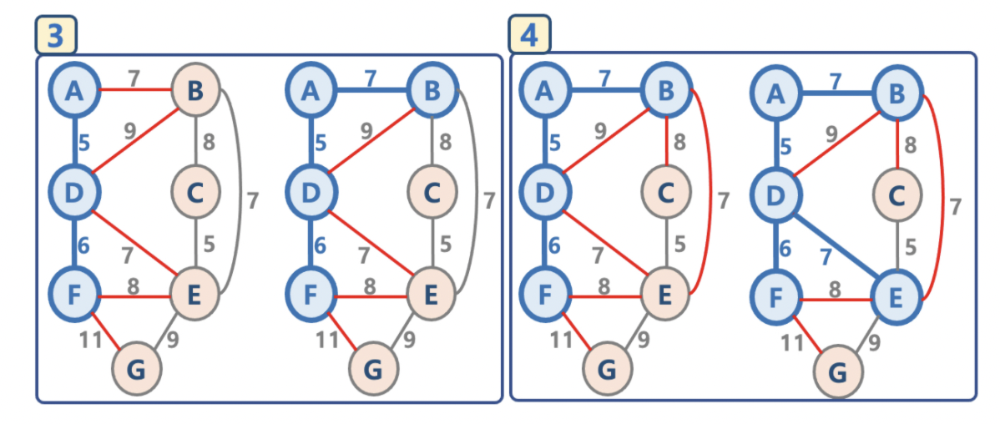

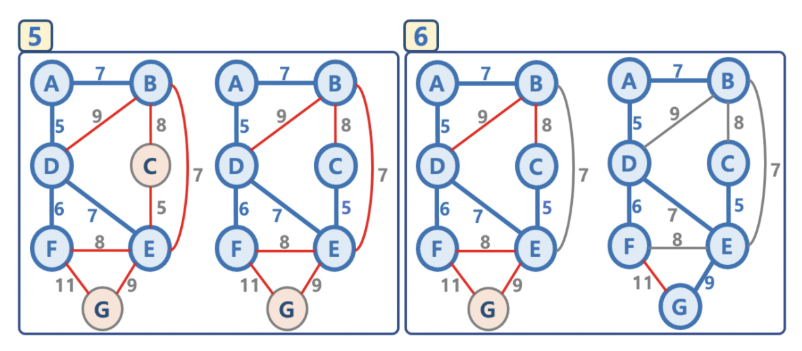

1. 임의의 정점을 선택, 연결된 노드 집합에 삽입
2. 선택된 정점에 연결된 간선들을 간선 리스트에 삽입
3. 간선 리스트에서 최소 가중치를 가지는 간선부터 추출
   * 해당 간선에 연결된 인접 정점이 '연결된 노드 집합'에 이미 들어있다면, 스킵
   * 해당 간선에 연결된 인접 정점이 '연결된 노드 집합'에 들어 있지 않으면, 해당 간선을 선택하고, 해당 간선 정보를 '최소 신장 트리'에 삽입
4. 추출한 간선은 리스트에서 제거
5. 간선 리스트에 더 이상 간선이 없을 때까지 3~4번을 반복

* 구현

  * Edge 클래스 정의

    ~~~java
    public class Edge implements Comparable<Edge> {
      public int weight;
      public String node1;
      public String node2;
      
      public Edge(int weight, String node1, String node2) {
        this.weight = weight;
        this.node1 = node1;
        this.node2 = node2;
      }
      
      public String toString() {
        return "(" + this.weight + ", " + this.node1 + ", " + this.node2 + ")";
      }
      
      @Override
      public int compareTo(Edge edge) {
        return this.weight - edge.weight;
      }
    }
    ~~~

  * PriorityQueue (우선순위 큐) 사용하기 // 간선 리스트 중 최소 가중치를 가지는 간선 추출 방법

    ~~~java
    import java.util.PriorityQueue;
    
    public class PQueue {
    
      public static void main(String[] args) {
        PriorityQueue<Edge> priorityQueue = new PriorityQueue<Edge>();
        priorityQueue.add(new Edge(2, "A", "B"));
        priorityQueue.add(new Edge(5, "B", "D"));
        priorityQueue.add(new Edge(3, "C", "A"));
    
        while (priortyQueue.size() > 0) {
          System.out.println(priorityQueue.poll());
        }
        //(2, A, B)
        //(3, C, A)
        //(5, B, D)
      }  
    }
    
    ~~~

  * 연결된 노드 집합에서 인접 정점이 있는지 없는지 확인하는 방법 containsKey()

    ~~~java
    import java.util.HashMap;
    import java.util.ArrayList;
    
    HashMAp<String, ArrayList<Edge>> graph = new HashMap<String, ArrayList<Edge>>();
    
    graph.put("A", new ArrayList<Edge>());
    graph.put("B", new ArrayList<Edge>());
    
    System.out.println(graph.containsKey("A"));
    //true
    
    //찾는 키에 대한 값이 없으면 false가 아닌 디폴트 값을 반환하기
    graph.getOrDefault("C", new ArrayList<Edge>());
    //[]
    ~~~
    
    

  * 프림 알고리즘 코드

    0. 모든 간선 정보를 저장 (adjacentEdges)
    1. 임의의 정점을 선택, 연결된 노드 집합(connectedNodes) 에 삽입
    2. 선택된 정점에 연결된 간선들을 간선 리스트(candidateEdgeList)에 삽입
    3. 간선 리스트(candidateEdgeList)에서 최소 가중치를 가지는 간선부터 추출해서
       * 해당 간선에 연결된 인접 정점이 연결된 노드 집합에 들어있으면 스킵
       * 들어있지 않으면 해당 간선을 최소 신장 트리(mst)에 삽입
         * 해당 간선에 연결된 인접 정점의 간선들 중, 연결된 노드 집합에 없는 노드와 연결된 간선들만 간선 리스트에 삽입
           * 연결된 노드 집합에 있는 노드와 연결된 간선들을 간선 리스트에 삽입해도, 해당 간선은 스킵될 것이기 때문이다.
           * 어차피 스킵될 간선을 간선 리스트에 넣지 않으므로 해서, 간선 리스트에서 최소 가중치를 가지는 간선부터 추출하기 위한 자료구조 유지를 위한 effort를 줄일 수 있음
    4. 선택된 간선은 간선 리스트에서 제거
    5. 간선 리스트에 더 이상의 간선이 없을 때까지 3~4번을 반복

    ~~~java
    package SpanningTree;
    
    import java.util.ArrayList;
    import java.util.Collections;
    import java.util.HashMap;
    import java.util.PriorityQueue;
    import java.util.Arrays;
    
    public class PrimPath {
      public ArrayList<Edge> primFunc(String startNode, ArrayList<Edge> edges) {
        
        ArrayList<String> connectedNodes = new ArrayList<String>();
        ArrayList<Edge> mst = new ArrayList<Edge>();
        HashMap<String, ArrayList<Edge>> adjacentEdges = new HashMap<String, ArrayList<Edge>>();
        Edge currentEdge, poppedEdge, adjacentEdgeNode;
        ArrayList<Edge> currentEdgeList, candidateEdgeList, adjacentEdgeNodes;
        PriorityQueue<Edge> priorityQueue;
    
        for (int i = 0 ; i < edges.size() ; i++) {
          currentEdge = edges.get(i);
          if(!adjacentEdges.containsKey(currentEdge.nodeU)) {
            adjacentEdges.put(currentEdge.nodeU, new ArrayList<Edge>());
          }
          if(!adjacentEdges.containsKey(currentEdge.nodeV)) {
            adjacentEdges.put(currentEdge.nodeV, new ArrayList<Edge>());
          }
        }
    
        for (int i = 0 ; i < edges.size() ; i++) {
          currentEdge = edges.get(i);
          currentEdgeList = adjacentEdges.get(currentEdge.nodeU);
          currentEdgeList.add(new Edge(currentEdge.weight, currentEdge.nodeU, currentEdge.nodeV));
          currentEdgeList = adjacentEdges.get(currentEdge.nodeV);
          currentEdgeList.add(new Edge(currentEdge.weight, currentEdge.nodeV, currentEdge.nodeU));
        }
    
        connectedNodes.add(startNode);
    
        // adjacentEdges.get(startNode) 인데, null이면 오류가 나니까 없을 때 default라도 내놓으라고 설정 
        candidateEdgeList = adjacentEdges.getOrDefault(startNode, new ArrayList<Edge>());
        priorityQueue = new PriorityQueue<Edge>();
        for (int i = 0 ; i < candidateEdgeList.size() ; i++) {
          priorityQueue.add(candidateEdgeList.get(i));
        }
    
        while (priorityQueue.size() > 0) {
          poppedEdge = priorityQueue.poll();
          if (!connectedNodes.contains(poppedEdge.nodeV)) {
            // 해당 edge를 mst에 추가
            connectedNodes.add(poppedEdge.nodeV);
            mst.add(new Edge(poppedEdge.weight, poppedEdge.nodeU, poppedEdge.nodeV));
    
            adjacentEdgeNodes = adjacentEdges.getOrDefault(poppedEdge.nodeV, new ArrayList<Edge>());
            for (int i = 0 ; i < adjacentEdgeNodes.size() ; i++) {
              adjacentEdgeNode = adjacentEdgeNodes.get(i);
              if (!connectedNodes.contains(adjacentEdgeNode.nodeV)) {
                priorityQueue.add(adjacentEdgeNode);
              }
            }
          }
        }
        return mst;
      }  
    
    
      public static void main(String[] args) {
        ArrayList<Edge> myedges = new ArrayList<Edge>();
        myedges.add(new Edge(7, "A", "B"));
        myedges.add(new Edge(5, "A", "D"));
        myedges.add(new Edge(8, "B", "C"));
        myedges.add(new Edge(9, "B", "D"));
        myedges.add(new Edge(7, "D", "E"));
        myedges.add(new Edge(5, "C", "E"));
        myedges.add(new Edge(7, "B", "E"));
        myedges.add(new Edge(6, "D", "F"));
        myedges.add(new Edge(8, "E", "F"));
        myedges.add(new Edge(9, "E", "G"));
        myedges.add(new Edge(11, "F", "G"));
    
        PrimPath pObject = new PrimPath();
        System.out.println(pObject.primFunc("A", myedges));
      }
    }
    ~~~

* 시간 복잡도
  * 최악의 경우, while 구문에서 모든 간선에 대해 반복하고, 최소 힙 구조를 사용하므로 O(E log E) 시간 복잡도를 가짐

## 참고: 개선된 프림 알고리즘
* 기존 프림 알고리즘의 경우 간선을 중심으로 적용되어 있음

* 간선이 아닌 노드를 중심으로 우선순위 큐를 적용하는 방식
  * 초기화 - 정점: key 구조를 만들어놓고, 특정 정점의 key값은 0, 이외의 정점은 무한대로 놓음.
  
  ​			모든 정점: key 값은 우선순위 큐에 넣음
  
  * 가장 key값이 작은 정점: key를 추출한 후
  * 해당 정점의 인접한 정점들에 대해 key 값과 연결된 가중치 값을 비교하여 key값이 작으면 해당 정점: key값을 갱신
    * 정점: key 값 갱신시, 우선순위 큐는 최소 key 값을 가지는 정점: key를 루트노드로 올려놓도록 재구성함

* 구현
  * Edge 클래스, Path 클래스 정의

  ~~~java
  package SpanningTree;
  
  class Path {
    public String node1;
    public String node2;
    public int weight;
  
    public Path(String node1, String node2, int weight) {
      this.weight = weight;
      this.node1 = node1;
      this.node2 = node2;
    }
  
    public String toString() {
      return "(" + this.weight + ", " + this.node1 + ", " + this.node2 + ")";
    }
  }
  
  public class PEdge implements Comparable<PEdge> {
    public int weight;
    public String node;
  
    public PEdge (int weight, String node) {
      this.weight = weight;
      this.node = node;
    }
  
    public String toString() {
      return "(" + this.weight + ", " + this.node + ")";
    }
  
    @Override
    public int compareTo(PEdge edge) {
      return this.weight - edge.weight;
    }
  }
  ~~~
  
  * 그래프
  
    ArrayList가 아닌 HashMap으로 간선 구현
  
  ~~~java
  HashMap<String, HashMap<String, Integer>> mygraph = new HashMap<String hashMap<String, Integer>>();
  
  HashMap<String, Integer> edges;
  
  edges = new HashMap<String, Integer>();
  edges.put("B", 7);
  edges.put("D", 8);
  mygraph.put("A", edges);
  
  edges = new HashMap<String, Integer>();
  edges.put("A", 7);
  edges.put("D", 9);
  edges.put("C", 8);
  edges.put("E", 7);
  mygraph.put("B", edges);
  
  edges = new HashMap<String, Integer>();
  edges.put("B", 8);
  edges.put("E", 5);
  mygraph.put("C", edges);
  
  edges = new HashMap<String, Integer>();
  edges.put("A", 5);
  edges.put("B", 9);
  edges.put("E", 7);
  edges.put("F", 6);
  mygraph.put("D", edges);
  
  edges = new HashMap<String, Integer>();
  edges.put("B", 7);
  edges.put("C", 5);
  edges.put("D", 7);
  edges.put("F", 8);
  edges.put("G", 9);
  mygraph.put("E", edges);
  
  edges = new HashMap<String, Integer>();
  edges.put("D", 6);
  edges.put("E", 8);
  edges.put("G", 11);
  mygraph.put("F", edges);
  
  edges = new HashMap<String, Integer>();
  edges.put("E", 9);
  edges.put("F", 11);
  mygraph.put("G", edges);
  ~~~
  
  * 전체
  
  ~~~java
  package SpanningTree;
  
  import java.util.HashMap;
  import java.util.ArrayList;
  import java.util.PriorityQueue;
  
  public class PrimPath2 {
    public ArrayList<Path> imporvedPrimFunc(HashMap<String, HashMap<String, Integer>> graph, String startNode) {
      ArrayList<Path> mst = new ArrayList<Path>();
      PriorityQueue<PEdge> keys = new PriorityQueue<PEdge>();
      HashMap<String, PEdge> keysObjects = new HashMap<String, PEdge>();
      HashMap<String, String> mstPath = new HashMap<String, String>();
      HashMap<String, Integer> linkedEdges;
      PEdge edgeObject, poppedEdge, linkedEdge;
      int totalWeight = 0;
  
      for (String key : graph.keySet()) {
        if (key == startNode) {
          edgeObject = new PEdge(key, 0);
          mstPath.put(key, key);
        } else {
          edgeObject = new PEdge(key, Integer.MAX_VALUE);
          mstPath.put(key, null);
        }
        keys.add(edgeObject);
        keysObjects.put(key, edgeObject);
      }
  
      while (keys.size() > 0) {
        poppedEdge = keys.poll();
        keysObjects.remove(poppedEdge.node);
  
        mst.add(new Path(mstPath.get(poppedEdge.node), poppedEdge.node, poppedEdge.weight));
        totalWeight += poppedEdge.weight;
  
        linkedEdges = graph.get(poppedEdge.node);
        for (String adjacent : linkedEdges.keySet()) {
          if (keysObjects.containsKey(adjacent)) {
            linkedEdge = keysObjects.get(adjacent);
  
            if (linkedEdges.get(adjacent) < linkedEdge.weight) {
              linkedEdge.weight = linkedEdges.get(adjacent);
              mstPath.put(adjacent, poppedEdge.node);
  
              keys.remove(linkedEdge);
              keys.add(linkedEdge);
            }
          }
        }
      }
      return mst;
    }
  
    public static void main(String[] args) {
      HashMap<String, HashMap<String, Integer>> mygraph = new HashMap<String, HashMap<String, Integer>>();
      HashMap<String, Integer> edges;
  
      edges = new HashMap<String, Integer>();
      edges.put("B", 7);
      edges.put("D", 8);
      mygraph.put("A", edges);
  
      edges = new HashMap<String, Integer>();
      edges.put("A", 7);
      edges.put("D", 9);
      edges.put("C", 8);
      edges.put("E", 7);
      mygraph.put("B", edges);
  
      edges = new HashMap<String, Integer>();
      edges.put("B", 8);
      edges.put("E", 5);
      mygraph.put("C", edges);
  
      edges = new HashMap<String, Integer>();
      edges.put("A", 5);
      edges.put("B", 9);
      edges.put("E", 7);
      edges.put("F", 6);
      mygraph.put("D", edges);
  
      edges = new HashMap<String, Integer>();
      edges.put("B", 7);
      edges.put("C", 5);
      edges.put("D", 7);
      edges.put("F", 8);
      edges.put("G", 9);
      mygraph.put("E", edges);
  
      edges = new HashMap<String, Integer>();
      edges.put("D", 6);
      edges.put("E", 8);
      edges.put("G", 11);
      mygraph.put("F", edges);
  
      edges = new HashMap<String, Integer>();
      edges.put("E", 9);
      edges.put("F", 11);
      mygraph.put("G", edges);
  
      PrimPath2 prim = new PrimPath2();
      System.out.println(prim.imporvedPrimFunc(mygraph, "A"));
    }
  }
  ~~~
  
  

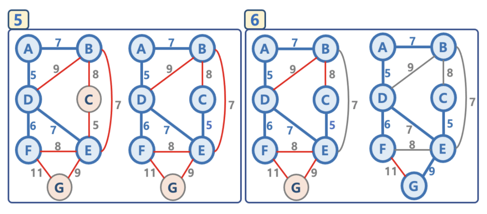

* 개선된 프림 알고리즘의 시간 복잡도
  * 최초 key 생성 시간 복잡도: O(V) // vertex 수 만큼
  * while 구문과 keys.poll()의 시간 복잡도는 O(V log V)
    * while 구문은 V(노드 갯수) 번 실행됨
    * heap 에서 최소 key 값을 가지는 노드 정보 추출 시(pop)의 시간 복잡도: O(log V)
  * for 구문의 총 시간 복잡도는 O(E log V)
    * for 구문은 while 구문 반복시에 결과적으로 총 최대 간선의 수 E만큼 실행 가능 O(E)
    * for 구문 안에서 key값 변경시마다 heap 구조를 변경해야 하며, heap 에는 최대 V개의 정보가 있으므로 O(log V)
  * 따라서 총 시간 복잡도는 O(V + V log V + E log V)
    * E > V이고 최대 V^2 = E 가 될 수 있음
    * O( (V + E) log V) = O( E log V)
