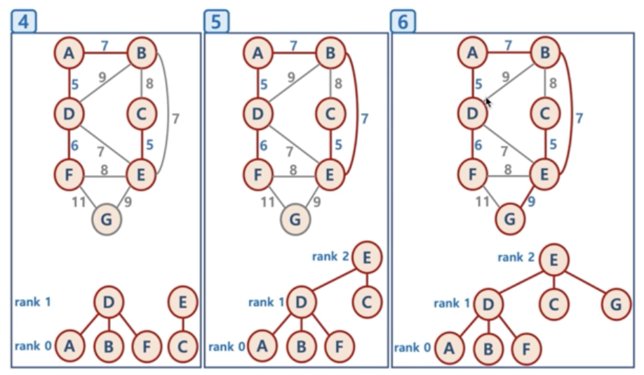

# 최소 신장 트리

* 신장 트리
  * Spanning Tree, 또는 신장 트리 라고 불리움
  * 원래의 그래프의 모든 노드가 연결되어 있으면서 트리의 속성을 만족하는 그래프
  * Spanning Tree의 조건
    * 본래의 그래프의 모든 노드를 포함해야함
    * 모든 노드가 서로 연결
    * 트리의 속성을 만족시킴 (사이클이 존재하지 않음)

* 최소 신장 트리

  * 가중치가 있는 그래프에서 간선의 가중치 합이 최소인 Spanning Tree를 지칭함

    

## 최소 신장 트리 알고리즘

* 그래프에서 최소 신장 트리를 찾을 수 있는 알고리즘이 존재함
* 대표적인 최소 신장 트리 알고리즘
  * 크루스칼 알고리즘, 프림 알고리즘 (난이도가 매우 높음)

### 크루스칼 알고리즘 (Kruskal's algorithm)

* 탐욕 알고리즘을 기초로 하고 있음 (당장 눈 앞의 최소 비용을 찾고, 결과적으로 최적의 솔루션을 찾음)
  1. 모든 정점을 독립적인 집합으로 만든다.
  2. 모든 간선을 비용을 기준으로 정렬하고, 비용이 작은 간선부터 양 끝의 두 정점을 비교한다.
  3. 두 정점의 최상위 정점을 확인하고, 서로 다를 경우 두 정점을 연결한다.

* 구현 방법

  1. 가중치 낮은 순으로 정렬
  2. 가중치가 가장 낮은 간선을 찾음

  3. 사이클이 생기는지 확인함

  4. 안 생겼으면 간선을 선택

  5. 2~4번 반복

* 구현 중 가장 문제되는 부분은 사이클이 생기는지 확인하는 부분임

  * Union-Find 알고리즘

    * Disjoint Set을 표현할 때 사용하는 알고리즘으로 트리 구조를 활용하는 알고리즘
    * 간단하게, 노드들 중에 연결된 노드를 찾거나, 노드들을 서로 연결할 때 사용

  * Disjoint Set이란?

    * 서로 중복되지 않는 부분 집합들로 나눠진 원소들에 대한 정보를 저장하고 조작하는 자료구조
    * 공통 원소가 없는 (서로소) 상호 베타적인 부분 집합들로 나눠진 원소들에 대한 자료구조를 의미함
    * Disjoint Set = 서로소 집합 자료구조

  * 구현 방법

    1. 초기화

       * n개의 원소가 개별 집합으로 이뤄지도록 초기화

         

    2. Union

       * 두 개별 집합을 하나의 집합으로 합침, 두 트리를 하나의 트리로 만듦

         

    3. Find

       * 여러 노드가 존재할 때, 두 개의 노드를 선택해서, 현재 두 노드가 서로 같은 그래프에 속하는지 판별하기 위해, 각 그룹의 최상단 원소 (루트 노드)를 확인

         

         

  * Union-Find 알고리즘의 고려할 점

    * Union 순서에 따라서, 최악의 경우 링크드 리스트와 같은 형태가 될 수 있음

    * 이 때는 Find/Union 시 계산량이 O(N)이 될 수 있으므로, 

    * 이 모습을 방지하기 위해, 해당 문제를 해결하기 위해, union-by-rank, path compression 기법을 사용함

      

  * union-by-rank 기법

    * 각 트리에 대해 높이(rank)를 기억해두고,

    * Union시 두 트리의 높이가 다르면, 높이가 작은 트리를 높이가 큰 트리에 붙임

      

    * Union시 두 트리의 높이가 같으면, 한 쪽의 트리 높이를 1 증가시켜주고, 다른 쪽의 트리를 해당 트리에 붙여줌

      

    * union-by-rank 기법을 이용한다면,

      * 높이가 h인 트리가 만들어지려면, 높이가 h-1인 두 개의 트리가 합쳐져야함
      * 높이가 h-1인 트리를 만들기 위해 최소 n개의 원소가 필요하다면, 높이가 h인 트리가 만들어지기 위해 최소 2n개의 원소가 필요함
      * 따라서 union-by-rank 기법을 사용하면, union/find 연산의 시간 복잡도는 O(N)이 아닌 O(log N)으로 줄일 수 있다.

  * path compression

    * Find를 실행한 노드에서 거쳐간 노드를 루트에 다이렉트로 연결하는 기법

    * Find를 실행한 노드는 이후부터는 루트 노드를 한 번에 알 수 있음

      

  * union-by-rank와 path compression 기법 사용시 시간 복잡도는 다음 계산식을 만족함이 증명되었음

    * O(M log* N)
    * N이 2^65536 값을 가지더라도, log* N의 값이 5이므로 거의 O(1), 즉 상수값에 가깝다고 볼 수 있음

* 구현

  * Edge 클래스 구현

  ~~~java
  import java.util.ArrayList;
  import java.util.Arrays;
  
  public class Edge3 implements Comparable<Edge3> {
    public int weight;
    public String nodeV;
    public String nodeU;
    
    public Edge3 (int weight, String nodeV, String nodeU) {
      this.weight = weight;
      this.nodeV = nodeV;
      this.nodeU = nodeU;
    }
    
    public String toString() {
      return "(" + this.weight + ", " + this.nodeV + ", " + this.nodeU + ")";
    }
    
    @Override
    public int compareTo(Edge3 edge) {
      return this.weight - edge.weight;
    }
  
    public static void main(String[] args) {
      ArrayList<String> vetices = new ArrayList<String>(Arrays.asList("A", "B", "C", "D", "E", "F", "G"));
      ArrayList<Edge3> edges = new ArrayList<Edge3>();
      edges.add(new Edge3(7, "A", "B"));
      edges.add(new Edge3(5, "A", "D"));
      edges.add(new Edge3(7, "B", "A"));
      edges.add(new Edge3(8, "B", "C"));
      edges.add(new Edge3(9, "B", "D"));
      edges.add(new Edge3(7, "B", "E"));
      edges.add(new Edge3(8, "C", "B"));
      edges.add(new Edge3(5, "C", "E"));
      edges.add(new Edge3(5, "D", "A"));
      edges.add(new Edge3(9, "D", "B"));
      edges.add(new Edge3(7, "D", "E"));
      edges.add(new Edge3(6, "D", "F"));
      edges.add(new Edge3(7, "E", "B"));
      edges.add(new Edge3(5, "E", "C"));
      edges.add(new Edge3(7, "E", "D"));
      edges.add(new Edge3(8, "E", "F"));
      edges.add(new Edge3(9, "E", "G"));
      edges.add(new Edge3(6, "F", "D"));
      edges.add(new Edge3(8, "F", "E"));
      edges.add(new Edge3(11, "F", "G"));
      edges.add(new Edge3(9, "G", "E"));
      edges.add(new Edge3(11, "G", "F"));
  
      System.out.println(edges);
    }
  }
  ~~~

  * Union-Find 알고리즘 메서드

  ~~~java
  // 1. 초기화
    public void makeSet(String node) {
      //n개의 개별적인 원소로 초기화
      parent.put(node, node);
      rank.put(node, 0);
    }
  
  // 2. Union
  	public String find(String node) {
      //path compression 기법
      //루트 노드에 모든 노드들이 붙어있는 모습을 보여줄 수 있음.
      if (parent.get(node) != node) {
        parent.put(node, find(parent.get(node))); //부모노드가 아니면 부모 노드를 찾아
      }
      return parent.get(node);
    }
  
    public void union(String nodeV, String nodeU) {
      String root1 = find(nodeV);
      String root2 = find(nodeU);
  
      //union-by-rank 기법
      if (rank.get(root1) > rank.get(root2)) {
        parent.put(root2, root1);
      } else {
        parent.put(root1, root2);
        if(rank.get(root1) == rank.get(root2)) {
          rank.put(root2, rank.get(root2) + 1);
        }
      }
    }
  ~~~

  * 전체

  ~~~java
  import java.util.ArrayList;
  import java.util.Arrays;
  import java.util.HashMap;
  import java.util.Collections;
  
  public class Edge3 implements Comparable<Edge3> {
    public int weight;
    public String nodeV;
    public String nodeU;
    HashMap<String, String> parent = new HashMap<String, String>();
    HashMap<String, Integer> rank = new HashMap<String, Integer>();
    
    public Edge3 (int weight, String nodeV, String nodeU) {
      this.weight = weight;
      this.nodeV = nodeV;
      this.nodeU = nodeU;
    }
    
    public String toString() {
      return "(" + this.weight + ", " + this.nodeV + ", " + this.nodeU + ")";
    }
    
    @Override
    public int compareTo(Edge3 edge) {
      return this.weight - edge.weight;
    }
  
    public String find(String node) {
      //path compression 기법
      //루트 노드에 모든 노드들이 붙어있는 모습을 보여줄 수 있음.
      if (parent.get(node) != node) {
        parent.put(node, find(parent.get(node))); //부모노드가 아니면 부모 노드를 찾아
      }
      return parent.get(node);
    }
  
    public void union(String nodeV, String nodeU) {
      String root1 = find(nodeV);
      String root2 = find(nodeU);
  
      //union-by-rank 기법
      if (rank.get(root1) > rank.get(root2)) {
        parent.put(root2, root1);
      } else {
        parent.put(root1, root2);
        if(rank.get(root1) == rank.get(root2)) {
          rank.put(root2, rank.get(root2) + 1);
        }
      }
    }
  
    public void makeSet(String node) {
      //n개의 개별적인 원소로 초기화
      parent.put(node, node);
      rank.put(node, 0);
    }
  
    public ArrayList<Edge3> kruskalFunc(ArrayList<String> vertices, ArrayList<Edge3> edges) {
      ArrayList<Edge3> mst = new ArrayList<Edge3>();
      Edge3 currentEdge;
  
      // 1. 초기화
      for (int i = 0 ; i < vertices.size() ; i++) {
        makeSet(vertices.get(i));
      }
  
      // 2. 간선 weight 기반, sorting
      Collections.sort(edges);
  
      for(int i = 0 ; i < edges.size() ; i++) {
        currentEdge = edges.get(i);
  
        //nodeV와 nodeU의 루트노드가 같지 않다는 것은 사이클이 생기지 않는다는 것과 같다.
        if (find(currentEdge.nodeV) != find(currentEdge.nodeU)) {
          union(currentEdge.nodeV, currentEdge.nodeU);
          mst.add(currentEdge);
        }
      }
      
    }
    public static void main(String[] args) {
      ArrayList<String> vertices = new ArrayList<String>(Arrays.asList("A", "B", "C", "D", "E", "F", "G"));
      ArrayList<Edge3> edges = new ArrayList<Edge3>();
      edges.add(new Edge3(7, "A", "B"));
      edges.add(new Edge3(5, "A", "D"));
      edges.add(new Edge3(7, "B", "A"));
      edges.add(new Edge3(8, "B", "C"));
      edges.add(new Edge3(9, "B", "D"));
      edges.add(new Edge3(7, "B", "E"));
      edges.add(new Edge3(8, "C", "B"));
      edges.add(new Edge3(5, "C", "E"));
      edges.add(new Edge3(5, "D", "A"));
      edges.add(new Edge3(9, "D", "B"));
      edges.add(new Edge3(7, "D", "E"));
      edges.add(new Edge3(6, "D", "F"));
      edges.add(new Edge3(7, "E", "B"));
      edges.add(new Edge3(5, "E", "C"));
      edges.add(new Edge3(7, "E", "D"));
      edges.add(new Edge3(8, "E", "F"));
      edges.add(new Edge3(9, "E", "G"));
      edges.add(new Edge3(6, "F", "D"));
      edges.add(new Edge3(8, "F", "E"));
      edges.add(new Edge3(11, "F", "G"));
      edges.add(new Edge3(9, "G", "E"));
      edges.add(new Edge3(11, "G", "F"));
  
      System.out.println(edges);
  
          
  
    }
  }
  ~~~

  

### 프림 알고리즘 (Prim's algorithm)