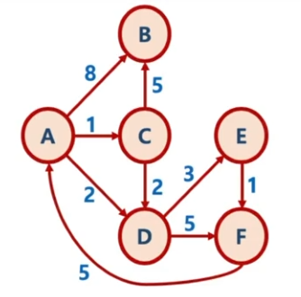
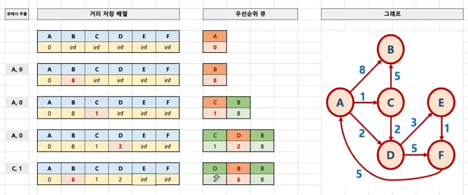
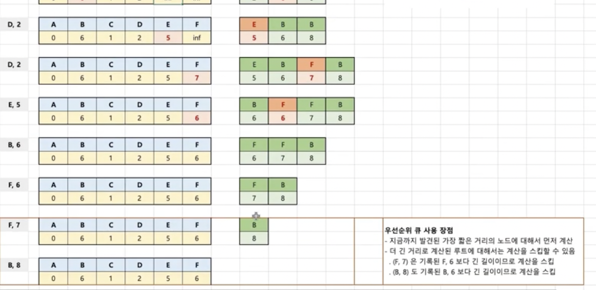

# 최단 경로  알고리즘

* 가중치 그래프에서 간선의 가중치 합이 최소가 되도록 하는 경로를 찾는 것이 목적

## 최단 경로 문제 종류

1. 단일 출발 최단 경로 문제
   * 그래프 내의 특정 노드에서 출발하여, 그래프 내의 모든 다른 노드에 도착하는 가장 짧은 경로를 찾는 문제
2. 단일 도착 최단 경로 문제
   * 모든 노드들로부터 출발해서, 그래프 내의 특정 노드로 도착하는 가장 짧은 경로를 찾는 문제
3. 단일 쌍 최단 경로 문제
   * 주어진 노드와 노드간의 최단 경로를 찾는 문제
4. 전체 쌍 최단 경로
   * 그래프 내의 모든 노드 쌍 사이에 대한 최단 경로를 찾는 문제

## 최단 경로를 찾는 알고리즘

### 다익스트라 알고리즘

* 다익스트라 알고리즘은 위의 최단 경로 문제 종류 중, 1번에 해당
  * 하나의 정점에서 다른 모든 정점에 도착하는 가장 짧은 거리를 구하는 문제

### 다익스트라 알고리즘 로직

* 방향치와 가중치가 있는 그래프에서 노드 간의 최소 가중치를 구하는 알고리즘

* 첫 정점을 기준으로 연결되어 있는 정점들을 추가해 가며, 최단 거리를 갱신하는 기법
* 다익스트라 알고리즘은 너비우선탐색(BFS)와 유사
  * 첫 정점부터 각 노드간의 거리를 저장하는 배열을 만든 후, 첫 정점의 인접 노드 같의 거리부터 먼저 계산하면서, 첫 정점부터 해당 노드간의 가장 짧은 거리를 해당 배열에 업데이트
* 우선 순위 큐를 활용한 다익스트라 알고리즘
  * 우선순위 큐는 최소 힙의 로직을 가진 큐
  * MinHeap 방식을 활용해서, 현재 가장 짧은 거리를 가진 노드 정보를 먼저 꺼내게 됨

1. 첫 정점을 기준으로 배열을 선언하여 첫 정점에서 각 정점까지의 거리를 저장
   * 초기 첫 정점의 거리는 0, 나머지는 무한대로 저장
   * 우선순위 큐에 첫 정점만 먼저 넣음
2. 우선순위 큐에서 노드를 꺼냄
   * 처음에는 첫 정점만 저장되어 있어, 첫 정점이 꺼내짐
   * 첫 정점에 인접한 노드들 각각에 대해, 첫 정점에서 각 노드로 가는 거리가 더 짧을 경우, 배열에 해당 노드의 거리를 업데이트 한다.
   * 배열에 해당 노드의 거리가 업데이트된 경우, 반드시 우선순위 큐에 넣는다
     * 큐라면 배열 뒤에 노드들이 쌓일텐데, 우선순위 큐이기 때문에 가중치가 작은 순서부터 쌓인다.
     * 결과적으로 BFS와 유사하게, 첫 정점에 인 접한 노드들을 순차적으로 방문하게 됨.
     * 만약 배열에 기록된 현재까지 발견된 가장 짧은 거리보다, 더 긴 루트를 가진 노드의 경우에는 해당 노드와 인접한 노드간의 거리 계산을 하지 않음
3. 2번의 과정을 우선순위 큐에 꺼낼 노드가 없을 때까지 반복한다.

### 구현

* 우선순위 큐

  ~~~java
  import java.util.PriorityQueue;
  
  public class Edge2 implements Comparable<Edge2> {
    public int distance;
    public String vertex;
  
    public Edge2(int distance, String vertex) {
      this.distance = distance;
      this.vertex = vertex;
    }
  
    public String toString() {
      return "vertext: " + this.vertex + " distance: " + this.distance;
    }
  
    @Override
    public int compareTo(Edge2 edge) {
      return this.distance - edge.distance;
    }
  
    public static void main(String[] args) {
  
      PriorityQueue<Edge2> priorityQueue = new PriorityQueue<Edge2>();
      //데이터 삽입
      priorityQueue.add(new Edge2(2, "A"));
      priorityQueue.add(new Edge2(5, "B"));
      priorityQueue.offer(new Edge2(1, "C"));
      priorityQueue.offer(new Edge2(7, "D"));
      
      System.out.println(priorityQueue);
  
      //데이터 출력
      System.out.println(priorityQueue.peek());
      System.out.println("peek 후" + priorityQueue);
  
      //데이터 삭제 후 출력
      Edge2 edge1 = priorityQueue.poll();
      System.out.println(edge1);
      System.out.println("poll 후" + priorityQueue);
  
      Edge2 edge2 = priorityQueue.poll();
      System.out.println(edge2);
      System.out.println("poll 후" + priorityQueue);
    }
  }
  
  ~~~

  * PriorityQueue 라이브러리를 사용
    * add, offer을 통해 데이터 넣을 수 있음
    * compareTo() 메서드를 구현했기 때문에 PriorityQueue의 정렬된 모습을 볼 수 있음.
      * 정렬된 모습은 최소 힙처럼 맨 앞에 가장 작은 수만 보임
    * peek() 메서드는 맨 앞 데이터 출력만
    * poll() 메서드는 맨 앞 데이터를 출력하고, 삭제
    * size() 메서드 또한 있음

* 그래프

  ~~~java
  //그래프
  HashMap<String, ArrayList<Edge>> graph = new HashMap<String, ArrayList<Edge>>();
  graph.put("A", new ArrayList<Edge>(Arrays.asList(new Edge(8, "B"), new Edge(1, "C"), new Edge(2, "D"))));
  graph.put("B", new ArrayList<Edge>());
  graph.put("C", new ArrayList<Edge>(Arrays.asList(new Edge(5, "B"), new Edge(2, "D"))));
  graph.put("D", new ArrayList<Edge>(Arrays.asList(new Edge(3, "E"), new Edge(5, "F"))));
  graph.put("E", new ArrayList<Edge>(Arrays.asList(new Edge(1, "F"))));
  graph.put("F", new ArrayList<Edge>(Arrays.asList(new Edge(5, "A"))));
  ~~~

  * HashMap에 들어있는 모든 키 가져오기

    ~~~java
    ArrayList<String> keyList = new ArrayList<String>();
    ArrayList<Edge> valueList = new ArrayList<Edge>();
    
    for(String key : graph.keySet()) {
      keyList.add(key);
      valueList.addAll(graph.get(key));
    }
    ~~~

    

* 다익스트라 알고리즘 구현

  1. 초기화

     ~~~java
     import java.util.PriorityQueue;
     import java.util.HashMap;
     import java.util.ArrayList;
     import java.util.Arrays;
     
     public class DijkstraPath {
       public HashMap<String, Integer> dijkstraFunc(HashMap<String, ArrayList<Edge>> graph, String start) {
         HashMap<String, Integer> distances = new HashMap<String, Integer>();
         for(String key : graph.keySet()) {
           distances.put(key, Integer.MAX_VALUE);
         }
         distances.put(start, 0);
     
         PriorityQueue<Edge> priorityQueue = new PriorityQueue<Edge>();
         priorityQueue.add(new Edge(distances.get(start), start));
     
         //알고리즘 작성
         return distances;
       }
     
       public static void main(String[] args) {
         //그래프
         HashMap<String, ArrayList<Edge>> graph = new HashMap<String, ArrayList<Edge>>();
         graph.put("A", new ArrayList<Edge>(Arrays.asList(new Edge(8, "B"), new Edge(1, "C"), new Edge(2, "D"))));
         graph.put("B", new ArrayList<Edge>());
         graph.put("C", new ArrayList<Edge>(Arrays.asList(new Edge(5, "B"), new Edge(2, "D"))));
         graph.put("D", new ArrayList<Edge>(Arrays.asList(new Edge(3, "E"), new Edge(5, "F"))));
         graph.put("E", new ArrayList<Edge>(Arrays.asList(new Edge(1, "F"))));
         graph.put("F", new ArrayList<Edge>(Arrays.asList(new Edge(5, "A"))));
     
         DijkstraPath dObject = new DijkstraPath();
         System.out.println(dObject.dijkstraFunc(graph, "A"));
         //{A=0, B=2147483647, C=2147483647, D=2147483647, E=2147483647, F=2147483647}
     
       }
     }
     ~~~

  2. 알고리즘 구현

     ~~~java
     import java.util.PriorityQueue;
     import java.util.HashMap;
     import java.util.ArrayList;
     import java.util.Arrays;
     
     public class DijkstraPath {
       public HashMap<String, Integer> dijkstraFunc(HashMap<String, ArrayList<Edge>> graph, String start) {
         HashMap<String, Integer> distances = new HashMap<String, Integer>();
         Edge edgeNode, adjacentNode;
         int currentDistance, weight, distance;
         String currentNode, adjacent;
         ArrayList<Edge> nodeList;
     
         for(String key : graph.keySet()) {
           distances.put(key, Integer.MAX_VALUE);
         }
         distances.put(start, 0);
     
         PriorityQueue<Edge> priorityQueue = new PriorityQueue<Edge>();
         priorityQueue.add(new Edge(distances.get(start), start));
     
         //알고리즘 작성
         while (priorityQueue.size() > 0) {
           edgeNode = priorityQueue.poll();
           currentDistance = edgeNode.distance;
           currentNode = edgeNode.vertex;
     
           if (distances.get(currentNode) < currentDistance) {
             continue;
           }
     
           nodeList = graph.get(currentNode);
           for(int i = 0 ; i < nodeList.size() ; i++) {
             adjacentNode = nodeList.get(i);
             adjacent = adjacentNode.vertex;
             weight = adjacentNode.distance;
             distance = currentDistance + weight;
     
             if(distance < distances.get(adjacent)) {
               distances.put(adjacent, distance);
               priorityQueue.add(new Edge(distance, adjacent));
             }
           }
         }
         return distances;
       }
     
       public static void main(String[] args) {
         //그래프
         HashMap<String, ArrayList<Edge>> graph = new HashMap<String, ArrayList<Edge>>();
         graph.put("A", new ArrayList<Edge>(Arrays.asList(new Edge(8, "B"), new Edge(1, "C"), new Edge(2, "D"))));
         graph.put("B", new ArrayList<Edge>());
         graph.put("C", new ArrayList<Edge>(Arrays.asList(new Edge(5, "B"), new Edge(2, "D"))));
         graph.put("D", new ArrayList<Edge>(Arrays.asList(new Edge(3, "E"), new Edge(5, "F"))));
         graph.put("E", new ArrayList<Edge>(Arrays.asList(new Edge(1, "F"))));
         graph.put("F", new ArrayList<Edge>(Arrays.asList(new Edge(5, "A"))));
     
         DijkstraPath dObject = new DijkstraPath();
         System.out.println(dObject.dijkstraFunc(graph, "A"));
     
       }
     }
     ~~~

     

### 시간 복잡도

* 최악의 경우 각 노드마다 인접한 간선들을 모두 검사하는 과정 => O(E)
* 우선순위 큐(힙)에서 노드/거리 정보를 넣고 삭제하는 과정 => O(E log E)
  * O(E) + O(E log E) = O(E log E)