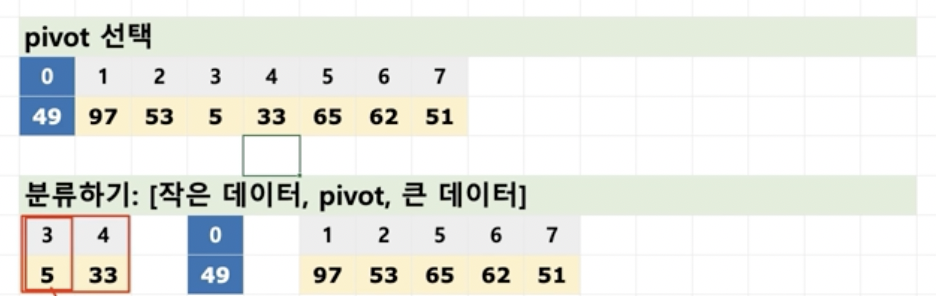

# 퀵 정렬

* 퀵 정렬이란?

  * 정렬 알고리즘의 꽃??
  * 기준점을 정해서, 기준점보다 작은 데이터는 왼쪽, 큰 데이터는 오른쪽으로 모으는 함수를 작성함
  * 각 왼쪽 오른쪽은 재귀용법을 사용해서 다시 동일 함수를 호출하여 위 작업을 반복함
  * 함수는 왼쪽 + 기준점 + 오른쪽을 리턴함

  
  * 데이터가 하나가 될 때 까지 계속 분류
  * 합치기

## 퀵 정렬 구현

* 피벗을 설정하고, 데이터를 분리하고 합치는 코드

  ~~~java
  import java.util.ArrayList;
  import java.util.Arrays;
  
  public class QuickSort {
    
    public ArrayList<Integer> quickSplitFunc(ArrayList<Integer> dataList) {
      if (dataList.size() <= 1) {
        return dataList;
      }
  
      ArrayList<Integer> leftArr = new ArrayList<Integer>();
      ArrayList<Integer> rightArr = new ArrayList<Integer>();
      int pivot = dataList.get(0);
  
      //while(dataList.get(0))
      for(int i = 1 ; i < dataList.size() ; i++) {
  
        if (pivot > dataList.get(i)) {
          leftArr.add(dataList.get(i));
        } else {
          rightArr.add(dataList.get(i));
        }
      }
      ArrayList<Integer> mergeArr = new ArrayList<Integer>();
      mergeArr.addAll(leftArr);
      mergeArr.add(pivot);
      mergeArr.addAll(rightArr);
  
      return mergeArr;
    }
  
    public static void main(String[] args) {
      QuickSort qSort = new QuickSort();
      qSort.quickSplitFunc(new ArrayList<Integer>(Arrays.asList(3,5,10,2,8,6,1,9,4,7)));
    }
  }
  ~~~

  

* 재귀용법을 통한 퀵 정렬 구현

  ~~~java
  import java.util.ArrayList;
  import java.util.Arrays;
  
  public class QuickSort {
    
    public ArrayList<Integer> quickSortFunc(ArrayList<Integer> dataList) {
      if (dataList.size() <= 1) {
        return dataList;
      }
  
      ArrayList<Integer> leftArr = new ArrayList<Integer>();
      ArrayList<Integer> rightArr = new ArrayList<Integer>();
  
      int pivot = dataList.get(0);
  
      for(int i = 1 ; i < dataList.size() ; i++) {
        if (pivot > dataList.get(i)) {
          leftArr.add(dataList.get(i));
        } else {
          rightArr.add(dataList.get(i));
        }
      }
  
      ArrayList<Integer> mergedArr = new ArrayList<Integer>();
      mergedArr.addAll(this.quickSortFunc(leftArr));
      mergedArr.add(pivot);
      mergedArr.addAll(this.quickSortFunc(rightArr));
  
      return mergedArr;
    }
  
    public static void main(String[] args) {
      QuickSort qSort = new QuickSort();
      System.out.println(qSort.quickSortFunc(new ArrayList<Integer>(Arrays.asList(3,5,10,2,8,6,1,9,4,7))));
    }
  }
  ~~~

  

* 분할 정복
  * 문제를 나눌 수 없을 떄까지 나누어서 각각을 풀면서 다시 합병하여 문제의 답을 얻는 알고리즘
  * 하양식 접근법으로, 상위의 해답을 구하기 위해, 아래로 내려가면서 하위의 해답을 구하는 방식
    * 일반적으로 재귀함수로 구현
  * 문제를 잘게 쪼갤 때, 부분 문제는 서로 중복되지 않음
    * 예 : 병합정렬, 퀵 정렬 등

## 퀵 정렬 알고리즘 분석

* 병합정렬과 유사하게, 일반적인 상황에서 시간 복잡도는 O(n log n)
  * 단 최악의 경우
    * 이미 정렬된 배열에서 pivot이 가장 크거나, 가장 작으면 가장 큰 시간이 소요됨
    * 모든 데이터를 비교하는 상황이 나오기 때문에 O(n^2)

