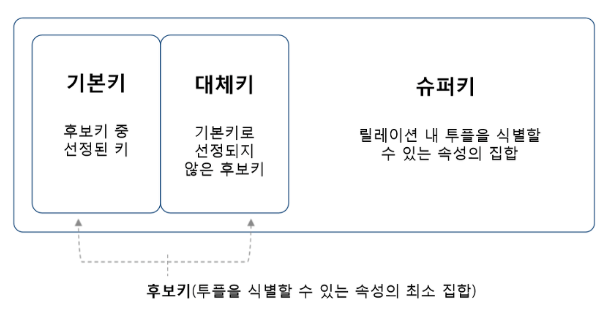
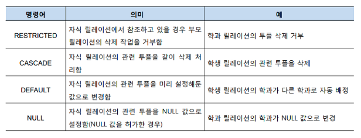

읽어볼것

https://velog.io/@mowinckel/%EC%95%84%EB%AC%B4%EB%8F%84-%EA%B0%80%EB%A5%B4%EC%B3%90-%EC%A3%BC%EC%A7%80-%EC%95%8A%EB%8A%94-%EA%B2%83
기술면접 내용 : https://velog.io/@hygoogi/%EA%B8%B0%EC%88%A0%EB%A9%B4%EC%A0%91-%EC%A4%80%EB%B9%84%ED%95%98%EA%B8%B0

기술면접 내용 : https://velog.io/@mongle/%EA%B8%B0%EC%88%A0%EB%A9%B4%EC%A0%91-%EA%B0%80%EC%9D%B4%EB%93%9C
면접질문 : https://velog.io/@minj9_6/%EA%B0%9C%EB%B0%9C%EC%9E%90%EB%A1%9C%EC%84%9C-%EC%B2%AB-%EB%A9%B4%EC%A0%91-%EC%A7%88%EB%AC%B8-%EC%A0%95%EB%A6%AC
면접질문 : https://velog.io/@minsgy/%EB%B0%B1%EC%97%94%EB%93%9C-%EA%B0%9C%EB%B0%9C%EC%9E%90-%EB%A9%B4%EC%A0%91%ED%95%99%EC%8A%B5%EB%82%B4%EC%9A%A9

## API

* RESTful이란?
  * 웹의 기존 기술과 HTTP 프로토콜을 그대로 활용하기 때문에 웹의 장점을 최대한 활용할 수 있는 아키텍처 스타일
  * 웹에서 사용되는 데이터나 자원을 HTTP로 표현하고 HTTP 프로토콜을 통해 요청과 응답을 정의하는 방식
  * HTTP URI를 통해 어떤 자원인지 명시하고 HTTP 메소드를 통해 자원을 처리하도록 설계된 것
  * 6가지 원칙
    * 인터페이스 일관성 - 하나의 URL로는 한 개의 데이터만 가져와야 한다.
    * Stateless(무상태) - API는 들어오는 요청만 단순히 수행
    * Cacheable(캐쉬 처리 가능) - 요청을 통해 보내는 자료들은 캐싱이 가능해야한다.
    * Client-Server역할 구분 - 사용자는 요청만 서버는 응답만
    * Layered System - 계층화 시켜 요청을 처리하게 만드는 것
    * Code on Demand(선택) - 서버는 고객에게 실제 실행 가능한 코드를 전송할 수 있어야한다.
  
  * URI작성 방법?
  
* HTTP란 무엇인가
  * 인터넷에서 데이터를 주고받을 수 있는 프로토콜
  * 요청
    * 시작줄(첫 번째 줄)
      * 메서드 구조 버전

    * 헤더(두 번째 줄)
      * 요청에 대한 정보

    * 본문(헤더에서 한 줄 띄고)
      * 요청 데이터

  * 응답
    * 시작줄(첫 번째 줄)
      * 버전 상태코드 상태메세지로 구성
    * 헤더(두 번째 줄)
      * 응답에 대한 정보
    * 본문(헤더에서 한 줄 띄고)
      * 응답 데이터

* HTTP 주요 메서드
  * GET : 읽기
  * POST 생성
  * PUT, PATCH 수정
  * DELETE 삭제
    * 멱등성 : 매 요청마다 같은 리소스를 반환하는 특징 / POST만 가지지 못함 - 상태를 변화시킨다
    * 생성은 생성을 계속 요청하면 생성이 계속 된다. 상태가 계속 변한다.
    * 읽기 수정 삭제는 한번 요청하고 난 후 계속 요청해도 똑같은 상태다.

* HTTP 상태코드
  * 100번 조건부 응답 - 요청을 받았고 작업을 계속한다.
  * 200번 성공
  * 300번 리다이렉션 완료 - 요청을 마치기 위해 추가 동작을 취해야 한다.
  * 400번 요청 오류
  * 500번 서버 오류
* 세션과 쿠키?
  * 보안성이 낮은 쿠키대신 세션을 사용하면 되는데 안하는 이유
    * 세션은 : 서버에 메모리를 과도하게 사용하는 방법
* 도메인네임과 호스트네임 차이
  * https://real-dongsoo7.tistory.com/122

## 자바

* 함수형 프로그래밍
  * 명령형 프로그래밍은 멀티스레드를 활용한 동시성 프로그래밍은 스레드간 공유되는 데이터나 상태 값이 변경 가능하기 때문에 데드락 상태에 빠질 위험이 있다. 함수형 프로그래밍은 여러 스레드가 동시에 공유 데이터에 접근하더라고 해당 데이터가 변경될 수 없기 때문에 동시성 관련 문제를 봉쇄한다.

## 스프링

* 스프링을 왜 쓰나?
  * 애플리케이션을 만드는데 필요한 거의 모든 요소를 지원해주기 때문이다. 어딘가에 있는 객체들을 빈으로 설정해서 주입해주고, 우리가 편리하게 쓰는 어노테이션들 예를들어 트랜잭션 등 반복적으로 써줘야 했던 내용들을 안써도 되게 해주고, 자유도가 높아 다양한 모듈을 사용할 수 있음.
* 예외처리는 어떻게?
  * 예외는 체크예외와 언체크 예외가 있다(컴파일러가 예외를 체크하냐 안하냐). 체크 예외는 반드시 잡거나 처리하지만 언체크 예외는 처리하지 않아도 문제가 없다면 예외를 안던지고 문제가 생기면 자동으로 예외를 던진다. 
  * 이 때 컨트롤러어드바이스로 ExceptionHandler 할 수 있도록 해주고, 런타임예외를 상속하는 클래스를 만들어서 개발자가 만드는 예외를 생성해서 처리할 수 있다.
* 프로젝트 설계를 어떻게 하나?
* 데이터소스를 왜 쓰나?
  * 데이터소스로 DB를 연결하고 커넥션을 획득해야합니다. 그 커넥션을 통해서 DB에 쿼리를 보내고 받는 결과를 가져올 수 있기 때문이다.
* 엔티티와 DTO를 왜 분리하나?
  * 엔티티의 경우 
* 유효성검사를 어떻게 했나?
* OOP? - 객체를 재사용하는 방법
  * 객체지향 설계
    * 우리가 만들려는 로직을 인터페이스를 구현하도록 만들고, 로직을 가져올 때 new 뭐뭐로 가져오는 것이 아닌 생성자나 필드나 메서드로 주입받아서 사용하는것을 의미. 왜냐면 이렇게 해야 사용하고 싶은 구현체를 자유롭게 변경할 수 있어 유지보수가 좋고 코드 재활용에 좋다.
* DI
  * 의존성 주입 - 필요한 객체를 직접 생성하는 것이 아닌 외부로부터 받아서 사용하는 것
  * 의존 관계를 외부에서 결정함으로서 코드 재사용성을 높일 수 있음
  * 생성자, 메서드(setter), 변수로 주입 가능
  * 생성자 전달이 권장됨
    * NullPointerException 방지
    * final 선언 가능
    * 테스트 코드 작성이 쉬움
* IoC
  * 제어의 역전 - 메서드나 객체 호출을 개발자가 아닌 프레임워크가 해주는것 (스프링 컨테이너가 해줌)
* DI와 IoC차이?
  * DI는 IoC 컨테이너가 xml 파일에 정의된대로 bean 객체를 생성하고 의존성을 대신 주입해주는것
  * IoC는 사용자가 직접 객체 생성 관리하는 것을 IoC 컨테이너가 대신 해주는 것
* 서블릿
  * 동적인 데이터를 제공하는 자바 클래스, HTTP요청을 받아서 그에 응답을 해준다.
* MVC 디자인패턴 - 양방향 통신
  * M - Model 응용프로그램의 동작 및 데이터 관리
  * V - View UI로 화면에 표출
  * C - Controller 사용자에게 요청 받아 Model를 조작하고 View를 업데이트
  * 컨트롤러에 요청이 오면 모델을 통해 데이터를 가져오고 그 데이터를 뷰로 화면에 보여주는 패턴
  * 모델1 방식 - JSP가 Controller과 View 역할을 모두 수행해서 요청 처리
  * 모델2 방식 - Controller 역할을 서블릿이 수행해서 View와 Model 어디로 보낼것인지 판단해서 전송

* mybatis
  * 데이터베이스를 이용할 때 JDBC API를 이용한다. JDBC를 이용하려면 작성해야 할 코드가 많다. 
  * 데이터 소스로부터 커넥션을 얻고 쿼리를 얻어서 얻는 결과를 가져오고 사용한 객체들을 close 시켜주는 것까지
  * mybtis는 JDBC로 처리하는 상당 부분의 코드와 설정들을 매핑해준다. 자바의 메서드와 SQL을 매핑해준다.
* ORM?
  https://velog.io/@modsiw/JPAJava-Persistence-API%EC%9D%98-%EA%B0%9C%EB%85%90
* JPA

  * 자바 ORM기술 API로 자바 클래스 즉 객체와 DB의 테이블을 매핑시켜주는 것을 말함(SQL 매핑이 아님)

* Q15. 프로젝트 구성을 MVC 패턴을 많이하는데 MVC 패턴이 뭔지 알고 있는지?
  Q16. 왜 MVC패턴을 사용하는지? 코드의 양이 많아져도 유지보수가 편하고 확장이 용이하다.
  Q17. MVC말고 다른 디자인패턴에 대해 알고 있는지?
  Q18. 아키텍처적인 패턴 외에 **다른 디자인 패턴은 공부해봤냐? EX> 싱글턴 패턴 , 팩토리 패턴 등
* TDD 테스트 주도 개발
  * https://velog.io/@matisse/TDD%EA%B0%80-%EB%AD%90%EC%A7%80
* 테스트 방법?
* 유닛테스트?
* 예외처리?

## DB

* DBMS 사용 이유
  * 단순 파일시스템을 사용할 경우 유지 보수가 어려움
  * 데이터 일관성 유지 어려움 - DB에선 테이블을 서로 참조해서 일관성을 유지하지만, 단순 파일 시스템에서는 고객 정보를 바꾼다면 다른 테이블도 똑같이 바꿔주면서 일관성 있는 데이터를 만들어줘야 함
  * 데이터 무결성 유지 어렵고, 데이터가 그 파일에 종속적임
* SQL분류
  * DDL - 테이블 생성 변경 제거
  * DML - 새 데이터 삽입, 수정, 삭제
  * DCL - 보안을 위해 데이터에 대한 접근 및 사용권한 조절
  * SELECT - 데이터 조회
* sql 정리 https://paris-in-the-rain.tistory.com/100
* 
* 관계형 DB와 비관계형 DB
  * https://newehblog.tistory.com/38?category=834445
    https://devuna.tistory.com/25
* 모델링방법
* 테이블을 키워야할 때 필요한 방법?
  * 테이블에 칼럼을 추가할지 테이블을 더만들지?
  * 단순히 컬럼을 넣는건 인덱스 걸어도 성능이 떨어짐
* 데이터베이스 정규화?
* inner outer join
* 서브쿼리를 join으로 바꾸는 경우
* select 쿼리 실행 순서
* 카디널리티
  * 데이터베이스에서 카디널리티라는 것은 중복도라고 생각하면 된다. 즉, 중복되는 값들이 적으면 카디널리티가 높은 것이고, 중복되는 값들이 많으면 카디널리티는 낮은 것이다.
  * 예를들어, 
    * 주민등록번호는 중복되는 값이 없으므로 카디널리티가 높다.
    * 이름은 중복되는 값이 많으므로 카디널리티가 낮다.
* PK 선정시 고려사항
  * 릴레이션 내 튜플을 식별할 수 있는 고유한 값을 가져야함
  * not null
  * 키 값 변동 x
* PK와 복합키(후보키라고도 함 = 튜플을 유일하게 식별할 수 있는 속성의 최소집합)
  * PK라는 것은 즉, 후보키 중 하나를 기본키로 사용한 것
  * 복합키를 쓰는 경우는 특정 데이터를 식별하는게 의미가 없는 도메인인 경우 (걸음기록과 같은 통계성 데이터)
  * 예) 걸음기록 테이블을 쓴다면 이름, 기록일시, 걸음수를 컬럼으로 들 수 있다.
  * 사용자의 최근 일주일간 평균 걸음 수를 조회할 수 있고, 각 날의 걸음 수를 조회하는 서비스를 만들 수 있다.
  * 그러면 복합키를 어떻게 설계할까? => 카디널리티가 낮은 순서(중복되는 값들이 많은 순서)로 복합키로 구성

* pk와 uk차이

* fk

  * 외래키는 다른 릴레이션의 기본키를 참조한 속성
  * PK와 달리 null값이 되어도 상관은 없음
  * https://velog.io/@subutai/%EB%A7%A4%EC%9D%BC-2day

* 무결성 제약조건

  * 데이터 무결성은 데이터베이스에 저장된 데이터의 일관성과 정확성을 지키는 것을 말한다.

  * 도메인 무결성 제약조건 : 릴레이션 내 튜플들이 각 속성의 도메인에 지정된 값만을 가져야한다.

    * 형식, null, default, chek 등으로 지정된 내용

  * 개체 무결성 제약조건 : 기본키 제약

    * 기본키는 null값을 가지면 안되고, 릴레이션 내에 오직 하나의 값만 존재해야 하는 조건

  * 참조 무결성 제약조건 : 외래키 제약

    * 릴레이션 간의 참조 관계를 선언

    * 자식 릴레이션의 외래키는 부모 릴레이션의 기본키와 도메인이 동일해야 한다.

    * 자식 릴레이션의 값이 변경될 때 부모 릴레이션의 제약을 우선 확인한다는 조건

    * 예) 부모 릴레이션에 3001이라는 학과코드(기본키)를 추가할 때, 문제 없다.
      그러나 자식 릴레이션에 존재하지 않는 3001 학과코드를 삽입하면 문제가 생긴다.

      >부모릴레이션에 삽입: 정상적으로 진행됨
      >
      >자식릴레이션에 삽입: 참조받는 테이블에 외래키 값이 없으므로 삽입 금지
      >
      >부모릴레이션의 삭제: 참조하는 테이블을 같이 삭제할 수 있어서 금지하거나 추가작업이 필요
      >
      >자식릴레이션의 삭제: 바로 삭제 가능함
      >
      >수정: 삭제와 삽입의 연속 수행으로 각 삭제와 삽입의 제약을 고려하여 진행됨

  

* DB인덱싱?

  * https://velog.io/@matisse/db-indexing
    https://velog.io/@juunini/%EC%A7%80%EA%B8%88%EA%B9%8C%EC%A7%80-%EA%B2%AA%EC%9D%80-DB%EC%97%90-%ED%95%98%EC%A7%80-%EB%A7%90%EC%95%84%EC%95%BC-%ED%95%A0-%EC%A7%93

* 트랜잭션

  * ACID 데이터베이스에서 일어나는 하나의 트랜잭션의 안전성을 보장하기 위한 성질
    * Atomic 원자성 - 한 트랜잭션 연산들이 모두 성공, 실패되는 성질
    * Consistency 일관성 - 데이터베이스의 상태가 일관, 트랜잭션이 일어나도 상태가 이전과 같다.
    * Isolation 고립성, 격리성 - 모든 트랜잭션은 서로 독립
    * Durability 지속성 - 트랜잭션에 대한 로그가 남아야 한다.

  * https://devuna.tistory.com/30?category=894625

  

## 배포

## AWS

## 네트워크

* HTTP, HTTPS 차이
  * HTTP는 웹브라우저와 서버간의 웹페이지 같은 자원들 주고받을 때 쓰는 통신 규약
  * HTTPS는 정보를 암호화하는 SSL(Secure Socket Layer)을 이용한 프로토콜
    * SSL - 현재는 TLS(전송 계층 보안)
    * 데이터를 주고 받을 때 데이터가 암호화 되어서 제3자가 확인할 수 없도록 보안적인 부분을 보강한 것
* OSI 7계층
  * 물리계층 : 전기적 신호 전송(bit)
  * 데이터계층 : 신뢰성 있는 데이터 전송 보장하기 위한 계층, 물리계층 오류를 찾아내고 수정, 물리적 주소 값 할당받음
  * 네트워크계층 : 여러 노드를 거치는 경로를 찾아주는 계층, 데이터를 목적지까지 가장 안전하고 빠르게 전달, 패킷 사용, IP주소
  * 전송계층 : 데이터 교환의 신뢰성 부여, 3계층에서 정해진 경로로 패킷을 전송하는 계층, TCP/UDP
  * 세션 : 양 끝단의 응용 프로세스(통신 장치) 간 상호작용 및 동기화, TCP/IP 세션을 만들고 업앰, 연결 세션에서 데이터 교환, 오류 복구
  * 표현 : 코드 간 번역 제공, 상위 계층에서 데이터 혁식 상의 차이를 다루는 부담을 덜어줌, 사용자의 명령어를 완료 및 결과 표현한다. ASCII
  * 응용: 사용자와 가장 밀접한 계층, 응용 프로세스 간의 정보 교환이 주 기능, 메일, 동영상
* OSI 7계층 나눠져 있는 이유
  * 통신 오류가 났을 때 정확히 어디서 문제가 생겼는지 확인 할 수 있도록 계층을 나눔
* TCP/IP 모델
  * 물 데 네 전 응
  * OSI 7계층 모델을 참고하여 구축된 모델
* TCP (Transmission Control Protocol)
  * 인터넷에서 데이터를 주고받는 과정을 제어하는 통신 표준
  * 이 프로토콜은 데이터를 교환하는 기기간 데이터의 무결성(정확성)과 전달의 신뢰성 보장
  * 거의 모든 애플리케이션 수준의 프로토콜(FTP, SSH, HTTP 등)에서 사용
* IP
  * 인터넷을 통해 데이터를 전송하기 위해 지켜야 하는 규칙
  * 데이터 전송 목적지 역할
* 패킷
  * 데이터를 전송할 때 완전한 데이터를 바로 보내지 않고 분할 작업을 거침
  * 이 때 분할되어 작아진 데이터 단위를 패킷이라고 함
  * 분할하는 이유는 데이터 전송이 실패했을 때 처음부터 다시 데이터를 전송하지 않을 수 있고, 데이터가 완전히 전송될 때까지 다른 데이터가 대기해야하기 때문에 분할 전송 후 수신측에서 완전한 데이터로 재결합하여 사용
* public ip와 private ip?
* vpc?