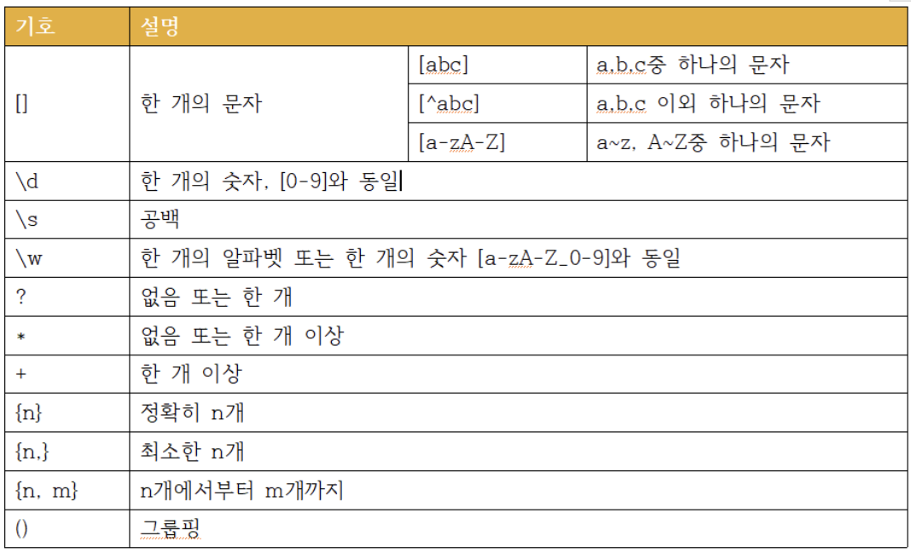
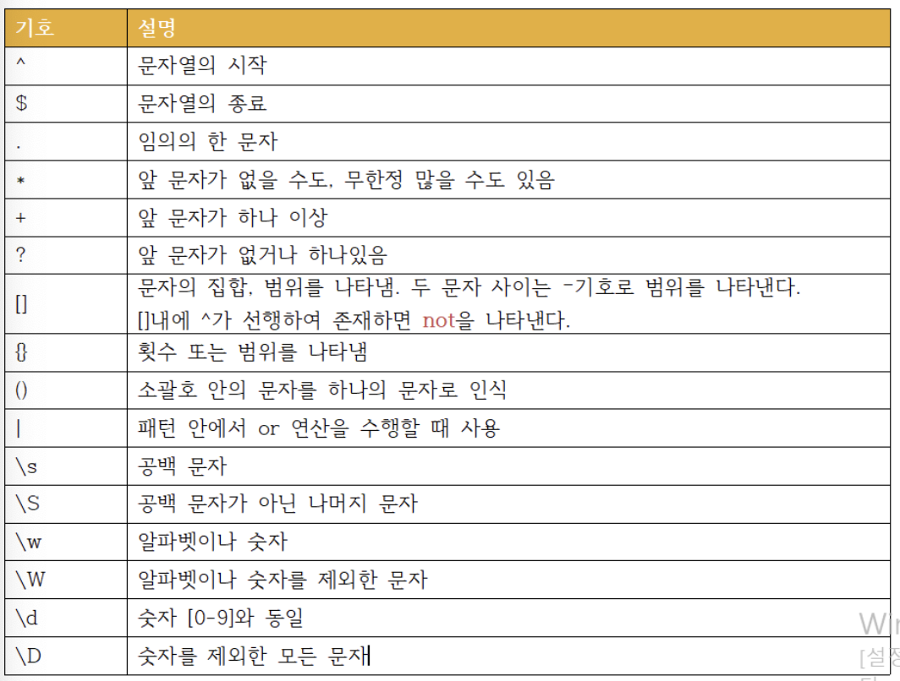

# replace(), replaceAll(), 정규식

## replace(찾을 문자열, 바꿀 문자열)

어떤 문자열을 원하는 문자열로 변경하는 메서드

~~~java
public class Test {
    public static void main(String[] args) {
        String str = "I have a pen, I have an apple";
        System.out.println(str.replace("have", "got"));
      	//결과 : I got a pen, I got an apple
    }
}
~~~

## replaceAll(정규식 또는 기존 문자, 대체 문자)

어떤 문자열이나 정규식에 맞춰 원하는 문자열로 변경하는 메서드
`replace`와 달리 정규식을 사용할 수 있다.

~~~java
public class Test {
    public static void main(String[] args) {
        String str = "I have a pen, I have an apple33";
        System.out.println(str.replaceAll("[^A-z]", ""));

        System.out.println(str.replaceAll("[\d]", "got"));
    }
}
~~~

### 정규표현식

* `.x` : 임의의 문자 + x

  ex) a.c : abc, aOc, a0c...

  ex) a..c : abbc, aOOc, a00c...

* `x*` : x의 0번 이상 반복

* `x+` : x의 1번이상 반복

* `^x` : 문자열이 x로 시작

* `x$` : 문자열이 x로 끝남

* `x?` : x가 존재 할수도, 하지 않을 수도 있음

  ex) ab?c : ac, abc

* `x|y` : x 또는 y

  ex) (x|y)z : xz, yz

* `x{n}` : x의 n번 반복

* `x{m, n}` : x의 m번 이상 n번 이하 반복

* `x{n,}` : x의 n번 이상 반복

* `[xy]` : x또는 y 한문자

* `[x-z]` : x~z 범위 내의 한 문자

* `[^xy]` : x또는 y를 제외한 한문자

> \w : 알파벳이나 숫자나 _ 언더바
>
> \W : 알파벳이나 숫자나 _ 언더바를 제외한 문자

## replaceFirst(찾을 문자열, 바꿀 문자열)

첫 번째로 발견되는 어떤 문자열만 원하는 문자열로 변경하는 메서드