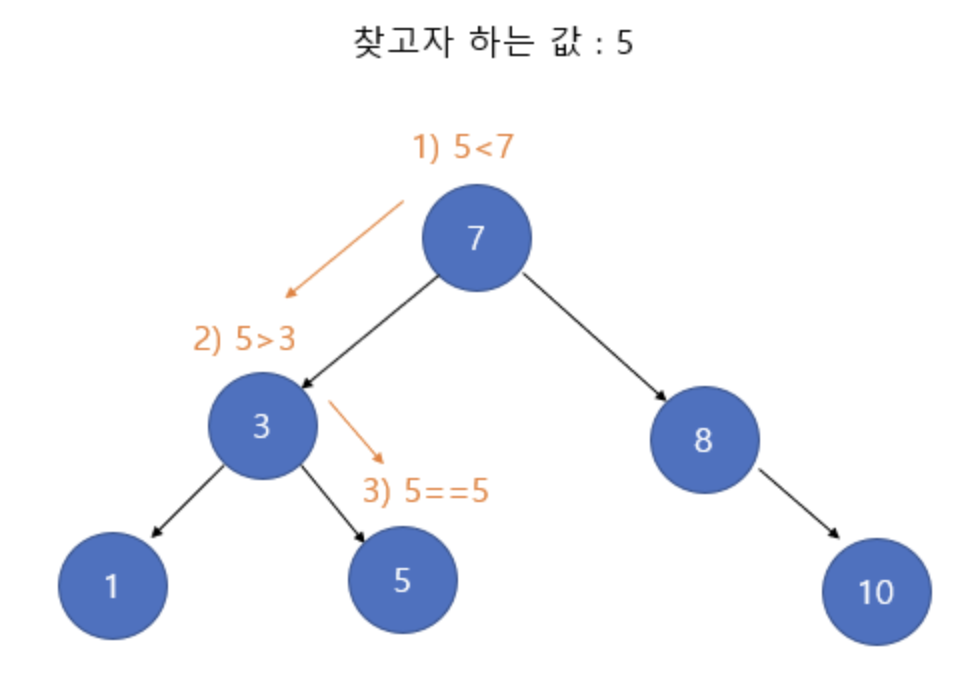

# 결정 알고리즘, 이진탐색트리

보기에는 모든 사건들을 다 찾아야 하는 것 처럼 보이지만, 나와야 하는 값을 이분 탐색으로 결정을 할 수 있다면?

같은 재귀함수지만 이진 탐색을 섞은 재귀함수이다.

찾고자 하는 값을 기준으로 이진탐색을 하면 되는 모습이다.




## 예제 코드

### 예제 1

아래 코드는 연속되는 정해진 개수의 부분집합들의 각 합중 가장 큰 합중 가장 작은 경우를 결정하는 코드이다.

예시 입력 1 

```java
9 3 //9개의 데이터 / 부분집합은 3개
1 2 3 4 5 6 7 8 9 //데이터
```

예시 출력 1

```java
17 // {1,2,3,4,5} / {6,7} / {8,9} 각 합 중 가장 큰 것은 17이고 이 것이 가장 작은 경우다.
```

~~~java
static void binarySearch (int lt, int rt) {
  if (lt > rt) return;

  int div = (lt + rt) / 2;
  int cnt = 0;
  int sum = 0;
  
  //직관적으로 보지말고 관점을 다르게 보자.
	//부분집합 3개를 만들었는데 그 중 합이 가장 큰 것을 결정하는 모습이 아니라
  //결정되는 합의 크기를 정하고 만들어지는 부분집합의 개수가 입력보다 많은지 적은지 확인하는 생각을 하자
  for (int i = 0; i < N; i++) {
    if (sum + arr[i] > div) {
      cnt++;
      sum = 0;
    }
    sum += arr[i];
  }

  //부분집합의 개수가 입력 값보다 적으면 결정값을 기억하고, lt ~ div-1 까지에서 찾아보자.
  //부분집합의 개수가 입력 값보다 크면 결정값은 해당되지 않으므로 이보다 큰 결정값을 찾아본다.
  if (cnt < M) {
    min = Math.min(min, div);
    binarySearch(lt, div - 1);
  } else {
    binarySearch(div + 1, rt);
  }
}
~~~


### 예제 2

설명

N개의 마구간이 수직선상에 있습니다.

C마리의 말들을 각 마구간에 한 마리의 말만 넣을 수 있고,

가장 가까운 두 말의 거리가 최대가 되게 말을 마구간에 배치하고 싶습니다.

C마리의 말을 N개의 마구간에 배치했을 때 가장 가까운 두 말의 거리가 최대가 되는 그 최대값을 출력하는 프로그램을 작성하세요.

예시 입력 1

```
5 3
1 2 8 4 9
```

예시 출력 2

```
3
```


* Two Pointer 알고리즘을 생각해보자. $O(n^2)$에서 $O(n)$으로 줄게 만드는 정말 좋은 방법이다.

```java
static void binarySearch (int lt, int rt) {
    if (lt > rt) return;
    int mid = (lt + rt) / 2;
    int cnt = 1;
    int idx = 0;
    for (int i = 1; i < N; i++) {
        if (arr[i] - arr[idx] >= mid) {
            cnt++;
            idx = i;
        }
    }

    if (cnt >= M) {
        result = Math.max(mid, result);
        binarySearch(mid + 1, rt);
    } else {
        binarySearch(lt, mid - 1);
    }
}
```