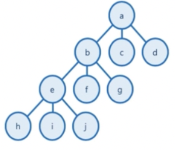
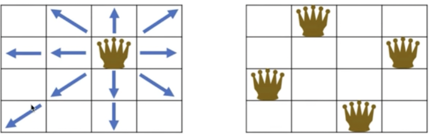
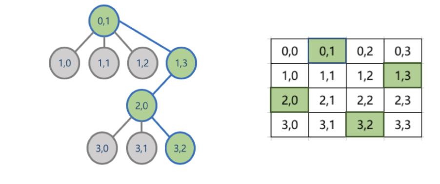
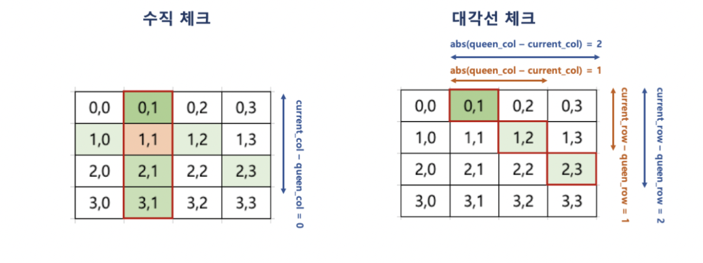

# 백 트래킹 

* 백 트래킹 또는 퇴각 검색으로 부름
* 제약 조건 만족 문제에서 해를 찾기 위한 전략
  * 해를 찾기 위해, 후보군에 제약 조건을 점진적으로 체크하다가, 해당 후보군이 제약 조건을 마족할 수 없다고 판단되는 즉시 backtrack(다시는 이 후보군을 체크하지 않을 것을 표기)하고, 결국 최적의 해를 찾는 방법
* 실제 구현시, 고려할 수 있는 모든 경우의 수(후보군)를 상태공간트리(State Space Tree)를 통해 표현
  * 각 후보군을 탐색하는 방식을 DFS 방식으로 확인
  * 상태 공간 트리를 탐색하면서, 제약이 맞지 않으면 해의 후보가 될만한 곳으로 바로 넘어가서 탐색
    * Promising: 해당 루트가 조건에 맞는지를 검사하는 기법
    * Pruning: 조건에 맞지 않으면 포기하고 다른 루트로 바로 돌아서서, 탐색의 시간을 절약하는 기법

## 상태 공간 트리(State Space Tree)

* 문제 해결 과정의 중간 상태를 각각의 노드로 나타낸 트리

 

## N Queen 문제 이해

* 대표적인 백 트래킹 문제
* N x N 크기의 체스판에 N개의 퀸을 서로 공격할 수 없도록 배치하는 문제
* 퀸은 다음과 같이 이동할 수 있으므로, 배치된 퀸 간에 공격할 수 없는 위치로 배치해야 함
  * 퀸 : 수직, 수평, 대각선 이동 가능
  * 따라서 다음 오른쪽 모습처럼 배치해야 함

### Pruning(가지치기) for N Queen 문제

* 한 행에는 하나의 퀸 밖에 위치할 수 없음 (퀸은 수평 이동이 가능하므로)
* 맨 위에 있는 행부터 퀸을 배치하고, 다음 행에 해당 퀸이 이동할 수 없는 위치를 찾아 퀸을 배치
* 만약 앞선 행에 배치한 퀸으로 인해, 다음 행에 해당 퀸들이 이동할 수 없는 위치가 없을 경우에는, 더 이상 퀸을 배치하지 않고, 이전 행의 퀸의 배치를 바꿈
  * 즉, 맨 위의 행부터 전체 행까지 퀸의 배치가 가능한 경우의 수를 상태 공간 트리 형태로 만든 후, 각 경우를 맨 위의 행부터 DFS 방식으로 접근, 해당 경우가 진행이 어려울 경우, 더이상 진행하지 않고, 다른 경우를 체크하는 방식

### Promising for N Queen 문제

* 해당 루트가 조건에 맞는지를 검사하는 기법을 활용하여,
* 현재까지 앞선 행에서 배치한 퀸이 이동할 수 없는 위치가 있는지를 다음과 같은 조건으로 확인
  * 한 행에 어차피 하나의 퀸만 배치 가능하므로 수평 체크는 별도로 필요하지 않음

#### 구현

~~~java
package BackTracking;

import java.util.ArrayList;

public class NQueen {

  public boolean isAvailable(ArrayList<Integer> candidate, Integer currentCol) {
    Integer currentRow = candidate.size();
    for (int i = 0 ; i < currentRow ; i++) {
      if ((candidate.get(i) == currentCol) || (Math.abs(candidate.get(i) - currentCol) == currentRow - i)) {
        return false;
      }
    }
    return true;
  }

  public void dfsFunc(Integer N, Integer currentRow, ArrayList<Integer> currentCandidate) {
    if(currentRow == N) {
      System.out.println(currentCandidate);
      return;
    }

    for(int i = 0 ; i < N ; i++) {
      if (this.isAvailable(currentCandidate, i) == true) {
        currentCandidate.add(i);
        this.dfsFunc(N, currentRow + 1, currentCandidate);
        currentCandidate.remove(currentCandidate.size() - 1);
      }
    }
  }  

  public static void main(String[] args) {
    NQueen nObject = new NQueen();
    nObject.dfsFunc(4, 0, new ArrayList<Integer>());
    
  }
}

~~~

* 내 구현

~~~java
package Algorithm;

import java.util.ArrayList;

public class NQueen {
  public boolean isAvailable(ArrayList<Integer> candidate, Integer currentCol) {
    int queenRow, queenCol, currentRow;

    for(int i = 0 ; i < candidate.size() ; i++) {
      queenRow = i;
      queenCol = candidate.get(queenRow);
      currentRow = candidate.size();

      if(Math.abs(queenCol - currentCol) == Math.abs(queenRow - currentRow) || queenCol == currentCol) {
        return false;
      }
    }
    candidate.add(currentCol);
    return true;
  }

  public ArrayList<Integer> nQueenFunc(Integer n) {
    ArrayList<Integer> candidate = new ArrayList<Integer>();
    int bool = 0;

    int startCol = 0;
    candidate.add(startCol);

    while(candidate.size() != n) {

      for(int i = 0 ; i < n ; i++) {
        if(this.isAvailable(candidate, i)) {
          if(candidate.size() == n) {
            return candidate;
          }
          bool += 1;
          break;
        }
      }

      if(bool > 0) {
        bool = 0;
      } else {
        candidate = new ArrayList<Integer>();
        candidate.add(startCol + 1);
      }

    }
    return candidate;
  }

  public static void main(String[] args) {
    NQueen nQueen = new NQueen();
    System.out.println(nQueen.nQueenFunc(4));
  }
}

~~~

