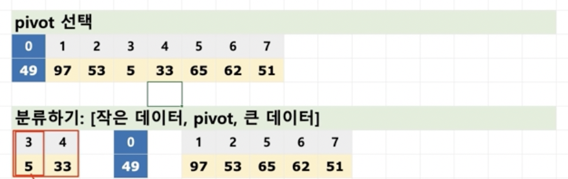

# 1. 병합 정렬

* 병합 정렬

  * 재귀용법을 활용한 정렬 알고리즘

    1. 리스트를 절반으로 잘라 비슷한 크기의 두 부분 리스트로 나눈다.
    2. 각 부분 리스트를 재귀적으로 합병 정렬을 이용해 정렬한다.
    3. 두 부분 리스트를 다시 하나의 정렬된 리스트로 합병한다.

  * 알고리즘 이해

    1단계 : 정렬되지 않은 배열을 끝까지 분리하는 단계

    2단계 : 분리한 데이터를 단계별로 합치는 단계

  * 예 :

    [1, 9, 3, 2]

    [1, 9], [3, 2]

    [1], [9], [3], [2] (여기까지 1단계)

    [1, 9], [2, 3] (여기부터 2단계)

    [1, 2, 3, 9]

## 병합 정렬 구현

* 배열을 앞 뒤 두 배열로 자르는 코드

  ~~~java
      public void SplitFunc(ArrayList<Integer> dataList) {
          if(dataList.size() <= 1) {
              return;
          } else {
              int midium = dataList.size() / 2;
  
              ArrayList<Integer> leftArr = new ArrayList<Integer>();
              ArrayList<Integer> rightArr = new ArrayList<Integer>();
              
              leftArr = new ArrayList<Integer>(dataList.subList(0, midium));
              rightArr = new ArrayList<Integer>(dataList.subList(midium, dataList.size()));
  
              System.out.println(leftArr);
              System.out.println(rightArr);
          }
      }
  ~~~

  

* 배열을 두 배열로 자르는 메소드를 통해 재귀용법을 이용

  * 만약 배열 갯수가 한 개이면 해당 값 리턴
  * 그렇지 않으면, 배열을 앞 뒤로 두 개로 나누기

* mergeFunc 메소드 만들기
  * leftArr, rightArr의 배열 데이터를 정렬 후 합쳐서 mergedList라는 이름으로 리턴하기
  * case1 : leftList, rightList 둘 다 있을 때
  * case2 : leftList만 있을 때 mergedList 뒤에 그대로 넣음
  * case3 : rightList만 있을 때 mergedList 뒤에 그대로 넣음

* 구현

  ~~~java
  import java.util.ArrayList;
  
  public class MergeSort {
  
      public ArrayList<Integer> mergeSplitFunc(ArrayList<Integer> dataList) {
          if(dataList.size() <= 1) {
              return dataList;
          }
          int midium = dataList.size() / 2;
  
          ArrayList<Integer> leftArr = new ArrayList<Integer>();
          ArrayList<Integer> rightArr = new ArrayList<Integer>();
          
          leftArr = mergeSplitFunc(new ArrayList<Integer>(dataList.subList(0, midium)));
          rightArr = mergeSplitFunc(new ArrayList<Integer>(dataList.subList(midium, dataList.size())));
  
          return mergeFunc(leftArr, rightArr);
      }
      
      public ArrayList<Integer> mergeFunc(ArrayList<Integer> leftList, ArrayList<Integer> rightList) {
          ArrayList<Integer> mergedList = new ArrayList<Integer>();
          int leftPoint = 0;
          int rightPoint = 0;
  
          //case1: left/right 둘 다 있을 때
          while(leftList.size() > leftPoint && rightList.size() > rightPoint) {
              if (leftList.get(leftPoint) > rightList.get(rightPoint)) {
                  mergedList.add(rightList.get(rightPoint));
                  rightPoint += 1;
              } else {
                  mergedList.add(leftList.get(leftPoint));
                  leftPoint += 1;
              }
          }
          //case2: right 데이터가 없을 떄
          while(leftList.size() > leftPoint) {
              mergedList.add(leftList.get(leftPoint));
              leftPoint += 1;
          }
          //case3: left 데이터가 없을 때
          while(rightList.size() > rightPoint) {
              mergedList.add(rightList.get(rightPoint));
              rightPoint += 1;
          }
  
          return mergedList;
      }
  
      public static void main(String[] args) {
          MergeSort sort = new MergeSort();
          //ArrayList<Integer> list = new ArrayList<Integer>(Arrays.asList(4,1,2,3,5));
          ArrayList<Integer> testData = new ArrayList<Integer>();
          
          for(int i = 0 ; i < 100 ; i++) {
              testData.add((int)(Math.random() * 100));
          }
  
          System.out.println(sort.mergeSplitFunc(testData));
      }  
    }
  ~~~

  

* 내 구현...

~~~java
package DataStructure;

import java.util.ArrayList;
import java.util.Arrays;

public class MergeSort {

  public void splitFunc(ArrayList<Integer> list) {
    if(list.size() > 1) {
      ArrayList<Integer> leftArr = new ArrayList<Integer>(list.subList(0, list.size() / 2));
      ArrayList<Integer> rightArr = new ArrayList<Integer>(list.subList(list.size() / 2, list.size()));
      
      this.splitFunc(leftArr);
      this.splitFunc(rightArr);
    } else {
      return;
    }
  }  

  public ArrayList<Integer> mergeFunc(ArrayList<Integer> list1, ArrayList<Integer> list2) {
    ArrayList<Integer> list = new ArrayList<Integer>();

    while(true) {
      if(list1.size() == 0 && list2.size() != 0) {
        list.add(list2.remove(0));
        break;
      } else if(list1.size() != 0 && list2.size() == 0) {
        list.add(list1.remove(0));
        break;
      } else if(list1.size() != 0 && list2.size() != 0){
        if(list1.get(0) > list2.get(0)) {
          list.add(list2.remove(0));
        } else {
          list.add(list1.remove(0));
        }
      } else if(list1.size() == 0 && list2.size() == 0) {
        break;
      }
    }
    return list;
  }

  public ArrayList<Integer> sort(ArrayList<Integer> list) {
    if(list.size() > 1) {
      ArrayList<Integer> leftArr = this.sort(new ArrayList<Integer>(list.subList(0, list.size() / 2)));
      ArrayList<Integer> rightArr = this.sort(new ArrayList<Integer>(list.subList(list.size() / 2, list.size())));

      return this.mergeFunc(leftArr, rightArr);
    } else {
      return list;
    }
  }

  public static void main(String[] args) {
    MergeSort mSort = new MergeSort();
    ArrayList<Integer> list = new ArrayList<Integer>();
    for(int i = 0 ; i < 100 ; i++) {
      list.add((int)(Math.random() * 100));
    }
    System.out.println(mSort.sort(list));
  }
}
~~~

## 병합정렬 시간 복잡도

* n개의 데이터가 있는 배열 하나가 있다.
* 단계를 거쳐 이 배열은 데이터 개수가 /2가 되고, 각 분리된 배열을 노드라고 부르자.
* 각 i 단계에서는 2^i 개의 노드가 있다. => log2 n개의 노드가 있다. => O(log n)
* 배열의 n개의 데이터는 한 번씩 체크된다. => O(n)
* 즉 각 단계에서는 시간 복잡도가 O(n) * O(log n) = O(n log n)

# 2. 퀵 정렬

* 퀵 정렬이란?

  * 정렬 알고리즘의 꽃??
  * 기준점을 정해서, 기준점보다 작은 데이터는 왼쪽, 큰 데이터는 오른쪽으로 모으는 함수를 작성함
  * 각 왼쪽 오른쪽은 재귀용법을 사용해서 다시 동일 함수를 호출하여 위 작업을 반복함
  * 함수는 왼쪽 + 기준점 + 오른쪽을 리턴함

  
  * 데이터가 하나가 될 때 까지 계속 분류
  * 합치기

## 퀵 정렬 구현

* 피벗을 설정하고, 데이터를 분리하고 합치는 코드

  ~~~java
  import java.util.ArrayList;
  import java.util.Arrays;
  
  public class QuickSort {
    
    public ArrayList<Integer> quickSplitFunc(ArrayList<Integer> dataList) {
      if (dataList.size() <= 1) {
        return dataList;
      }
  
      ArrayList<Integer> leftArr = new ArrayList<Integer>();
      ArrayList<Integer> rightArr = new ArrayList<Integer>();
      int pivot = dataList.get(0);
  
      //while(dataList.get(0))
      for(int i = 1 ; i < dataList.size() ; i++) {
  
        if (pivot > dataList.get(i)) {
          leftArr.add(dataList.get(i));
        } else {
          rightArr.add(dataList.get(i));
        }
      }
      ArrayList<Integer> mergeArr = new ArrayList<Integer>();
      mergeArr.addAll(leftArr);
      mergeArr.add(pivot);
      mergeArr.addAll(rightArr);
  
      return mergeArr;
    }
  
    public static void main(String[] args) {
      QuickSort qSort = new QuickSort();
      qSort.quickSplitFunc(new ArrayList<Integer>(Arrays.asList(3,5,10,2,8,6,1,9,4,7)));
    }
  }
  ~~~

  

* 재귀용법을 통한 퀵 정렬 구현

  ~~~java
  import java.util.ArrayList;
  import java.util.Arrays;
  
  public class QuickSort {
    
    public ArrayList<Integer> quickSortFunc(ArrayList<Integer> dataList) {
      if (dataList.size() <= 1) {
        return dataList;
      }
  
      ArrayList<Integer> leftArr = new ArrayList<Integer>();
      ArrayList<Integer> rightArr = new ArrayList<Integer>();
  
      int pivot = dataList.get(0);
  
      for(int i = 1 ; i < dataList.size() ; i++) {
        if (pivot > dataList.get(i)) {
          leftArr.add(dataList.get(i));
        } else {
          rightArr.add(dataList.get(i));
        }
      }
  
      ArrayList<Integer> mergedArr = new ArrayList<Integer>();
      mergedArr.addAll(this.quickSortFunc(leftArr));
      mergedArr.add(pivot);
      mergedArr.addAll(this.quickSortFunc(rightArr));
  
      return mergedArr;
    }
  
    public static void main(String[] args) {
      QuickSort qSort = new QuickSort();
      System.out.println(qSort.quickSortFunc(new ArrayList<Integer>(Arrays.asList(3,5,10,2,8,6,1,9,4,7))));
    }
  }
  ~~~

* 내 구현

~~~java
package DataStructure;

import java.util.ArrayList;

public class QuickSort {
  public ArrayList<Integer> split(ArrayList<Integer> list) {
    
    if(list.size() > 1) {

      ArrayList<Integer> leftArr = new ArrayList<Integer>();
      ArrayList<Integer> rightArr = new ArrayList<Integer>();
      
      int pivot = list.remove(0);
      
      while(list.size() != 0) {
        if(list.get(0) > pivot) {
          rightArr.add(list.remove(0));
        } else {
          leftArr.add(list.remove(0));
        }
      }
      ArrayList<Integer> mergeList = new ArrayList<Integer>();

      mergeList.addAll(this.split(leftArr));
      mergeList.add(pivot); 
      mergeList.addAll(this.split(rightArr));

      return mergeList;
    } else {
      return list;
    }
  }

  public static void main(String[] args) {
    ArrayList<Integer> list = new ArrayList<Integer>();

    for(int i = 0 ; i < 100 ; i++) {
      list.add((int)(Math.random() * 100));
    }
    QuickSort qSort = new QuickSort();
    System.out.println(qSort.split(list));
  }
}
~~~

* 분할 정복
  * 문제를 나눌 수 없을 때까지 나누어서 각각을 풀면서 다시 합병하여 문제의 답을 얻는 알고리즘
  * 하양식 접근법으로, 상위의 해답을 구하기 위해, 아래로 내려가면서 하위의 해답을 구하는 방식
    * 일반적으로 재귀함수로 구현
  * 문제를 잘게 쪼갤 때, 부분 문제는 서로 중복되지 않음
    * 예 : 병합정렬, 퀵 정렬 등

## 퀵 정렬 알고리즘 분석

* 병합정렬과 유사하게, 일반적인 상황에서 시간 복잡도는 $O(n log n)$
  * 단 최악의 경우
    * 이미 정렬된 배열에서 pivot이 가장 크거나, 가장 작으면 가장 큰 시간이 소요됨
    * 모든 데이터를 비교하는 상황이 나오기 때문에 $O(n^2)$

