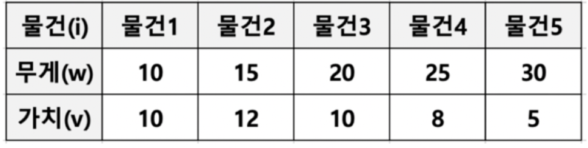
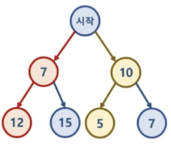

# 탐욕 알고리즘

## 탐욕 알고리즘 이란?

* Greedy algorithm
* 최적의 해에 가까운 값을 구하기 위해 사용됨
* 여러 경우 중 하나를 결정해야할 때마다, **매순간 최적이라고 생각되는 경우를 선택**하는 방식으로 진행해서, 최종적인 값을 구하는 방식

## 탐욕 알고리즘 예

### 문제1 : 동전 문제

* 지불해야 하는 값이 4720원 일 때, 1원, 50원, 100원, 500원 동전으로 동전의 수가 가장 적게 지불하시오
  * 가장 큰 동전부터 최대한 지불해야 하는 값을 채우는 방식으로 구현
  * 탐욕 알고리즘으로 매순간 최적이라고 생각되는 경우를 선택하면 됨

* 구현

~~~java
import java.util.ArrayList;
import java.util.Arrays;

public class Coin {
  public int greedy(int totalCost, ArrayList<Integer> kindsCoin) {
    
    int i = 1;
    int totalCount = 0;
    while(totalCost > 0 && i <= kindsCoin.size()) {
      totalCount += totalCost / kindsCoin.get(kindsCoin.size() - i);
      totalCost = totalCost % kindsCoin.get(kindsCoin.size() - i);
        
      i++;
    }
    return totalCount;
  }
  public static void main(String[] args) {
    Coin coin = new Coin();
    ArrayList<Integer> kindsCoin = new ArrayList<Integer>(Arrays.asList(1, 50, 100, 500));
    System.out.println(coin.greedy(4720, kindsCoin));
  }
}
~~~


* 위의 문제 경우 이런 경우라면 어떻게 될까?

  ~~~java
  5 //동전 종류 N
  1 8 20 25 50 //동전 값 arr[]
  129 //지불해야 하는 값 M
  ~~~

  50 + 50 + 25 + 1 + 1 + 1 + 1 => 7개가 나온다.

  그러나 50 + 50 + 20 + 8 + 1 => 이렇게 하면 5개가 나온다.

  즉, 위처럼 탐욕알고리즘은 최적의 해를 가져오지 않는다.

* 구현

~~~java
static int minCnt = Integer.MAX_VALUE, N, M;
static int[] arr;

static void rec_function(int sum, int cnt) {
  if (minCnt < cnt) return; //모든 탐색을 돌지만, cnt가 minCnt보다 큰 경우 그 탐색은 넘어가기
  if (sum >= M) {
    if (sum == M) minCnt = cnt;
    return;
  }
  
  for (int i = 0; i < N; i++) {
    rec_function(sum + arr[i], cnt + 1);
  }
}

public static void main(String[] args) throws IOException {
  solution();
  rec_function(0, 0);
  System.out.println(minCnt);
}
~~~


### 문제2 : 부분 배낭 문제(Fractional Knapsack Problem)

* 무게 제한이 k인 배낭에 최대 가치를 가지도록 물건을 넣는 문제
  * 각 물건은 무게와 가치로 표현될 수 있음
  * 물건을 쪼갤 수 있으면 Fractional Knapsack Problem이고,
  * 물건을 쪼갤 수 없다면 0/1 Knapsack Problem
* 문제 해결 방법
  * 가치 / 무게 가 가장 높은 것으로 객체를 정렬하고, 총 무게 k에 대해서 w로 나누면서 가치를 극대화하기




* 각 물건의 무게와 가치들을 자료구조화 하기

```java
//이차원 배열로 자료구조화
Integer[][] objectList = { {10, 10}, {15, 12}, {20, 10}, {25, 8}, {30, 5}};
```


* 위 객체를 정렬하기
  * 가치 / 무게 가 가장 높은 순으로 객체를 정렬해야하는데... 어떻게??
  * Comparable / Comparator


### Comparable 과 Comparator 인터페이스

* Comparable 과 Comparator 는 둘 다 인터페이스로, 정렬 기준을 구현하기 위해 사용됨
  * Comparable 인터페이스는 compareTo() 메서드를 오버라이드 해서 구현
    * 일반적으로 정렬할 객체에 Comparable 인터페이스를 추가하여 구현
  * Comparator 인터페이스는 compare() 메서드를 오버라이드 해서 구현
    * 일반적으로 별도 클래스를 정의해서 구현하며, 따라서, 동일 객체에 다양한 정렬 기준을 가진 클래스를 작성 가능


#### Comparable 사용

~~~java
import java.util.ArrayList;
import java.util.Arrays;

public class Edge implements Comparable<Edge> {
  public Integer distance;
  public String vertex;
  
  public Edge (Integer distance, String vertex) {
    this.distance = distance;
    this.vertex = vertex;
  }
  
  @Override
  public int compareTo(Edge e) {
    return this.distance - e.distance; //오름차순
    //return e.distance - this.distance; 내림차순
  }
  
  public static void main(String[] args) {
    Edge edge1 = new Edge(12, "A");
    Edge edge2 = new Edge(10, "A");
    Edge edge3 = new Edge(13, "A");
    Edge[] edges = new Edge[]{edge1, edge2, edge3};
    Arrays.sort(edges);
    
    for (int i = 0 ; i < edges.length ; i++) {
      System.out.println(edges[i].distance);
    }
  }
}
~~~


#### Comparator 사용

* Comparable 인터페이스가 정의되어 있다하더라고, Comparator 클래스의 정렬 기준으로 정렬이 됨

~~~java
import java.util.ArrayList;
import java.util.Arrays;

public class Edge implements Comparable<Edge> {
  public Integer distance;
  public String vertex;
  
  public Edge (Integer distance, String vertex) {
    this.distance = distance;
    this.vertex = vertex;
  }
  
  //밑에 Comparator를 정의하였기 때문에 Comparable를 어떻게 정의하더라도, Comparator기준으로 정렬이 됨.
  @Override
  public int compareTo(Edge e) {
    return this.distance - e.distance;
    //return e.distance - this.distance;
  }
  
  public static void main(String[] args) {
    Edge edge1 = new Edge(12, "A");
    Edge edge2 = new Edge(10, "A");
    Edge edge3 = new Edge(13, "A");
    Edge[] edges = new Edge[]{edge1, edge2, edge3};
    Arrays.sort(edges, new Comparator<Edge>() {
      @Override
      public int compare(Edge objectItem1, Edge objectItem2) {
				//정렬 기준 결정하는 곳
        return objectItem2.distance - objectItem1.distance;
      }
    });
    
    for (int i = 0 ; i < edges.length ; i++) {
      System.out.println(edges[i].distance);
    }
  }
}
~~~


* Comparator 간단하게 사용하기
  Comparator는 함수형 인터페이스다.
  밑 처럼 compare() 메서드를 구체화해야 하는데, 람다식으로 사용하면 아주 간편하게 쓸 수 있다.

~~~java
List<String> list = Arrays.asList("abc", "aaa", "bbb", "ddd", "aaa");

List.sort(list, new Comparator<String>() {
                  public int compare(String s1, String s2) {
                    return s2.compareTo(s1);
                  }
                });
~~~

~~~java
List.sort(list, (s1, s2) -> s2.compareTo(s1));
~~~


#### 배낭 문제 해결

* 부분 배낭 문제(Comparable)

~~~java
package Algorithm;

import java.util.ArrayList;
import java.util.Collections;

public class FractionalKnapsack implements Comparable<FractionalKnapsack> {
  Integer[] object = new Integer[2];
  
  public FractionalKnapsack(int weigh, int value) {
    this.object[0] = weigh;
    this.object[1] = value;
  }

  @Override
  public int compareTo(FractionalKnapsack object) { 
    if((double)this.object[0] / this.object[1] > (double)object.object[0] / object.object[1]) {
      return 1;
    }
    return -1;
  }

  public void knapsackFunc(ArrayList<FractionalKnapsack> objectList, double space) {
    
    double weigh = 0.0;
    double value = 0.0;

    while(weigh != space) {
      if(weigh + objectList.get(0).object[0] < space) {
        value += objectList.get(0).object[1];
        weigh += objectList.remove(0).object[0];
      } else {
        double empty = space - weigh;
        weigh = space;
        value += objectList.get(0).object[1] * (empty / objectList.get(0).object[0]);
      }
      
    }
    System.out.println("무게:" + weigh + " 최고 가치:" + value);
  }

  public static void main(String[] args) {
    ArrayList<FractionalKnapsack> objectList = new ArrayList<FractionalKnapsack>();
    objectList.add(new FractionalKnapsack(10, 10));
    objectList.add(new FractionalKnapsack(15, 12));
    objectList.add(new FractionalKnapsack(20, 10));
    objectList.add(new FractionalKnapsack(25, 8));
    objectList.add(new FractionalKnapsack(30, 5));
    Collections.sort(objectList);

    System.out.println(objectList.get(0).object[0] + ", " + objectList.get(0).object[1]);

    FractionalKnapsack fK = new FractionalKnapsack(0, 0);
    fK.knapsackFunc(objectList, 30.0);
  }
}
~~~


* 부분 배낭 문제(Comparator)

~~~java
Integer[][] objectList = { {10, 10}, {15, 12}, {20, 10}, {25, 8}, {30, 5}};
~~~

~~~java
import java.util.Arrays;
import java.util.Comparator;

public class GreedyAlgorithm {
  public void knapsackFunc(Integer[][] objectList, double capacity) {
    
    double totalValue = 0.0;
    double fraction = 0.0;
    
    Arrays.sort(objectList, new Comparator<Integer[]>() {
      @Override
      public int compare(Integer[] objectItem1, Integer[] objectItem2) {
        return (objectItem2[1] / objectItem2[0]) - (objectItem1[1] / objectItem1[0]);
      }
    });

    for (int i = 0 ; i < objectList.length ; i++) {
      if (capacity - (double)objectList[i][0] > 0) {
        capacity -= (double)objectList[i][0];
        totalValue += (double)objectList[i][1];
        System.out.println("무게:" + objectList[i][0] + ", 가치:" + objectList[i][1]);
      } else {
        fraction = capacity / (double)objectList[i][0];
        totalValue += (double)objectList[i][1] * zfraction;
        System.out.println("무게:" + objectList[i][0] + ", 가치:" + objectList[i][1] + ", 비율:" + fraction);
        break;
      }
    }
    System.out.println("총 담을 수 있는 가치:" + totalValue);
  }

  public static void main(String[] args) {
    Integer[][] objectList = { {10, 10}, {15, 12}, {20, 10}, {25, 8}, {30, 5}};

    GreedyAlgorithm gAlgorithm = new GreedyAlgorithm();
    gAlgorithm.knapsackFunc(objectList, 30.0);
  }
}
~~~


## 탐욕 알고리즘의 한계

* 탐욕 알고리즘은 근사치 추정에 활용 됨.
* 반드시 최적의 해를 구할 수 있는 것은 아니다!
* 최적의 해에 **가까운 값**을 구하는 방법 중 하나이다.



* 시작 노드에서 leaf 노드까지 가는 경로중 가장 작은 값을 고른다면?
  * 탐욕 알고리즘 적용시, 시작 노드에서 7 => 12 를 선택하는 모습을 볼 수 있음.
  * 탐욕 알고리즘은 그 상황에서 가장 최선을 구하는 알고리즘이기 때문에 이런 현상이 나타남

