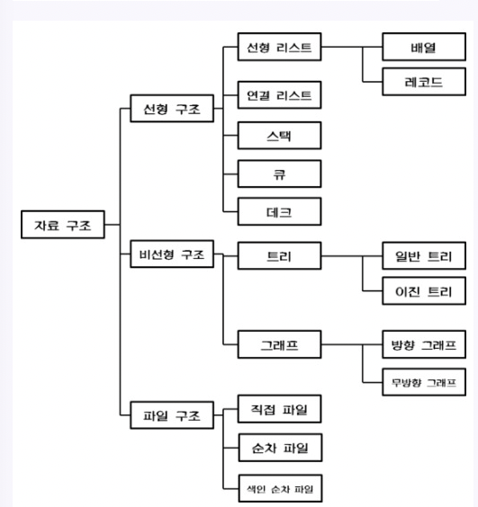

# 8가지 자료구조

1. Array

배열은 기본적인 데이터 구조이다. 생성되는 순간 셀에 인덱스가 부여되고, 셀의 개수가 고정된다. 부여된 인덱스로 인해 원하는 데이터에 접근할 수 있다. 배열을 기반으로 더 복잡한 자료구조를 만들 수 있고, 정렬이 용이하다는 장점이 있다. 그러나 생성될 때 셀의 개수가 고정되어, 데이터를 저장할 수 있는 메모리의 크기가 고정되어있고, 데이터를 추가, 삭제하는 과정이 비효율적이다. 또한 데이터가 삭제되고 나면 남는 셀은 빈 공간이 되므로 메모리 낭비가 심하다.

* 인덱스 통한 검색시 : O(1)

2. ArrayList(연속 리스트)

배열처럼 연속적인 인덱스에 데이터가 저장되는 자료구조다. 연속적으로 데이터가 저장되어 검색에 용이하지만, 데이터 삽입이나 삭제는 용이하지 않다. 삽입과 삭제시 자료의 이동이 필요하다.

* 인덱스 통한 검색시 : O(1)
* 삽입, 삭제시 : O(N)

3. LinkedList(연결 리스트)

데이터를 임의의 기억 공간에 기억시키되, 데이터 항목 순서에 따라 노드의 포인터를 이용하여 서로 연결시킨 자료구조이다. 데이터를 새로 추가하고 삭제하는 것이 용이하고 효율적이다. 배열처럼 데이터가 메모리에 연속적으로 위치하지 않아 구조의 재구성이 필요없다. 메모리를 더 효율적으로 사용할 수 있기 때문에 대용량 데이터 처리에 적합하다. 그러나 연결이 끊어지면 다음 노드를 찾기가 어렵고 속도가 느리다.

* 검색시 : O(N)
* 삽입, 삭제시 : O(1)

4. Stack(스택)

순서가 유지되는 선형 데이터 구조이다. 리스트 한 쪽에서만 데이터의 삽입과 삭제가 일어나므로 가장 마지막 요소부터 처리하는 LIFO 메커니즘을 갖고 있다. 기억공간이 부족한 경우 Overflow가 발생하고 삭제할 데이터가 없을 때 Underflow가 발생한다. 데이터를 받는 순서대로 정렬되고 메모리의 크기가 동적이지만 한 번에 하나의 데이터만 처리할 수 있는 불편함이 있다.

5. Queue(큐)

스택과 비슷하지만 먼저 입력된 요소를 먼저 처리하는 FIFO 메커니즘을 가진다. 리스트의 한 쪽에서는 삽입이 일어나고 다른 쪽에서는 삭제가 일어난다. 데이터 시작부분을 프런트 끝 부분을 리어라고 한다. 동적인 메모리 크기와 빠른 런타임을 자랑하지만 가장 오래된 요소만을 가져오고 한 번에 하나의 데이터만 처리하는 단점이 있다.

6. Graph

정점과 간선으로 이루어진 데이터구조이며 사이클이 없는 그래프를 특별히 트리라고 한다. 새로운 요소들의 추가나 삭제가 용이하고 구조를 응용하기에 적합하다.

7. Tree

노드로 구성된 계층적인 자료구조다. 최상위 노드를 만들고 그 아래에 자식을 추가하는 방식으로 트리구조는 다양하게 구현할 수 있다.

8. Heap

자식노드를 최대 2개만 갖는 이진트리 구조이다. 루트 노드의 값이 가장 크면 최대 힙, 가장 작으면 최소 힙이라 부른다. 보통 데이터를 저장할 때 부모노드보다 값이 작으면 왼쪽 자식으로 가고, 값이 크면 오른쪽 자식으로 간다.

* 최대값 최소값 찾는 시간복잡도 : O(log N)
* 배열에서 최대값 최소값 찾을 때 : O(N)