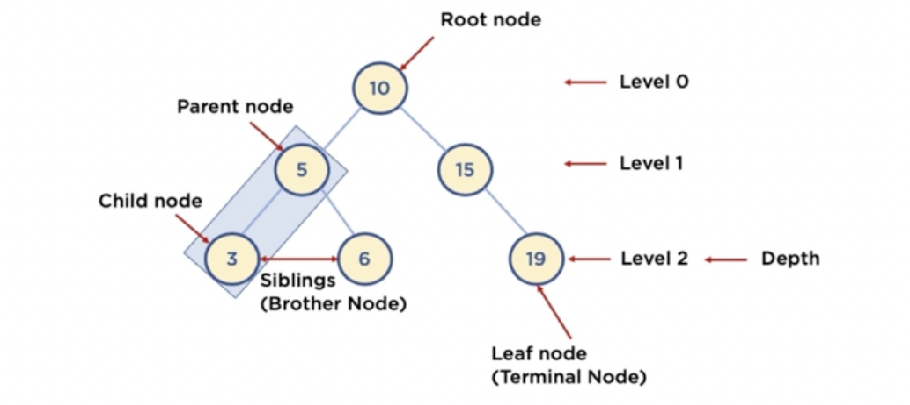
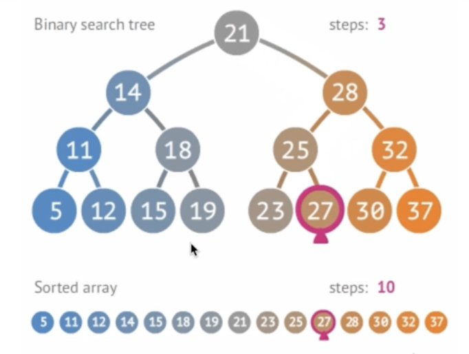

# 트리

* 트리 구조
  * Node와 Branch를 이용해서, 사이클을 이루지 않도록 구성한 데이터 구조
  * 실제로 사용되는 곳은?
    * 트리 중 이진 트리 형태의 구조
    * 탐색 알고리즘임
* 알아둘 용어
  * Node : 데이터를 저장하는 기본 요소
  * Root node
  * Leaf node

* 이진 트리

  * 노드의 최대 Branch가 2인 트리
  * 이진 탐색 트리 (Binary Search Tree, BST) : 이진 트리에 다음과 같은 추가적인 조건이 있는 트리
    * 왼쪽 노드는 해당 노드보다 작은 값, 오른쪽 노드는 해당 노드보다 큰 값을 가지고 있다.

  

  * 정렬된 배열과 이진 탐색 트리의 탐색 스텝 차이
    * 배열은 27을 찾기위해 데이터가 27과 같은지 10번 탐색하지만, 트리의 경우 27보다 작으면 오른쪽으로 27보다 크면 왼쪽으로 이동하면서 27을 탐색

## 이진 탐색 트리 구현

* 이진 탐색 트리 (데이터 저장, 탐색)

~~~JAVA
class NodeMgmt {
  Node head = null;
  
  public class Node {
    Node left;
    Node right;
    int value;
    public Node (int data) {
      this.value = data;
      this.left = null;
      this.right = null;
    }
  }
  
  public boolean insertNode(int data) {
    //case1 : Node가 하나도 없을 때
    if(this.head == null) {
      this.head = new Node(data);
    } else {
      //case2 : Node가 하나 이상 들어가 있을 때
      Node findNode = this.head;
      while(true) {
        //case2-1 : 현재 Node의 왼쪽에 Node가 들어갈 때
        if(data < findNode.value) {
          if(findNode.left != null) {
            findNode = findNode.left;
          } else {
            findNode.left = new Node(data);
            break;
          }
        } else {
        //case2-2 : 현재 Node의 오른쪽에 Node가 들어갈 때
          if(findNode.right != null) {
            findNode = findNode.right;
          } else {
            findNode.right = new Node(data);
            break;
          }
        }
      }
    }
    return true;
  }
  
  public Node search(int data) {
    //case1 : node가 하나도 없을 때
    if(this.head == null) {
      return null;
    } else {
      //case2 : node가 하나 이상 있을 때
      Node findNode = this.head;
      while(findNode != null) {
        if(findNode.value == data) {
          return findNode;
        } else if(data < findNode.value) {
          findNode = findNode.left;
        } else {
          findNode = findNode.right;
        }
      }
      return null;
    }
  }
}

public class Tree {
  NodeMgmt nodeMgmt = new NodeMgmt();
  nodeMgmt.insertNode(3);
  nodeMgmt.insertNode(1);
  nodeMgmt.insertNode(5);
  nodeMgmt.insertNode(2);
  
  Node test = nodeMgmt.search(1);
  System.out.println(test.value);
  System.out.println(test.right.value);
}
~~~

* 이진 탐색 트리 데이터 삭제

  * 삭제 할 노드가 Leaf Node인 경우

    * 부모 노드의 right객체를 삭제하면 됨.

  * 삭제 할 노드의 Child Node가 하나인 경우

    * 부모 노드와 Child Node를 이어주면 됨.

  * 삭제 할 노드의 Child Node가 두개인 경우

    1. 삭제 할 노드의 오른쪽 자식 중, 가장 작은 값을 삭제할 노드의 부모 노드가 가리키도록 한다.

    2. 삭제 할 노드의 왼쪽 자식 중, 가장 큰 값을 삭제할 노드의 부모 노드가 가리키도록 한다.

* 삭제 구현
  * 삭제 할 노드의 오른쪽 자식 중, 가장 작은 값을 삭제할 노드의 부모 노드가 가리키도록 한다.

~~~java
class Node {
    Node left;
    Node right;
    int value;
    public Node (int data) {
      this.value = data;
      this.left = null;
      this.right = null;
    }
}

class NodeMgmt {
    Node head = null;
    /*
    public class Node {
      Node left;
      Node right;
      int value;
      public Node (int data) {
        this.value = data;
        this.left = null;
        this.right = null;
      }
    }*/
    
    public boolean insertNode(int data) {
      //case1 : Node가 하나도 없을 때
      if(this.head == null) {
        this.head = new Node(data);
      } else {
        //case2 : Node가 하나 이상 들어가 있을 때
        Node findNode = this.head;
        while(true) {
          //case2-1 : 현재 Node의 왼쪽에 Node가 들어갈 때
          if(data < findNode.value) {
            if(findNode.left != null) {
              findNode = findNode.left;
            } else {
              findNode.left = new Node(data);
              break;
            }
          } else {
          //case2-2 : 현재 Node의 오른쪽에 Node가 들어갈 때
            if(findNode.right != null) {
              findNode = findNode.right;
            } else {
              findNode.right = new Node(data);
              break;
            }
          }
        }
      }
      return true;
    }
    
    public Node search(int data) {
      //case1 : node가 하나도 없을 때
      if(this.head == null) {
        return null;
      } else {
        //case2 : node가 하나 이상 있을 때
        Node findNode = this.head;
        while(findNode != null) {
          if(findNode.value == data) {
            return findNode;
          } else if(data < findNode.value) {
            findNode = findNode.left;
          } else {
            findNode = findNode.right;
          }
        }
        return null;
      }
    }
    
    public boolean delete(int value) {
      boolean searched = false;
      
      Node currParentNode = this.head;
      Node currNode = this.head;
      
      //코너 케이스1 : Node가 하나도 없을 때
      if(this.head == null) {
        return false;
      } else {
        if(this.head.value == value && this.head.left == null && this.head.right == null) {
          //코너 케이스2 : Node가 단지 하나만 있고, 해당 Node가 삭제할 Node일 때
          this.head = null;
          return true;
        }
        
        while(currNode != null) {
          if(currNode.value == value) {
            searched = true;
            break;
          } else if(value < currNode.value) {
            currParentNode = currNode;
            currNode = currNode.left;
          } else {
            currParentNode = currNode;
            currNode = currNode.right;
          }
        }
        
        if(searched == false) {
          return false;
        }
        
        //currNode에는 삭제할 데이터를 가지고 있음
        //currParentNode에는 삭제할 노드의 부모노드
        
        //case1 : 삭제할 노드가 Leaf Node인 경우
        if(currNode.left == null && currNode.right == null) {
          if(value < currParentNode.value) {
            currParentNode.left = null;
            currNode = null;
          } else {
            currParentNode.right = null;
            currNode = null;
          }
          return true;
        }
        
        //case2 : 삭제할 노드가 Child Node 하나만 가지고 있는 경우
        else if(currNode.left != null && currNode.right == null) {
          //2-1 자식 노드가 left
          if(value < currParentNode.value) {
            currParentNode.left = currNode.left;
            currNode = null;
          } else {
            currParentNode.right = currNode.left;
            currNode = null;
          }
          return true;
        } else if(currNode.left == null && currNode.right != null) {
          //2-2 자식 노드가 right
          if(value < currParentNode.value) {
            currParentNode.left = currNode.right;
            currNode = null;
          } else {
            currParentNode.right = currNode.right;
          }
          return true;
        }
        
        //case3 : 삭제할 노드의 Child Node가 2개인 경우
        //삭제할 노드의 오른쪽 자식 중 가장 작은 값을 삭제할 노드의 Parent Node가 가리키도록 한다.
        //case3-1 : 삭제할 노드가 왼쪽인 경우
        else {
            //삭제할 노드가 부모 노드의 왼쪽에 있을 때
            if(value < currParentNode.value) {
                Node changeNode = currNode.right;
                Node changeParentNode = currNode.right;
                while(changeNode.left != null) {
                    changeParentNode = changeNode;
                    changeNode = changeNode.left;
                }
                //changeNode에는 삭제할 노드의 오른쪽 자식 노드들 중에 가장 작은 값을 가지고 있음
                //case3-1-1 : 삭제할 노드의 오른쪽 자식 중 가장 작은 값을 가진 노드가 자식 노드가 없는 경우
                if(changeNode.right != null) {

                    changeParentNode.left = changeNode.right;
                    //아래는 changeNode의 값만 변경하는 것이기에 chageParentNode.left랑 관련이... 없나?
                    //changeNode는 아직 써야되니까?
                    //아~ currNode는 이제 버리고 changeNode를 쓸 거임
                    //changeNode = changeNode.right;
                //case3-1-2 : 삭제할 노드의 오른쪽 자식 중 가장 작은 값을 가진 노드가 오른쪽 자식을 가지고 있는 경우
                } else {
                    //chageParentNode의 left를 비우기
                    changeParentNode.left = null;
                }
                currParentNode.left = changeNode;
                //currNode = changeNode;

                //changeNode의 왼쪽/오른쪽을 currNode의 왼족 오른쪽으로 변경
                changeNode.left = currNode.left;
                changeNode.right = currNode.right;

                currNode = null;
            }
            //case3-2 : 삭제할 노드가 오른쪽인 경우
            else {
                Node changeNode = currNode.right;
                Node changeParentNode = currNode.right;
                while(changeNode.left != null) {
                    changeParentNode = changeNode;
                    changeNode = changeNode.left;
                }
                //case3-2-1 : changeNode의 오른쪽 자식 노드가 있을 때
                if(changeNode.right != null) {
                    changeParentNode.left = changeNode.right;
                //case3-2-2 : changeNode의 오른쪽 자식 노드가 없을 때
                } else {
                    changeParentNode.left = null;
                }
                
                //currParentNode의 오른쪽 자식 중 가장 작은 값을 가진 changeNode를 연결
                currParentNode.right = changeNode;

                changeNode.left = currNode.left;
                changeNode.right = currNode.right;

                currNode = null;
            }
            return true;
        }
        
    }
    }
  }
  
  public class Tree {
      public static void main(String[] args) {

        NodeMgmt myTree = new NodeMgmt();
        myTree.insertNode(10);
        myTree.insertNode(15);
        myTree.insertNode(13);
        myTree.insertNode(11);
        myTree.insertNode(14);
        myTree.insertNode(18);
        myTree.insertNode(16);
        myTree.insertNode(19);
        myTree.insertNode(17);
        myTree.insertNode(7);
        myTree.insertNode(8);
        myTree.insertNode(6);
        System.out.println(myTree.delete(15));
        System.out.println("HEAD: " + myTree.head.value);
        System.out.println("HEAD LEFT: " + myTree.head.left.value);
        System.out.println("HEAD LEFT LEFT: " + myTree.head.left.left.value);
        System.out.println("HEAD LEFT RIGHT: " + myTree.head.left.right.value);

        System.out.println("HEAD RIGHT: " + myTree.head.right.value);
        System.out.println("HEAD RIGHT LEFT: " + myTree.head.right.left.value);
        System.out.println("HEAD RIGHT RIGHT: " + myTree.head.right.right.value);

        System.out.println("HEAD RIGHT RIGHT LEFT: " + myTree.head.right.right.left.value);
        System.out.println("HEAD RIGHT RIGHT RIGHT: " + myTree.head.right.right.right.value);
        }
    }
~~~

## 이진 탐색 트리 시간 복잡도와 단점

* 시간 복잡도 (탐색시)
  * depth(트리의 높이)를 h라 표기한다면 O(h)
  * 노드의 개수는 depth에 이렇게 비례함. n = 2^h
  * 스텝이 1씩 증가 하면 선택할 수 있는 노드의 개수가 1/2로 감소함. 즉, 한 번 실행시마다, 실행할 수도 있는 50%의 명령을 제거한다는 의미. 즉 50%의 실행 시간을 단축시킬 수 있다는 것을 의미함.
  * n개의 노드를 가진다면 h = log2 n, O(logn)이라고 할 수 있다.
    * 빅오 표기법에서 log n의 밑은 10이 아닌 2이다.

* 이진 탐색 트리 단점
  * 위에 시간 복잡도는 트리가 균형잡혀 있을 때의 평균 시간 복잡도이며
  * 최악의 경우는(트리가 배열처럼 자식 노드를 1개씩만 가지고 있을 경우) 링크드 리스트와 동일한 성능을 보여주므로 O(n)