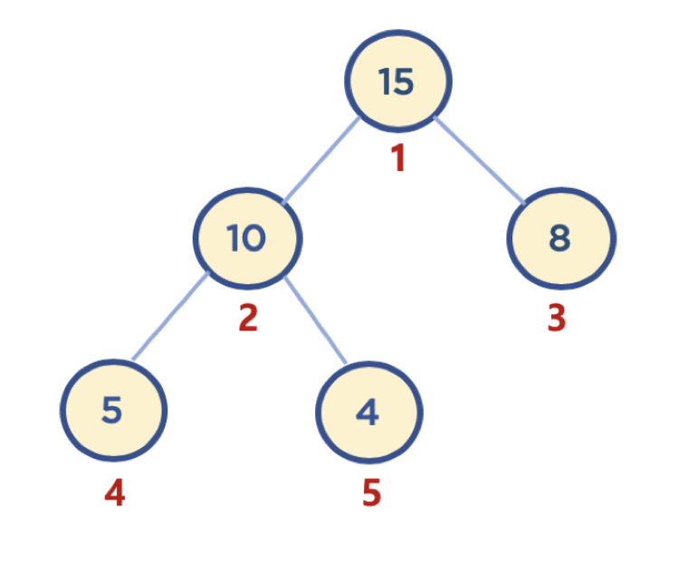
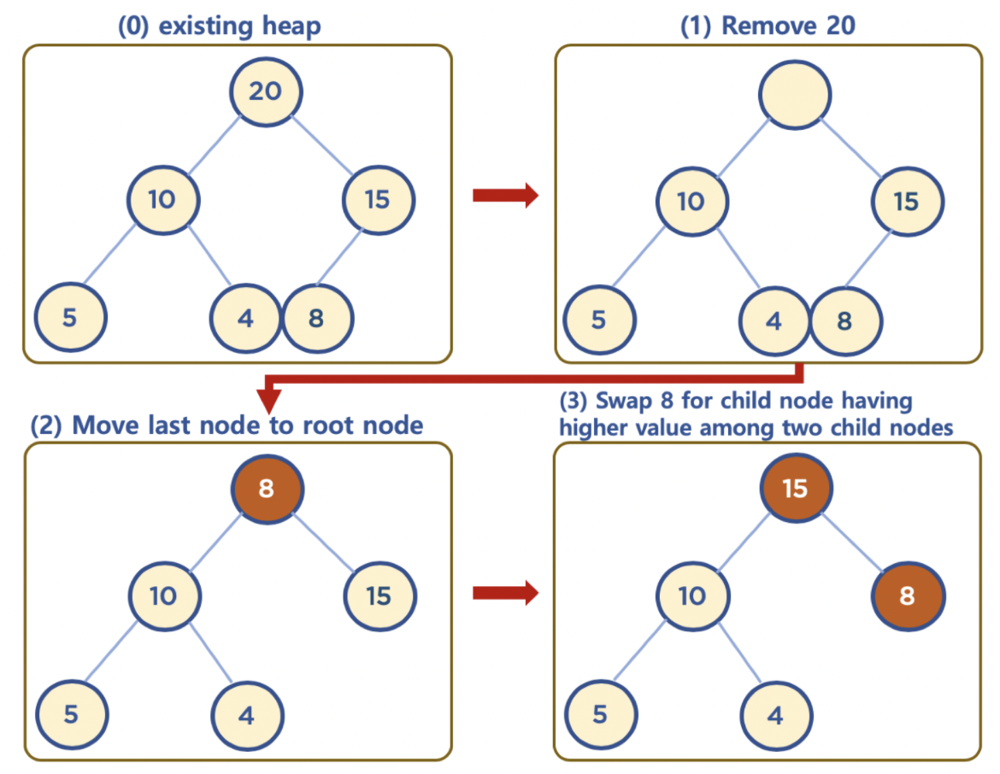

# 힙

* 힙
  * 데이터에서 최대값과 최소값을 빠르게 찾기 위해 고안된 완전 이진 트리
    * **완전 이진 트리** : 노드를 삽입할 때 최하단 왼쪽 노드부터 차례대로 삽입하는 트리
* 힙을 사용하는 이유
  * 배열에 데이터를 넣고, 최대값과 최소값을 찾는다면, 시간 복잡도는 O(n)
  * 이에 반해, 힙에 데이터를 넣고, 최대값과 최소값을 찾는다면, 시간 복잡도는 O(log n)
  * 우선순위 큐와 같이 최대값 또는 최소값을 빠르게 찾아야 하는 자료구조 및 알고리즘 구현 등에 활용됨
* 힙 구조
  * 힙은 최대값을 구하기 위한 구조와 최소값을 구하기 위한 구조로 분류됨
  * 두 가지 조건
    * 각 노드의 값은 해당 노드의 자식 노드가 가진 값보다 크거나 같다. => 이 조건 때문에 최대, 최소값을 구하는 것이 빠르다.
    * 완전 이진 트리 형태를 가진다.
* 이진 탐색 트리와의 공통점 및 차이점
  * 공통점 : 이진 트리
  * 차이점 : 
    * 이진 탐색 트리는 왼쪽이 오른쪽보다 데이터가 작음
    * 힙은 위 조건이 없고, 각 노드의 값이 자식 노드보다 크거나 같음
  * 이진 탐색 트리는 탐색을 위한 구조 / 힙은 최대, 최솟값 검색을 위한 구조

* 힙 동작
  * 힙의 데이터 삽입 방법
    * 삽입 된 데이터는 완전 이진 트리 구조에 맞춰, 최하단부 왼쪽 노드부터 채워짐
    * 채워진 노드 위치에서, 부모 노드보다 값이 클 경우, 부모 노드와 위치를 바꿔주는 작업을 반복(swap)
  * 힙의 데이터 삭제하기
    * Max Heap의 경우 최대값을 꺼냈을 때 루트 노드가 나오는 경우
      * 남아있는 데이터의 맨 밑 오른쪽 데이터를 루트 노드로 바꿔치기 함
      * 자식 노드 중에 보다 큰 값을 가진 노드와 바꿔주는 작업을 반복(swap)

## 힙 구현

* 힙과 배열

  * 일반적으로 힙 구현시 배열 자료구조를 활용함

  * 배열은 인덱스가 0부터 시작하지만 구현 편의를 위해 root노드를 인덱스 번호를 1로 지정하면서 수월하게

    * 부모 노드 인덱스 번호 = 자식 노드 인덱스 번호 / 2
    * 왼쪽 자식 노드 인덱스 번호 = 부모 노드 인덱스 번호 * 2
    * 오른족 자식 노드 인덱스 번호 = 부모 노드 인덱스 번호 * 2 + 1

    

* 힙에 데이터 삽입 구현

~~~java
import java.util.ArrayList;

public class Heap {
  public ArrayList<Integer> heapArray = null;
  
  public Heap (Integer data) {
    heapArray = new ArrayList<Integer>();
    
    heapArray.add(null);
    heapArray.add(data);
  }

  public boolean insert(Integer data) {
      if(heapArray == null) {
          heapArray = new ArrayList<Integer>();

          heapArray.add(null);
          heapArray.add(data);
      } else {
        heapArray.add(data);
      }
      return true;
  }
  public static void main(String[] args) {
      Heap heapTest = new Heap(1);

  }
}
~~~

* 힙 구현에 사용되는 Collections.swap() 메서드 사용
  * Collections.swap(List list, int a, int b)
  * list 배열내에서 인덱스 a와 인덱스 b에 있는 데이터를 서로 맞바꾸는 것

* 힙에 데이터 삭제 구현 (Max Heap의 경우)
  * 보통 삭제는 루트 노드를 삭제하는 것이 일반적임
  * 힙의 용도는 최댓값 또는 최솟값을 루트 노드에 놓아서 바로 꺼내 쓸 수 있도록 하는 것임

~~~java
package DataStructure;

import java.util.ArrayList;
import java.util.Collections;

public class Heap2 {
  public ArrayList<Integer> heapArray = null;

  public Heap2(Integer data) {
    heapArray = new ArrayList<Integer>();

    heapArray.add(null);
    heapArray.add(data);
  }

  public boolean move_up(Integer inserted_idx) {
    if(inserted_idx <= 1) {
      return false;
    }
    Integer parent_idx = inserted_idx / 2;
    if(this.heapArray.get(inserted_idx) > this.heapArray.get(parent_idx)) {
      return true;
    } else {
      return false;
    }
  }

  public boolean insert(Integer data) {
    Integer inserted_idx, parent_idx;
    if(this.heapArray == null) {
      this.heapArray = new ArrayList<Integer>();
      heapArray.add(null);
      heapArray.add(data);
      return true;
    }

    this.heapArray.add(data);
    inserted_idx = this.heapArray.size() - 1;

    while(this.move_up(inserted_idx)) {
      parent_idx = inserted_idx / 2;
      Collections.swap(this.heapArray, inserted_idx, parent_idx);
      inserted_idx = parent_idx;
    }
    return true;
  }

  public boolean move_down(Integer popped_idx) {
    Integer left_child_popped_idx, right_child_popped_idx;
    
    left_child_popped_idx = popped_idx * 2;
    right_child_popped_idx = popped_idx * 2 + 1;

    //case1 : 왼쪽 자식 노드가 없을 때
    if(left_child_popped_idx >= this.heapArray.size()) {
      return false;

    //case2 : 오른쪽 자식 노드만 없을 때
    } else if(right_child_popped_idx >= this.heapArray.size()) {

      if(this.heapArray.get(popped_idx) < this.heapArray.get(left_child_popped_idx)) {
        return true;
      } else {
        return false;
      }
    }
    //case3 : 왼쪽/오른쪽 자식 노드가 모두 있을 때
    else {
      if(this.heapArray.get(left_child_popped_idx) > this.heapArray.get(right_child_popped_idx)) {
        if(this.heapArray.get(left_child_popped_idx) < this.heapArray.get(popped_idx)) {
          return true;
        } else {
          return false;
        }
      } else {
        if(this.heapArray.get(right_child_popped_idx) > this.heapArray.get(popped_idx)) {
          return true;
        } else {
          return false;
        }
      }
    }
  }

  public Integer pop() {
    Integer returned_data, popped_idx, left_child_popped_idx, right_child_popped_idx;

    if(this.heapArray == null) {
      return null;
    } else {
      returned_data = this.heapArray.get(1);
      this.heapArray.set(1, this.heapArray.get(this.heapArray.size() - 1));
      this.heapArray.remove(this.heapArray.size() - 1);
      popped_idx = 1;

      while(this.move_down(popped_idx)) {
        left_child_popped_idx = popped_idx * 2;
        right_child_popped_idx = popped_idx * 2 + 1;

        //case2 : 오른쪽 자식만 없을 때
        if(right_child_popped_idx >= this.heapArray.size()) {
          if(this.heapArray.get(popped_idx) < this.heapArray.get(left_child_popped_idx)) {
            Collections.swap(heapArray, popped_idx, left_child_popped_idx);
            popped_idx = left_child_popped_idx;
          }
        //case3 : 왼쪽/오른쪽 자식 노드 모두 있을 때
        } else {
            if(this.heapArray.get(left_child_popped_idx) > this.heapArray.get(right_child_popped_idx)) {
              if(this.heapArray.get(left_child_popped_idx) > this.heapArray.get(popped_idx)) {
                Collections.swap(heapArray, popped_idx, left_child_popped_idx);
                popped_idx = left_child_popped_idx;
              }
            } else {
              if(this.heapArray.get(popped_idx) < this.heapArray.get(right_child_popped_idx)) {
                Collections.swap(heapArray, popped_idx, right_child_popped_idx);
                popped_idx = right_child_popped_idx;
              }
            }
        }
      }
      return returned_data;
    }
  }

  public static void main(String[] args) {
    Heap2 heapTest = new Heap2(15);
        heapTest.insert(10);
        heapTest.insert(8);
        heapTest.insert(5);
        heapTest.insert(4);
        heapTest.insert(20);
        System.out.println(heapTest.heapArray);

        heapTest.pop();
        System.out.println(heapTest.heapArray);
  }
}

~~~

* 내 구현

~~~java
package DataStructure;

import java.util.ArrayList;
import java.util.Collections;

public class Heap {
  ArrayList<Integer> heap;

  public Heap() {
    this.heap = new ArrayList<Integer>();
    this.heap.add(null);
  }

  public boolean insert(int data) {
    this.heap.add(data);
    this.swap(this.heap.size() - 1);
    return true;
  }

  public void swap(int n) {
    while(n / 2 > 0) {
      if(this.heap.get(n) > this.heap.get(n / 2)) {
        Collections.swap(this.heap, n, n / 2);
        n = n / 2;
      } else {
        return;
      }
    }
  }
  
  public void move_down() {
    int n = 1;
    while((n * 2) + 1 <= (this.heap.size() - 1)) {
      if(this.heap.get(n * 2 + 1) != null) {
        //오른쪽 o, 왼쪽 o
        if(this.heap.get(n * 2 + 1) > this.heap.get(n * 2)) {
          if(this.heap.get(n * 2 + 1) > this.heap.get(n)) {
            Collections.swap(this.heap, n , n * 2 + 1);
            n = n * 2 + 1;
          } else {
            return;
          }
        } else {
          if(this.heap.get(n * 2) > this.heap.get(n)) {
            Collections.swap(this.heap, n, n * 2);
            n = n * 2;
          } else {
            return;
          }
        }
      } else {
        //오른쪽 x
        if(this.heap.get(n * 2) != null) {
          //왼쪽 o
          if(this.heap.get(n) < this.heap.get(n * 2)) {
            Collections.swap(this.heap, n, n * 2);
            n = n * 2;
          }
          return;
        } else {
          //왼쪽 x
          return;
        }
      }
    }
  }

  public Integer pop() {
    if(this.heap.size() > 1) {
      Collections.swap(this.heap, 1, this.heap.size() - 1);
      int max = this.heap.remove(this.heap.size() - 1);
      this.move_down();
      return max;
    } else {
      return null;
    }
  }
  public static void main(String[] args) {
    Heap heap = new Heap();
    heap.insert(1);
    heap.insert(3);
    heap.insert(5);
    heap.insert(7);
    heap.insert(11);
    heap.insert(11);
    heap.insert(9);
    System.out.println(heap.heap);
    System.out.println(heap.pop());//11
    System.out.println(heap.heap);
    System.out.println(heap.pop());//11
    System.out.println(heap.heap);
    System.out.println(heap.pop());//9
    System.out.println(heap.heap);
    System.out.println(heap.pop());//7
    System.out.println(heap.heap);
    System.out.println(heap.pop());//5
    System.out.println(heap.heap);
    System.out.println(heap.pop());//3
    System.out.println(heap.heap);
    System.out.println(heap.pop());//1
    System.out.println(heap.heap);
    System.out.println(heap.pop());//null
    System.out.println(heap.heap);
  }
}

~~~

## 힙의 시간 복잡도

* depth를 h라 표기한다면,
* n개의 노드를 가지는 heap 에 데이터 삽입 또는 삭제시, 최악의 경우 root 노드에서 leaf 노드까지 비교해야 하므로 h = log n에 가깝다.
* 그러므로 시간 복잡도는 O(log n)
  * 배열의 O(n)보다 성능이 좋다는 것을 알 수 있다. ㅜ