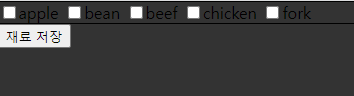

# DB 사용시 컬럼 이름만 가져오는 것은 어렵다

* 레시피 DB를 만들 때 두 가지 방법을 고안하였다.

  1. 레시피를 작성할 때 재료 선택하는 박스에서 체크하면 DB에는 1로 저장 체크하지 못하면 0으로 저장

     | recipe_no | fork | beef | chicken | sugar | ...  |
     | --------- | ---- | ---- | ------- | ----- | ---- |
     | 1         | 1    | 0    | 0       | 1     | ...  |
     | 2         | 0    | 1    | 1       | 0     | ...  |

     

  2. 레시피를 작성할 때 재료 선택하는 박스에서 재료를 체크하면 DB에는 재료 이름들을 String으로 저장

     | recipe_no | ingredient                       |
     | --------- | -------------------------------- |
     | 1         | 돼지고기, 소고기, 사과, 강황가루 |
     | 2         | 소고기, 고추장, 설탕             |


## 1번 방법

* 우선 1번 방식으로 선택하였다. 그 이유는 당시 설계시 데이터 값이 1인 컬럼 네임을 찾는 것이 쉬울 것이라 생각하였다.

  그래서 고안한 방법은 

  1. 컬럼 이름을 모두 가져와서 리스트로 저장

  ```sql
  #컬럼 이름 조회 list_ColumnName
  SELECT COLUMN_NAME
  FROM INFORMATION_SCHEMA.COLUMNS
  WHERE TABLE_SCHEMA='finaldb'  
     AND TABLE_NAME='ingredient';
  ```

  2. 해당하는 recipe_no의 모든 데이터 값을 리스트로 저장

  ```sql
  #데이터 조회 list_ColumnValue
  SELECT *
  FROM INGREDIENT
  WHERE RECIPE_NO=#{RECIPE_NO}
  ```

  3.  두 리스트를 맵으로 저장
  
  ```JAVA
  Map<String, String> map = new HashMap<String, String>();
  for(int i=0 ; i<list.size() ; i++){
      map.put(list_ColumnName.get(i), list_ColumnValue.get(i));
  }
  ```
  
  4. map에서 value값이 1인 key를 찾아 리스트에 저장
  
  ```java
  List<String> list = new ArrayList<String>();
  for(Entry<String, String> elem : map.entrySet()){
      if(elem.getValue() == 1){
          list.add(elem.getKey());
      }
  }
  ```
  
  5. list를 jsp에 보내서 jsp에서 나타내기
  
  ```java
  ModelAndView mv = New ModelAndView;
  mv.addObject("list", list)
  ```
  
  ```jsp
  <c:forEach items=${list} var="ingredient">
  	${ingredient}
  </c:forEach>
  ```

* 방법은 다 고안했으나 이 설계는 포기하였다.
* 그 이유는 데이터를 저장하는데 0이 아닌 null 값을 넣는 방법을 고안해내지 못했다. (insert 하는 부분에 순서대로 값을 넣는 부분에서 다른 방법을 못 고안함...) DB에 필요없는 데이터가 너무 많고(0값을 가지는 컬럼이 너무 많다) 조회하는데 컬럼이 많아지면 DB가 무거워 진다고 생각하였다. 그렇기 때문에... 이 방법은 도중에 포기하였다.


## 2번 방법

* 처음에 2번 방법을 선택 안 한 이유가 실제로 만들 때 데이터를 배열로 어떻게 넣을지 고민하였고 데이터를 받아서 split해서 값을 빼내는 부분이 불편하다 생각하였다.
* 그러나 실제로 구상해보니 1번 방법에 비해 아주 편하고 쓸 데 없는 데이터를 저장하지 않아 편하였다.

