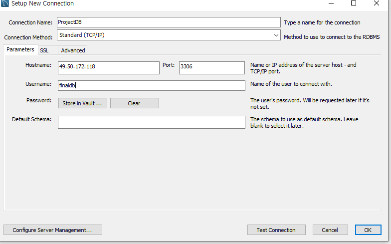

# 클라우드 서버 만들어서 배포하기

## 클라우드 설정

1.서버 크기 및 이미지 설정


* Jenkins-CentOS-7.8을 사용


* 주의사항을 보면 ACG 18080 포트로 설정해서 공인IP:18080으로 Jenkins를 접속 가능하다고 써있다.

2. 인증키 설정


3. ACG 설정(네트워크 접근 제어 및 관리)


* ACG포트번호를 알맞게 설정해줄 필요가 있다.


4. 공인IP 설정( 외부에서 들어올 수 있도록 IP를 설정하는 것임 )

   * 외부로 알려진 port로 접속시 내부 포트로 변경하는 포트 포워딩을 한다. 

   * 생성한 ubuntu 기반의 서버에 접속하기 위해서는 포트포워딩이라는 과정을 거쳐야 한다.

   * 포트포워딩이란?

     * 공인IP:외부포트 연결 시도 => 내부포트 서버에서 만든 WAS, FTP서비스 등 
     * 공인IP 서버에서 외부포트의 종류에 따라 내부 서비스에 연결해주는 과정
     * 

     * 포트포워딩 설정을 통해 내부 포트 22번과 연결시켜줄 외부포트를 설정한다.
     * 그러면 설정한 공인IP와 다르게 서버 접속용 공인IP와 외부 포트가 설정되어있어 putty 프로그램을 통해 서버에 접속 가능하다.
     * 

5. 서버 접속 전 서버 만들면서 만든 인증키를 넣어줌으로서 관리자 비밀번호 확인

   * 
   * 생긴 관리자 이름과 비밀번호 따로 저장(putty에서 들어갔을 때 관리자 아이디 비밀번호임)
   * 

6. putty 프로그램 열고 서버접속용 공인IP와 외부포트 입력해서 서버 접속

   

7. 관리자 이름과 비밀번호 입력하면 서버 관리할 준비 완료됨.

   

   * passwd root를 통해 비밀번호 변경 = > 1234

## PuTTY


```
- 설치 사용 명령어
wget – 다운로드
tar cvf - 압축
tar xvf – 압축해제
yum – 다운로드+설치(yum repository에 등록한 패키지만 다운로드 설치 가능)
rpm – redhat package manager( 네이버서버는 리눅스 centos 7버전이고 centos는 redhat계열 리눅스임)
yum 레포에 등록되지 않아 다운로드 설치 불가능할 때 다운로드 설치

ls - 디렉토리 목록 확인
pwd - 현재 디렉토리 확인
cd - 디렉토리 이동
ln -s 폴더명 이름 - 심볼릭 링크 등록
find / which- 파일 찾기
```

1. maven 설치

   1. https://maven.apache.org/download.cgi 접속

   * 중간쯤 Files 제목에서 apache-maven-3.8.3-bin.tar.gz – 우클릭 - 링크 주소를 복사
     (설치시 인증 – 연결 오류등 뜨면 화면 상단에서 other mirrors 에서 다른 url로 변경

   2. 디렉토리 생성 mkdir /usr/mydir
      디렉토리 이동 cd /usr/mydir
      현재폴더 확인 pwd

   3. /usr/mydir에서 maven 설치

   * wget https://downloads.apache.org/maven/maven-3/3.8.3/binaries/apache-maven-3.8.3-bin.tar.gz

   *  내려받은 tar.gz 파일 압축 해제
     * tar -xvf apache-maven-3.8.3-bin.tar.gz

   4. 심볼릭 링크 등록(간편한 이름)
      * ln -s apache-maven-3.8.3 maven

   5. 환경변수 설정

      vi ~/.bash_profile - 환경변수 설정하는 명령어
      이제 vi 명령어만 쓸 수 있음

      * vi 명령어

        vi edior
        아래 1줄 삽입 - o
        한 문자 삽입 - i
        한줄 삭제 - dd

      

   ```
   소문자 o 입력 빈 라인 확보 – 아래 입력
   
   export MAVEN_HOME=/usr/mydir/maven
   PATH=$PATH:$HOME/bin:$MAVEN_HOME/bin
   
   export PATH
   
   esc 입력 후 아래 저장-종료 명령 입력 - 엔터
   :wq
   ```

   

   6. 환경변수 적용 및 확인
      * source ~/.bash_profile
      * echo $PATH
      * (환경변수 설정한 값)mvn -version

2. jdk 설치

   1. java 위치확인 – 위치 확인 불필요시 생략 가능 3번으로 이동

      which java
      ===> java 포함 폴더 확인
      /usr/bin/java
      readlink -f /usr/bin/java
      ===> 확인된 링크 정보 가져오기
      /usr/lib/jvm/java-1.8.0-openjdk-1.8.0.262.b10-0.el7_8.x86_64/jre/bin/java

       * javac 위치확인 --> 검색안됨.

   2. jdk 설치 진행

       * yum install java-1.8.0-openjdk-devel.x86_64
       * ==> 설치는 /usr/lib 경로에(자동설정 yum 저장소 설정인 듯)
       ==> 중간에 y 클릭
       ==> Complete! 확인

   3. 정상적으로 설치되었는지 확인

       cd ~
       java -version
       javac -version

   4. 환경변수 설정

      * vi ~/.bash_profile

      * java jdk 경로 찾아서 환경변수 설정

        ```
        소문자 o 입력 빈 라인 확보 – 아래 입력
        
        export JAVA_HOME=/usr/lib/jvm/java-1.8.0-openjdk-1.8.0.302.b08-0.el7_9.x86_64
        PATH=$PATH:$HOME/bin:$MAVEN_HOME/bin:$JAVA_HOME/bin
        
        export PATH
        
        esc 입력 후 아래 저장-종료 명령 입력 - 엔터
        :wq
        ```

        

3. tomcat 설치

   1. url 확인
      * https://tomcat.apache.org/download-90.cgi
      * ...tar.gz 링크 주소 복사
      * /usr/mydir 위치에서 다운로드
      * wget https://archive.apache.org/dist/tomcat/tomcat-9/v9.0.14/bin/apache-tomcat-9.0.14.tar.gz
   2. 압축 해제
      * tar -xvf apache-tomcat-9.0.14.tar.gz
   3. 심볼릭 링크 설정
      * ln -s /usr/mydir/apache-tomcat-9.0.14 /usr/mydir/tomcat
   4. 시작
      /usr/mydir/tomcat/bin/startup.sh
   6. 종료
    /usr/mydir/tomcat/bin/shutdown.sh

   7. 다시 시작
    /usr/mydir/tomcat/bin/startup.sh

   7. 네이버 클라우드 ACG에 8080 추가되어있는지 확인 후 브라우저에서 공인ip:8080 접속

4. mysql 설치

   1. url 확인

      * https://www.mysql.com/downloads/

      * 화면 하단의
        MySQL Community (GPL) Downloads »

        첫번째 항목
        •	MySQL Yum Repository

        현재 네이버 리눅스 센토스 7버전이므로
        red hat enterprise linux 7 / oracle linus 7 rpm package의 다운로드 클릭

        No thanks, just start my download. – 우클릭 – 링크 주소 복사

      * /url/mydir 위치에서 다운로드

      * wget https://dev.mysql.com/get/mysql80-community-release-el7-3.noarch.rpm

   2. repository 설치

      * rpm -ivh mysql80-community-release-el7-3.noarch.rpm
      * yum install -y mysql-community-server.x86_64

   3. 시작
      systemctl start mysqld

   4. 종료
      systemctl stop mysqld

   5. 재부팅 후 자동시작
      systemctl enable mysqld

   6. 초기 비밀번호 확인

      grep 'temporary password' /var/log/mysqld.log

   7. 접속 
      mysql -u root -p

   8. 초기 비밀번호 입력

   9. 비밀번호 변경

      ALTER USER 'root'@'localhost' IDENTIFIED BY '변경할 비밀번호';

   10. 새 user 생성

       사용자 계정을 추가하기 전에 먼저 현재 생성된 사용자 계정을 확인한다.

       mysql > use mysql;    // mysql database 선택
       mysql > select host, user from user;    // user 테이블 살펴보기

   11. 사용자 추가 
       create user 'userid'@'%' identified by '비밀번호';  

       create user 'finaldb'@'%' identified bt 'FinalDB_1234'

       * '%' 의 의미는 외부에서의 접근을 허용
   
   12. 새 DB 생성
   
       create database finaldb default character set utf8;
   
       show databases
   
   13. 사용자 권한 추가
   
       GRANT ALL PRIVILEGES ON DB명.테이블 TO 계정아이디@host IDENTIFIED BY '비밀번호';
   
       GRANT ALL PRIVILEGES ON finaldb.* TO 'finaldb'@'%';
   
       
   
       flush privileges;     // 변경된 내용을 메모리에 반영(권한 적용)
   
   
       SHOW GRANTS FOR finaldb@'%';  //확인
   
   14. 사용자 접속
   
       mysql -u finaldb -p
   
       암호 입력
   
   15. db선택
   
       use fibaldb;
   
   16. 테이블 생성 후 조회
   
       create table test(a int, b varchar(10));
       insert into test values(1, 'test1');
       insert into test values(2, '테스트2');
       commit;
   
       select * from test;
   
   17. 네이버 서버로 가서 acg 설정에 3306포트 추가
   
       * mybatis : 오라클 1521 / mysql 3306
   
   18. mysql workbench에서 접속 설정
   
       
   
       * hostname – 공인ip
         username - finaldb
         password - FinalDB_1234
         default schema - finaldb

## jenkins 설정

1. acg에 18080포트 추가 후 웹브라우저로 접속

2. putty에서 jenkins 초기 비밀번호 확인

   cat /var/lib/jenkins/secrets/initialAdminPassword

   => c9d0da8b161d4ccbb141687d641dc485

3. install suggested plugin 설치 선택


4. 플러그인 설치 완료 후 jenkins에서 새 계정 생성

   finalproject / qwer1234

5. 젠킨스 메인 화면 - jenkins 관리 - global tool configuration - maven configuration

   maven 동작시 필요한 setting 파일 경로 설정

   * Default settings provider에서 maven settings.xml 경로 설정

     /usr/mydir/maven/conf/settings.xml

   * Default global settings provider 또한 경로 설정

     /usr/mydir/maven/conf/settings.xml

   

   * Maven 관련 라이브러리 저장위치 설정

     Add Maven - install automatically 체크 해제

     Name - M2_HOME

     MAVEN_HOME - /usr/mydir/apache-maven-3.8.3

   

   *  JDK 설정 - Add JDK - install automatically 체크 해제

     JAVA_HOME 경로 설정

     NAME - JAVA_HOME

     JAVA_HOME - /usr/lib/jvm/java-1.8.0-openjdk-1.8.0.312.b07-1.el7_9.x86_64

     

   * 저장

6. jenkins 관리 - 플러그인 관리 - 설치 가능 - Deploy to container 검색 후 설치 - 재시작


7. 깃 허브 설정
   1. 깃허브에서 토큰 발급
   2. jenkins 관리 - 시스템 설정
   3. GitHub - Add GitHub Server 클릭 - mygithub 이름 추가, api url은 그대로 사용
   4. Credentials에 github token 추가(종류는 secret text)


5. test connection이 완료되면 깃허브와 연동이 완료된 것

## sts에서 설정

1. github에 push할 스프링 부트 프로젝트 생성

2. 첫 화면에서 packaging : WAR 압축 선택!!!!

   (그러면 ServletInitializer.java 자동 생성되는데 다른 서버에서 war로 배포시 web.xml 역할을 하게 된다)

   ===> 수동으로 추가했더니 네이버서버에서 jsp를 서블릿 소스로 변경하여 컴파일하는 과정이 실행되지 않는 점이 발견되었다!!! 주의하자.)

   

   

   

3. 깃허브 repository에 올리고 연동

## jenkins 추가 설정

1. jenkins 메인화면 - New Item - FreeStyle project
2. GitHub project 체크 - 프로젝트 url 입력


3. 소스코드 관리


4. Build 목록 설정

   * Maven version 선택하고 Goals에 clean package 입력
   * POM은 프로젝트명/pom.xml

   

   * 빌드 후 조치 Deploy war/ear to a container
     * WAR files 입력
     * url 포트번호는 8080
     * 톰캣 초기 id와 password는 tomcat / 1234 로 써놓고 putty에서 설정 예정

   

   

## PuTTY 추가 설정

1. jenkins에서 설정한 tomcat user name과 password를 설정

2. vi /usr/mydir/tomcat/conf/tomcat-users.xml 여기서 밑 처럼 설정

   

   ```xml
   <role rolename="manager-gui"/>
   <role rolename="manager-script"/>
   <role rolename="manager -status"/>
   <user username="tomcat" password="1234" roles="manager-gui,manager-script,manager-status" />
   ```

3. vi /usr/mydir/tomcat/webapps/manager/META-INF/context.xml 에서 Valve 태그 주석처리

   

4. 톰캣 재시작 후 Manager App에서 로그인 시도

   tomcat / 1234

   1. 시작
      /usr/mydir/tomcat/bin/startup.sh
   2. 종료
      /usr/mydir/tomcat/bin/shutdown.sh

   3. 다시 시작
      /usr/mydir/tomcat/bin/startup.sh
