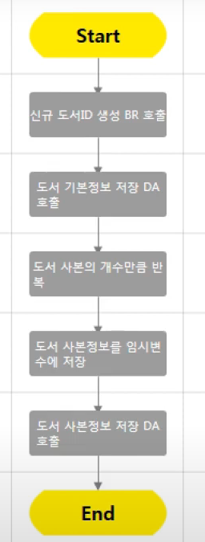

# DevOn NCD

Source Code가 아닌 Flow Chart로 작성하는 개발
코딩 없이 시스템 개발이 가능한 개발 platform
DevOn UI Prototper, UI-BIZ Connector, BizActor를 이용하여 모델을 기반으로 시스템을 개발

* 자바를 이용해서 테스트로 오류제거가 편함

**DevOn NCD로 할 수 있는 개발**

* DevOn BizActor(DevOn Studio)로 비즈니스 로직 작성
* UI-BIZ Connector로 Controller단 개발
* DevOn UI Prototyper를 통해 화면 개발
* 

**DevOn NCD 테스팅**

편리한 테스트 지원도구를 통해 트스트 가능

**Bizactor 관리계층**

* Service
  * 기능을 수행하는 단위
* Component
  * Service들의 집합
  * 소유권을 가지고 있는 사용자만 수정, 삭제 가능
* Group
  * Component들의 집합
  * 소유권 개념 없이 모든 사용자들이 함께 사용
* Layer
  * Business Rule Service (BR)
    * DA/SA/BR을 호출하여 조건 등 제어 Logic을 수행하는 Service
    * 복잡한 비즈니스 로직은 대부부분 BR로 구현
  * Data Access Service (DA)
    * DB와 관련된 기능을 수행하는 Service
    * SQL을 수행
  * Service Access Service (SA)
    * 외부시스템과 연계를 담당하는 Service

**Service 상태**

* C* : 아무 제약 없이 수정 가능
* A : 다른 BR에서 호출가능, 호출되고 있는 경우 Deactivate 불가
* M* : 수정중인 상태, 다른 BR에서 호출시는 수정 전 상태로 호출됨
* S : UI 화면 서비스 가능, BR에서 조회 가능

**Service 소유권**

소유권이 있어야만 수정/삭제가 가능하고, 없을 땐 View/Test만 가능하다.

**DataSet**

BizActor에서 사용하는 데이터 타입으로 DataSet, DataTabe, DataAccess

**Service Parameter**

DataSet 형태로 파라미터 전송됨

**Business Rule Layer Step**

* call
* If
* Switch
* Loop
* Script
* Substitution
* Error
* Group
* Poin

**NCD 1분완성 레시피**

* 포인트 스텝

  * 설계할 때 사용

    

* search

  * 목록에 search를 통해 원하는 br이나 DB 컬럼 등 찾을 수 있다.

* Exception 발생 위치

  * Test시 예외가 발생했다면 테스트 메세지 창에서 LOC를 통해 위치를 찾을 수 있다.

* 예외처리하기 Ignore Exception

  * 예외가 생기면 로직은 실패하고 예외를 던지고 롤백된다.
  * 예외가 발생하는 step을 클릭하면 Ignore를 선택할 수 있다.
  * 예외가 발생했을 때, RslNum이 -1이면 에러가 발생하고, 아니면 예외가 발생하지 않도록 if문을 사용하면,
  * 예외가 발생하여도 롤백되지 않고, 사용자가 지정한 메세지를 출력한다.

* Service Access Legacy

  * SA Legacy 연계를 하면 다른 서버에 있는 BizActor의 서비스를 호출할 수 있다.
  * 업무별로 서버를 여러 개 구축했을 때나 Transaction을 분리하고 싶을 때 유용하다.
    1. admin 계정에 들어가서 Legacy System에 연계할 BizActor 서버를 넣어서 만든다
    2. 사용할 서버에서 디자이너 아이디로 접속하고, Service Access에서 추가한다.
    3. 연계할 서버의 호출할 서비스를 입력한다. Service ID는 'EXT.호출할 Service ID', 반드시 S상태여야함
    4. 호출 Service 정보를 참고하여 DataSet을 추가해서 Service 생성
  
* History Rollback, View

  * 버전 관리를 History에서 확인할 수 있다.

* 확장 트리

  * 서비스 이동 및 다른 디자이너의 서비스나 컴포넌트 소유권 가져오기 가능

* 유효성 검증

  * internal data로 유효성 검증을 만들 수 있다..???

* substitute step

  * 하나의 데이터 테이블에 담긴 데이터를 또 다른 데이터 테이블에 복사해서 가공할 때 
  * internal data에 input data를 담는 행위를 할 수 있다.
  * internal data를 플로우에 넣고 input data의 substitute all 메뉴를 실행하면 된다.

* test data 저장

  * test시 input datatable에 데이터를 매번 입력하는 경우 
  * 한 번 입력한 데이터를 계속 사용하고 싶은 경우
  * save test data 이용하면 된다.

* 데이터 테이블 합치고 정렬

  * 스크립트 스텝을 추가해서 여러 테이블을 merge 함수를 통해 합칠 수 있다.
  * 스크립트 스텝을 통해 테이블을 sortRow("기준컬럼", 1 or 2) 함수를 통해 정렬할 수 있다.

* 스텝별 디버깅

  * Request by step에서 가능
  * 다른 곳에서 호출한 BR인 경우 step into 버튼을 눌러서 호출한 BR의 flow를 확인할 수 있다.

## DAC

서비스

* AdHoc
  * where전 이전까지만 스크립트 작성
  * optional에 들어가 있으면 or조건
  * 다음 스크립트를 추가하면 and조건으로 들어감
