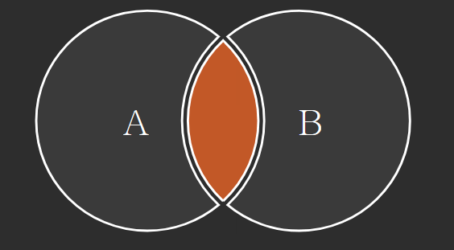
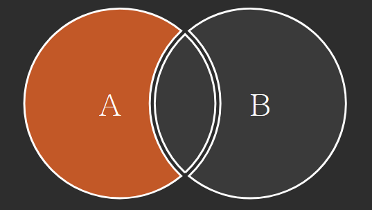
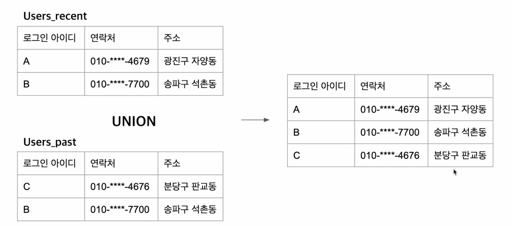

## 함수

* power(값, 제곱횟수) - 제곱
* sqrt(값) - 제곱근
* abs(값) - 절대값
* DATE_ADD(now(), INTERVAL 1 DAY) - 날짜 하루 증가
* DATE_SUB(..) - 날짜 빼는 함순

**중간값 rownum 이용**

~~~sql
set @rownum:=-1;

select round(abs(ln), 4)
from (
    select @rownum:=@rownum+1 as rn, lat_n as ln
    from station
    order by lat_n
    ) rs
    /*갯수가 홀수인경우 짝수인경우 확인*/
where rs.rn in (floor(@rownum/2), ceil(@rownum/2))
~~~

**inner join 응용**

* grade가 8이상이면 이름을 보여주고 아니면 null
  * grades 표는 각 grade에 점수 구간이 있음.

~~~sql
select if(g.grade >= 8, s.name, 'NULL'), g.grade, s.marks
from students s
    inner join grades g
    on s.marks between min_mark and max_mark
order by g.grade desc, name, s.marks;
~~~

## 정규 표현식

정규표현식 튜토리얼: https://regexone.com/lesson/introduction_abcs
정규표현식을 테스트 해 볼 수 있는 사이트: https://regexr.com/

~~~sql
//a e i o u로 시작되는 필드를 가져와라
select city
from station
where city like 'a%' or city like 'e%' or city like 'i%' or city like 'u%';

select city
from station
where city regexp '^[aeiou].*';

//끝 문자 aeiou
select city
from station
where city regexp '[aeiou]$';

//처음 문자 끝 문자 aeiou
select distinct city
from station
where city regexp '^[aeiou]' and city regexp '[aeiou]$'
~~~

## JOIN

테이블 둘을 서로 붙이는 것으로 알면 된다.

~~~sql
select *
from a
inner join b on a.key = b.key
~~~

~~~sql
select *
from a
left join b on a.key=b.key
where b.key is null
~~~

## UNION

JOIN이 테이블 둘을 가로로 붙이는 것이라면, UNION은 테이블 둘을 세로로 붙이는 것이다.

**UNION**은 중복을 없애주고, **UNION ALL**은 중복도 넣어준다.

**FULL OUTERJOIN**

교집합만 뺀 결과를 만들기 위해서는 FULL OUTERJOIN을 사용할 수 있다.
그러나 이것은 mysql에서 제공하지 않아 사용하기 위해서는 다른 방법을 이용해야한다.

~~~sql
select *
from a
	left join b on a.key=b.key

union

select *
from b
	right join b on a.key=b.key
~~~

## Update

**update 내에서 when then**

~~~sql
update salary
set sex = case
			when sex='f' then 'm'
			when sex='m' then 'f'
			end
~~~

## Delete

where 절 서브쿼리를 통해 조건을 만들어서 삭제

~~~sql
#중복되는 이메일이 있다면 삭제해라
delete
from person p
where p.id not in (
	select sub.id
	from (
    	select email, min(id) id
    	from person
    	group by email
    	) sub
	)
#delete에서 inner join
delete p1
from person p1
	inner join person p2 on p1.email=p2.email
where p1.id > p2.id
~~~

## 데이터 타입

* 정수
  * tinyint(), smallint(), mediumint, int(), bigint()
* 실수
  * decimal(), double(), float()
* 문자
  * varchar(), char()
* 날짜, 시간
  * date() 1000-01-01 ~ 9999-12-31
  * datetime() 1000-01-01 00:00:00.000000 ~ 9999-12-31 23:59:59.999999
  * timestamp() = datetime()+timezone
  * string을 datetime으로 바꾸는 함수도 있다.
    * str_to_date()