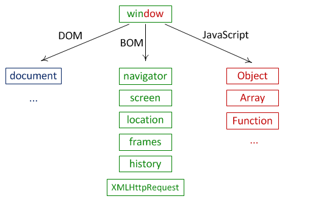

# 1. 웹에서 사용하는 JavaScript

**웹 브라우저의 구성요소를 객체화**

웹 브라우저에서 사용하는 구성요소들은 객체화되어 있다. 이 객체들을 제어해서 웹 브라우저를 제어할 수 있다. 아래처럼 객체화된 구성요소들을 이용하는 방법을 배우자.

* window

  * window는 전역객체로 위 객체들의 조상이다.보통 사용하는 객체들 앞에window가 생략되어 있다.

  * window 객체 사용법

    1. **팝업창**

       * window.open(URL, 적용할 방법, 속성)
  
         * _self -> 현재 스크립트 상에서 변경
         * _blank -> 새 창으로 연결
         * _ot -> 새 창으로 연결, 동일한 이름의 창이 있다면 그 곳에서만 
         
         ~~~html
         <body>
         <input type="button" id="button" value="button">
         
         
         ~~~
  
     * 팝업창은 보안과 관련되어 있다.
         1. 버튼을 눌렀을 때 `window.open()`이 되는 경우 팝업차단x
       2. 어떤 웹 페이지에 접속했을 때 스크립트에 의해 자동으로 팝업이 생성되는 경우 팝업차단알림 생성
  
  

* BOM(Browser Object Model)

  * BOM 객체는 웹 브라우저의 창이나 프레임을 추상화해서 프로그래밍적으로 제어할 수 있도록 제공하는 수단이다. 

  * BOM은 전역객체인 Window의 프로퍼티와 메서드들을 통해서 제어할 수 있다.

    1. Location 객체 - URI에 해당하는 데이터를 담고있다.

    > <u>http://</u> <u>www.naver.com</u> <u>:8080</u> <u>/module/1</u> <u>?id=1</u> <u>#book</u>
    >
    > protocol						port 	path name		hash
    >
    > ​			host name									search

    * URL을 변경하거나 리로드 하는 경우에 사용된다.

      ~~~js
      location.href='www.naver.com';
      location.href=location.href;
      location.reload();
      ~~~

  * Navigator 객체 - 과거 웹 표준이 정의되지 않았을 때 사용자의 웹 브라우저 환경을 알기 위해 자주 사용

    * 예) Netscape 에서는 addEventListener / ie 에서는 attachEvent
    * 어떤 웹 브라우저인지 확인해서 사용하는 메서드를 각 브라우저에 맞게 적용

* DOM(Document Object Model)

  * 제어 대상을 찾는 방법

    1. getElementsByTagName

       ~~~js
       //태그 명으로 제어대상을 고르는 방법
       var lis = document.getElementsByTagName('li');
       for (var i = 0; i < lis.length; i++) {
           lis[i].style.color='red';
       }
       ~~~

       

    2. getElementsByClassName

       ~~~js
       //클래스 명으로 제어대상을 고르는 방법
       var lis = document.getElementsByClassName('active');
       for (var i = 0; i < lis.length; i++) {
           lis[i].style.color='red';
       }
       ~~~

       

    3. getElementById

       ~~~js
       //아이디 명으로 제어대상을 고르는 방법
       //아이디는 document 내에 하나만 존재
       var lis = document.getElementById('user');
       lis.style.color='red';
       ~~~

       

    4. querySelector

       ~~~js
       //css 선택자를 이용해서 제어대상을 고르는 방법
       var lis = document.querySelector('.li');
       lis.style.color='red';
       
       var lis = document.querySelectorAll('.li');
       for (var i = 0; i < lis.length; i++) {
           lis[i].style.color='red';
       }
       ~~~

**jQuery**

JavaScript 라이브러리로 DOM을 통해 제어대상을 고르고 제어하는 것을 편리하게 사용할 수 있는 라이브러리

~~~html
<head>
    
</head>
<body>
    $(인자).css('color', 'red');
</body>
~~~

* 인자가 들어가는 방법
  * `$('li')` 
  * `$('.active')`
  * `$('#active')`