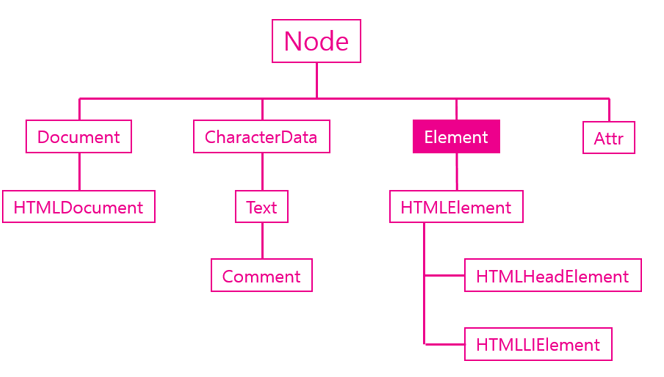

# DOM Tree

## Element 객체

* Element의 속성은 constructor.name으로 확인할 수 있다.
  * a 태그의 constructor.name => HTMLAnchorElement
  * li 태그의 constructor.name => HTMLLIElement
  * Input 태그의 constructor.name => HTMLInputElement
  
* HTMLElement를 상속하는 객체이다.

  

> **DOM 구조에서 Element 객체를 알아가는 목적은 식별하고 조회하고 속성을 알아내서 변경하는 API를 제공하기 때문이다.**

### 식별자 API

Element를 제어하기 위해 Eelement를 조회해야하고, Element를 조회하기 위해 식별자가 필요하다.
HTML에서 Element의 name, id, class는 식별자로 사용된다. 

classList, className, id, tagName들을 통해서 특정 Element를 식별할 수 있다.

**tagName**

~~~html
<ul>
    <li id="active">hmtl</li>
</ul>

~~~

* .tagName을 통해 가져온 Element의 태그 네임을 알 수 있으나, 태그 네임을 변경할 수 없다.

**id**

문서에서 id는 단 하나만 등장할 수 있는 식별자이다. id는 변경이 가능하다.

~~~html
<ul>
    <li id="active">hmtl</li>
</ul>

~~~

**className**

className은 사용하기 까다로운 api이기 때문에 보통은 classList를 이용한다.
있는지 없는지 확인해야 하는 번거로움이 있기 때문이다.
id처럼 className도 변경이 가능하다.

~~~js
var active = documnet.getElementById('active');
active.className = "deactive";
~~~

**classList**

클래스 이름의 그룹을 확인, 추가 삭제 가능한 api

~~~html
<ul>
    <li id="active" class="marked1 marked2 marked3">hmtl</li>
</ul>

~~~

### 조회 API

document.getElementsBy... 사용해왔었는데, Element에서도 조회를 해서 조회 대상을 계속 해서 좁혀나가는 방법

~~~js
var active = document.getElementById('active');
var list = active.getElementsByClassName('marked');
//active의 아이디를 가진 태그에서 하위 태그 중 class name을 특정하는 방법
~~~

### 속성 API

속성을 제어하는 방법

Element.getAttribute(name);
Element.setAttribute(name, value);
Element.hasAttribute(name);
Element.removeAttrbute(name);

~~~js
var t = document.getElementById('active');
t.getAttribute('id'); //id 속성의 값을 가져오는 방법
t.setAttribute('id', 'deActive'); //id 속성의 값을 바꾸는 방법
t.removeAttribute('id') //id 속성의 값을 제거하는 방법
t.hasAttribute('id'); //id 속성의 값이 있는지 확인하는 방법
~~~

* attribute 방식 vs property 방식
  * target.setAttribute('class', 'important'); // attribute 방식
  * target.className='important' // property 방식
  * property 방식이 더 빠르고 코드도 짧지만, 원하는 값이 다를 수 있고, 속성 이름이 달라 혼동에 주의해야 한다. 
    * 예) class 속성을 바꾸려면, className으로 지정해야 한다.

**jQuery 속성 제어 API**

Element를 제어하기 위해 jQuery에서는 어떤 방법을 제공할까

setAttribute, getAttribute 메서드를 사용해왔지만, jQuery에서는 attr 메서드를 제공한다.

~~~js
var t = $('#target');
t.attr('title', 'naver'); // 속성 변경
t.removeAttr('title'); // 속성 삭제
~~~

그러면, 속성 값을 property 방식으로 받는 방법은 무엇일까?

~~~js
var t1 = $('#t1');
t1.attr('href'); // attribute 방식으로 값을 가져온다.
t1.prop('href'); // property 방식으로 값을 가져온다.

t2.attr('checked') // checked에 해당하는 속성 값을 가져온다.
t2.prop('checked'); // checked 상태의 true, false 결과를 가져온다.
~~~

**jQuery 조회 범위 제한**

~~~html
<ul>
<li class="marked">html</li>
<li id="active">JAvaScript
	<ul>
        <li>JavaScript Core</li>
        <li class="marked">DOM</li>
        <li class="marked">BOM</li>
	</ul>
</li>
</ul>

//이를 좀더 간단하게
<srcipt>
    $(".marked", "#active").css("background-color", "red");

	$("#active .marked").css("background-color", "red");

	$('#active').find('.marked').css("background-color", "red");
    
    //활용 방법
    $('#active').css('color', 'blue').find('.marked').css('background-color', 'red');
</script>
~~~

## Node 객체

모든 DOM 객체는 Node 객체를 상속한다.

* Node.childNodes
* Node.firstChild
* Node.lastChild
* Node.nextSibling
* Node.previousSibling
* Node.contains()
* Node.hasChildNodes()

**노드의 종류**

* Node.nodeType
* Node.nodeName

**노드의 값**

* Node.nodeValue
* Node.textContent

**노드의 자식관리**

* Node.appendChild()
* Node.removeChild()

### Node  관계 API 

~~~html
<body id="start">
    <ul>
        <li></li>
        <li></li>
    </ul>
</body>

~~~

### Node 종류 API

노드 작업을 하다보면 노드의 종류를 확인해야 하는 경우가 있다.

* nodeType은 숫자로 결과가 나오는데, 종류에 따라 정해진 상수로 나온다.
  * 1은 ELEMENT_NODE, 3은 TEXT_NODE ...
* nodeName
  * start.nodeName => BODY 	이처럼 노드 태그 이름을 알 수 있다.

재귀함수 이용해서 모든 노드들을 제어하는 방법

~~~html
<body id="start">
    <ul>
        <li></li>
        <li></li>
    </ul>
</body>

~~~

### 노드 변경 API

노드의 추가와 관련된 API들은 appendChild(), insertBefore()
노드를 추가하기 위해서

~~~html
<body>
    <ul id = "target">
        <li>HTML</li>
        <li>CSS</li>
    </ul>
    <input type="button" onclick="callAppendChild();" value="append"/>
    <input type="button" onclick="callInsertBefore()" value="before"/>
    
    
</body>
~~~

### 노드 삭제 API

삭제하고 싶은 대상이 있을 때 부모 노드도 알아야하고 대상도 알아야 하는 설계적인 단점이 있다.

~~~js
// <li id="target">JavaScript</li>
function callRemoveChild() {
    var target = document.getElementById('target');
    target.parentNode.removeChild(target);
}
~~~

### 노드 변경 API

~~~js
// <li id="target">JavaScript</li>
function callReplaceChild() {
    var a = document.createElement('a');
    a.setAttribute('href', 'http://www.naver.com');
    a.appendChild(document.createTextNode('web browser'));
    
    var target = document.getElementById('target');
    target.parentNode.replaceChild(a, target.firstChild); //target의 first child는 JavaScript임
}
~~~

### Node 변경 API (jQuery)

주요 메서드 4가지 : before prepend append after

**변경**

~~~html
<body>
    <!--before-->
    

        <!--prepend-->
        content
        <!--append-->
    

    <!--after-->
    
    
</body>
~~~

**제거**

~~~html
<body>
    <!--before-->
    

        <!--prepend-->
        content
        <!--append-->
    

    <!--after-->
	<input type="button" value="remove" id="btn1"/>
    <input type="button" value="empty" id="btn2"/>

</body>
~~~

**바꾸기**

replaceAll, replaceWith는 모두 노드의 내용을 교체하는 API이다.

~~~html
<body>
    <!--before-->
    

        <!--prepend-->
        content
        <!--append-->
    

    <!--after-->
	<input type="button" value="replaceAll" id="btn1"/>
    <input type="button" value="replaceWith" id="btn2"/>

</body>
~~~

**복사**

~~~html
<body>
    <!--before-->
    

        <!--prepend-->
        content
        <!--append-->
    

    <!--after-->
    
    

        source
    

    
	<input type="button" value="replaceAll" id="btn1"/>
    <input type="button" value="replaceWith" id="btn2"/>

</body>
~~~

**이동**

~~~html
<body>
    <!--before-->
    

        <!--prepend-->
        content
        <!--append-->
    

    <!--after-->
    
    

        source
    

    
	<input type="button" value="replaceAll" id="btn1"/>
    <input type="button" value="replaceWith" id="btn2"/>

</body>
~~~

### 좀 더 나은 Node 변경 API

DOM의 api를 보고 노드를 변경하는 방법 append replace 등등 에 대해 알아왔다.
그러나 DOM api는 매우 복잡해서 많이 불편하다. 
좀 더 편리하게 노드를 조작하는 방법으로 다른 api를 사용할 수 있다.

**innerHTML**

innerHTML을 이용해서 타겟의 **하위 내용**을 가져올 수 있고, 내용 모두를 바꿀 수 있다.

~~~html
<ul id="target">
    <li>HTML</li>
    <li>CSS</li>
</ul>

<input type="button" onclick="get();" value="get"/>
<input type="button" onclick="set();" value="set"/>

~~~

**outerHTML**

자기 자신을 포함한 **모든 내용**을 가져올 수 있고, 모두 바꿀 수 있다.

~~~html
<ul id="target">
    <li>HTML</li>
    <li>CSS</li>
</ul>

<input type="button" onclick="get();" value="get"/>
<input type="button" onclick="set();" value="set"/>

~~~

**innterText**, **outerText**

HTML 코드를 제외한 문자열을 읽고 변경할 수 있다. (태그를 넣었다면 문자열 모두 태그가 그 안에 들어감)

**insertAdjacentHTML(??, '문자열')**

HTML 내용을 바꿀 수 있는 방법 

beforebegin, afterbegin, beforeend, afterend

~~~html
<!--beforebegin-->
<ul id="target">
<!--afterbegin-->
	<li>CSS</li>
<!--beforeend-->
</ul>
<!--afterend-->

~~~

## Document 객체

document는 window 객체의 소속이다. document 객체의 자식으로 document 전체 내용을 가리킨다.

~~~js
document.childNodes[0] //=> <!DOCTYPE html>
document.childNodes[1] //=> <html> ... </html>
~~~

**API**

* 노드 생성 API
  * createElement()
  * createTextNode()
* 문서 정보 API
  * title
  * URL
  * referrer
  * lastModified

## Text 객체

태그와 태그 사이 내용은 Text 객체이다. 

~~~html
<!-- 공백이 존재하기 때문에 p태그의 firstChild는 Text 객체가 나온다. 
span을 원하면 nextSibling을 통해 형제 노드를 가리켜야 한다.-->

    text1

<!-- 공백이 없기 때문에 p태그의 firstChild는 span태그를 가리킨다. -->

text2

~~~

**값 API**

텍스트 노드는 DOM에서 실질적인 데이터가 저장되는 객체이기 때문에 값을 가져오는 것은 중요하다.

nodeValue, data를 통해 데이터를 가져오고 변경할 수 있다.

~~~html
<ul>
    <li id="target">html</li>
</ul>

~~~

**조작 API**

텍스트 노드가 상속받은 CharacterData 객체는 문자를 제어할 수 있는 다양한 API를 제공한다.

* appendData(data) : 데이터 추가
* deleteData(strat, len) : 추가 위치 포함해서 데이터 삭제
* insertData(start, data) : 추가 위치에서 데이터 삽입
* replaceData(start, len, data) : 추가 위치 포함해서 길이만큼 삭제하고 데이터 추가
* substringData(start, len) : 추가위치 포함해서 길이만큼 데이터 리턴

~~~html
<!DOCTYPE html>
<html>
<head>

</head>
<body>
	
Coding everybody!

	
data : <input type="text" id="datasource" value="JavaScript"/>

	
start : <input type="text" id="start" value="5"/>

	
len : <input type="text" id="len" value="3"/>

	<input type="button" value="appendData(data)" onclick="callAppendData()"/>
	<input type="button" value="deleteData(start, len)" onclick="callDeleteData()"/>
	<input type="button" value="insertData(start, data)" onclick="callInsertData()"/>
	<input type="button" value="replacaeData(start, len, data)" onclick="callReplaceData()"/>
	<input type="button" value="substringData(start, len)" onclick="callSubstringData()"/>

	
</body>
</html>
~~~

