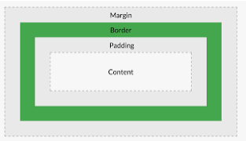

# 문서의 기하학적 특성

margin 테두리와 테두리 사이
border 테두리
padding 컨텐트와 테두리 사이

이 내용들을 확인할 수 있는 API

~~~js
var t = document.getElementById('target');
console.log(t.getBoundingClientRect());
//이 객체의 bottom, height, left, right, top, width 등 내용들을 리턴해준다.

//테두리를 제외한 Element의 크기를 알고 싶다면 ClientWidth, ClientHeight를 사용한다.
~~~

## Viewport

문서가 브라우저의 크기보다 큰 경우 스크롤이 만들어진다. 

~~~js
//스크롤의 y좌표
pageYOffset 
~~~

## Scroll

~~~js
//x좌표 y좌표 스크롤로 이동
window.scrollTo(0, 1000);
~~~

## Screen

~~~js
//viewport의 크기
window.innerWidth
window.innerHeight
//모니터 픽셀
screen.width
screen.height
~~~

